```mermaid
erDiagram
    tbl_user ||--o{ Cust_PartialRun : "creates/modifies"
    tbl_user ||--o{ cust_PartialPicked : "picks"

    Cust_PartialRun ||--o{ cust_PartialPicked : "contains"
    Cust_PartialRun ||--o{ Cust_PartialPalletLotPicked : "has"
    Cust_PartialRun ||--o{ Cust_PartialLotPicked : "includes"

    cust_PartialPicked ||--o{ Cust_PartialPalletLotPicked : "assigns"
    cust_PartialPicked ||--o{ Cust_PartialLotPicked : "uses"

    LotMaster ||--o{ Cust_PartialLotPicked : "picked_from"
    LotMaster ||--o{ LotTransaction : "has_history"
    LotMaster }o--|| BINMaster : "located_in"

    BINMaster ||--o{ BinTransfer : "source/destination"
    LotTransaction ||--o{ BinTransfer : "triggers"

    tbl_user {
        int userid PK
        nvarchar uname
        nvarchar Fname
        nvarchar Lname
        nvarchar auth_source
        bit ad_enabled
        nvarchar app_permissions
    }

    Cust_PartialRun {
        int RunNo PK
        int RowNum PK
        nvarchar BatchNo
        nvarchar FormulaId
        nvarchar Status
        int NoOfBatches
    }

    cust_PartialPicked {
        int RunNo PK,FK
        int RowNum PK,FK
        int LineId PK
        nvarchar ItemKey
        float ToPickedPartialQtyKG
        float PickedPartialQtyKG
        nvarchar Allergen
    }

    Cust_PartialLotPicked {
        int LotTranNo PK
        int RunNo PK,FK
        int RowNum PK,FK
        int LineId PK,FK
        varchar LotNo FK
        float QtyOnHand
        nvarchar BinNo FK
    }

    LotMaster {
        varchar LotNo PK
        varchar ItemKey PK
        varchar LocationKey PK
        nvarchar BinNo PK,FK
        float QtyOnHand
        nvarchar LotStatus
    }

    LotTransaction {
        int LotTranNo PK
        varchar LotNo FK
        varchar ItemKey
        float QtyIssued
        char Processed
    }

    BINMaster {
        nvarchar Location PK
        nvarchar BinNo PK
        varchar aisle
        varchar row
        varchar rack
    }

    BinTransfer {
        int BinTranID PK
        varchar LotNo FK
        nvarchar BinNoFrom FK
        nvarchar BinNoTo FK
        float TransferQty
    }
```

# Database Schema Documentation
## Partial Picking System - TFCPILOT3 Database

> **Database Server**: 192.168.0.86:49381
> **Database Name**: TFCPILOT3
> **Generated**: 2025-10-06

---

## Table of Contents
1. [Authentication Tables](#1-authentication-tables)
2. [Picking Transaction Tables](#2-picking-transaction-tables)
3. [Lot Management Tables](#3-lot-management-tables)
4. [Sequence Number Management](#4-sequence-number-management)
5. [Bin Management Tables](#5-bin-management-tables)
6. [Entity Relationships](#6-entity-relationships)
7. [Backend API Recommendations](#7-backend-api-recommendations)
8. [Real Usage Patterns & Data Dictionary](#8-real-usage-patterns--data-dictionary)
9. [Critical Implementation Notes](#9-critical-implementation-notes)
10. [Example SQL Queries](#10-example-sql-queries)
11. [Database Connection String](#11-database-connection-string)
12. [Summary](#12-summary)
13. [Item Master Table (INMAST)](#13-item-master-table-inmast)
14. [Label Printing Overview](#14-label-printing-overview)
15. [Cross-Reference: Operational Workflows](#15-cross-reference-operational-workflows)
16. [Weight Scale Configuration Tables](#16-weight-scale-configuration-tables)

---

## 1. Authentication Tables

### 1.1 `tbl_user`
**Purpose**: User authentication and authorization with dual SQL/LDAP support

#### Schema Details

| Column Name | Data Type | Nullable | Primary Key | Default Value | Description |
|-------------|-----------|----------|-------------|---------------|-------------|
| `userid` | int | Yes | ✓ | NULL | Unique user identifier |
| `uname` | nvarchar | No | | NULL | Username for login |
| `Fname` | nvarchar | Yes | | NULL | First name |
| `Lname` | nvarchar | Yes | | NULL | Last name |
| `created_at` | datetime2 | Yes | | getdate() | Account creation timestamp |
| `email` | nvarchar | Yes | | NULL | User email address |
| `department` | nvarchar | Yes | | NULL | Department assignment |
| `auth_source` | nvarchar | Yes | | 'LOCAL' | Authentication source (LOCAL/LDAP) |
| `ldap_username` | nvarchar | No | | NULL | LDAP/AD username |
| `ldap_dn` | nvarchar | No | | NULL | LDAP Distinguished Name |
| `last_ldap_sync` | datetime | No | | NULL | Last AD sync timestamp |
| `ad_enabled` | bit | Yes | | 1 | Active Directory enabled flag |
| `app_permissions` | nvarchar | Yes | | 'putaway' | Application permissions |
| `pword` | nvarchar | Yes | | NULL | Hashed password (SQL auth) |

#### Indexes
- **Primary Key**: `userid`

#### Backend Endpoints
```typescript
POST   /api/auth/login          // SQL or LDAP authentication
POST   /api/auth/ldap/verify    // LDAP credential validation
GET    /api/users/:userid       // Get user details
GET    /api/users               // List all users
```

---

## 2. Picking Transaction Tables

### 2.1 `Cust_PartialRun`
**Purpose**: Master record for partial picking runs/batches

> 📋 **See Also**: [project-brief.md - Run No Search & Auto-Population Workflow](./project-brief.md#run-no-search--auto-population-workflow) for complete frontend/backend implementation

#### Schema Details

| Column Name | Data Type | Nullable | Primary Key | Default Value | Description |
|-------------|-----------|----------|-------------|---------------|-------------|
| `RunNo` | int | Yes | ✓ | NULL | Unique run number |
| `RowNum` | int | Yes | ✓ | NULL | Row sequence number |
| `BatchNo` | nvarchar | Yes | | NULL | Batch identifier |
| **`FormulaId`** | nvarchar | Yes | | NULL | **FG Item Key (Finished Goods identifier)** |
| **`FormulaDesc`** | nvarchar | No | | NULL | **FG Description** |
| `NoOfBatches` | int | No | | NULL | Number of batches in run |
| `PalletsPerBatch` | int | No | | NULL | Pallets per batch count |
| `Status` | nvarchar | Yes | | NULL | Run status |
| `RecUserId` | nvarchar | No | | NULL | Record creator user ID |
| **`RecDate`** | datetime | No | | NULL | **Production Date** |
| `ModifiedBy` | nvarchar | No | | NULL | Last modifier user ID |
| `ModifiedDate` | datetime | No | | NULL | Last modification date |
| `User1` - `User5` | nvarchar | No | | NULL | Custom text fields |
| `User6` | datetime | No | | NULL | Custom date field |
| `User7` - `User8` | float | No | | NULL | Custom numeric fields |
| `User9` - `User10` | decimal | No | | NULL | Custom decimal fields |
| `User11` - `User12` | int | No | | NULL | Custom integer fields |
| `CUSTOM1` - `CUSTOM10` | bit | No | | NULL | Custom boolean flags |
| `ESG_REASON` | nvarchar | No | | NULL | ESG audit reason |
| `ESG_APPROVER` | nvarchar | No | | NULL | ESG approver |

#### Indexes
- **Composite Primary Key**: `RunNo, RowNum`

#### ⚠️ **CRITICAL: Field Mappings for Auto-Population**

When user searches for a Run No, these fields auto-populate the UI:

| UI Field | Source Column | Example Value | Notes |
|----------|--------------|---------------|-------|
| FG Item Key | `FormulaId` | TSM2285A | Finished Goods identifier |
| FG Description | `FormulaDesc` | Marinade, Savory | Product description |
| Batch No | `BatchNo` | 850417 | Current batch number |
| Batches (count) | `NoOfBatches` | 2 | Total batches in run |
| Production Date | `RecDate` | 06/10/25 | Format: MM/DD/YY |

**Real Production Example (Run 6000037):**
```sql
SELECT
    RunNo,             -- 6000037
    FormulaId,         -- TSM2285A (→ FG Item Key)
    FormulaDesc,       -- Marinade, Savory (→ FG Description)
    BatchNo,           -- 850417 (→ Batch No)
    NoOfBatches,       -- 2 (→ Batches)
    RecDate            -- 2025-10-06 (→ Production Date as 06/10/25)
FROM Cust_PartialRun
WHERE RunNo = 6000037
ORDER BY RowNum;
```

#### Backend Endpoints
```typescript
GET    /api/runs                     // List all runs
GET    /api/runs/:runNo              // Get run details with auto-population data
POST   /api/runs                     // Create new run
PUT    /api/runs/:runNo              // Update run
GET    /api/runs/:runNo/batches      // Get batches for run
```

---

### 2.2 `cust_PartialPicked`
**Purpose**: Main picking transaction records with item details

> ⚠️ **CRITICAL**: Table name is `cust_PartialPicked` (lowercase 'c')
> 📋 **See Also**: [project-brief.md - Run No Search & Auto-Population Workflow](./project-brief.md#run-no-search--auto-population-workflow) for item retrieval queries

#### Schema Details

| Column Name | Data Type | Nullable | Primary Key | Default Value | Description |
|-------------|-----------|----------|-------------|---------------|-------------|
| `RunNo` | int | Yes | ✓ | NULL | Run number (FK to Cust_PartialRun) |
| `RowNum` | int | Yes | ✓ | NULL | Row number |
| `BatchNo` | nvarchar | Yes | | NULL | Batch number |
| `LineTyp` | nvarchar | No | | NULL | Line type |
| `LineId` | int | Yes | ✓ | NULL | Line identifier |
| **`ItemKey`** | nvarchar | No | | NULL | **Item key/SKU for INMAST lookup** |
| `Location` | nvarchar | No | | NULL | Warehouse location |
| `Unit` | nvarchar | No | | NULL | Unit of measure |
| `StandardQty` | float | No | | NULL | Standard quantity |
| `PackSize` | float | No | | NULL | Package size |
| **`ToPickedPartialQty`** | float | No | | NULL | **Total Needed / Target quantity** |
| **`PickedPartialQty`** | float | No | | NULL | **Actual picked quantity (from scale)** |
| `PickingDate` | datetime | No | | NULL | Date picked |
| `RecUserId` | nvarchar | No | | NULL | Recording user |
| `RecDate` | datetime | No | | NULL | Record date |
| `ModifiedBy` | nvarchar | No | | NULL | Modifier |
| `ModifiedDate` | datetime | No | | NULL | Modification date |
| `User1` - `User5` | nvarchar | No | | NULL | Custom text fields |
| `User6` | datetime | No | | NULL | Custom date field |
| `User7` - `User8` | float | No | | NULL | Custom numeric fields |
| `User9` - `User10` | decimal | No | | NULL | Custom decimal fields |
| `User11` - `User12` | int | No | | NULL | Custom integer fields |
| `ToPickedPartialQtyKG` | float | No | | NULL | **Target weight in KG** |
| `PickedPartialQtyKG` | float | No | | NULL | **Actual weight picked in KG** |
| `ItemBatchStatus` | nvarchar | No | | NULL | Batch status |
| `Allergen` | nvarchar | No | | NULL | **Allergen information** |
| `CUSTOM1` - `CUSTOM10` | bit | No | | NULL | Custom boolean flags |
| `ESG_REASON` | nvarchar | No | | NULL | ESG audit reason |
| `ESG_APPROVER` | nvarchar | No | | NULL | ESG approver |

#### Indexes
- **Composite Primary Key**: `RunNo, RowNum, LineId`

#### ⚠️ **CRITICAL: Actual Weight Fields Used in Production**
**Production data shows these fields are ACTIVELY USED:**
- `ToPickedPartialQty` - Target quantity to pick (e.g., 20.4952)
- `PickedPartialQty` - Actual picked quantity (e.g., 20.5)

**These KG-suffix fields exist but are NEVER used (always NULL):**
- ❌ `ToPickedPartialQtyKG` - **NOT USED in production**
- ❌ `PickedPartialQtyKG` - **NOT USED in production**

**For real-time weight scale integration, use:**
- `PickedPartialQty` (without KG suffix) for current weight
- `ToPickedPartialQty` (without KG suffix) for target weight

#### Backend Endpoints
```typescript
GET    /api/picks                           // List all picks
GET    /api/picks/:runNo/:rowNum/:lineId    // Get pick details
POST   /api/picks                           // Create pick record
PUT    /api/picks/:runNo/:rowNum/:lineId    // Update pick
PATCH  /api/picks/:runNo/:rowNum/:lineId/weight
       // Update PickedPartialQty (actual weight from scale)
GET    /api/picks/pending                   // Get pending picks
GET    /api/picks/completed                 // Get completed picks (ItemBatchStatus='Allocated')
```

---

### 2.3 `Cust_PartialPalletLotPicked`
**Purpose**: Pallet-level lot picking associations

> ⚠️ **CRITICAL - Pallet Assignment Timing**: This table is populated **AFTER all items are picked**, NOT during picking. Records are created when run status changes from "NEW" to "PRINT".

#### Schema Details

| Column Name | Data Type | Nullable | Primary Key | Default Value | Description |
|-------------|-----------|----------|-------------|---------------|-------------|
| `RunNo` | int | Yes | ✓ | NULL | Run number |
| `RowNum` | int | Yes | ✓ | NULL | Row number |
| `BatchNo` | nvarchar | Yes | | NULL | Batch number |
| `LineId` | int | Yes | ✓ | NULL | Line identifier (always 1) |
| **`PalletID`** | nvarchar | Yes | | NULL | **Pallet identifier from PT sequence** |
| `RecUserid` | varchar | No | | NULL | Recording user/workstation |
| `RecDate` | datetime | No | | NULL | Pallet assignment date |
| `ModifiedBy` | nvarchar | No | | NULL | Modifier |
| `ModifiedDate` | datetime | No | | NULL | Modification date |
| `User1` - `User5` | nvarchar | No | | NULL | Custom text fields |
| `User6` | datetime | No | | NULL | Custom date field |
| `User7` - `User8` | float | No | | NULL | Custom numeric fields |
| `User9` - `User10` | decimal | No | | NULL | Custom decimal fields |
| `User11` - `User12` | int | No | | NULL | Custom integer fields |
| `CUSTOM1` - `CUSTOM10` | bit | No | | NULL | Custom boolean flags |
| `ESG_REASON` | nvarchar | No | | NULL | ESG audit reason |
| `ESG_APPROVER` | nvarchar | No | | NULL | ESG approver |

#### Indexes
- **Composite Primary Key**: `RunNo, RowNum, LineId`

#### ⚠️ **CRITICAL: Pallet Assignment Workflow**

**Timing**: Pallet records are created when run is completed, NOT during picking

**Trigger Condition:**
```sql
-- All items must be allocated
SELECT COUNT(*) as Total,
       COUNT(CASE WHEN ItemBatchStatus = 'Allocated' THEN 1 END) as Picked
FROM cust_PartialPicked
WHERE RunNo = @RunNo AND RowNum = @RowNum;
-- When Total = Picked, trigger completion
```

**Completion Process:**
1. Get next PalletID from PT sequence:
   ```sql
   UPDATE Seqnum SET SeqNum = SeqNum + 1 WHERE SeqName = 'PT';
   SELECT SeqNum FROM Seqnum WHERE SeqName = 'PT';
   ```

2. Update run status:
   ```sql
   UPDATE Cust_PartialRun
   SET Status = 'PRINT', ModifiedDate = GETDATE()
   WHERE RunNo = @RunNo;
   ```

3. Create pallet record:
   ```sql
   INSERT INTO Cust_PartialPalletLotPicked (
       RunNo, RowNum, BatchNo, LineId, PalletID, RecUserid, RecDate
   ) VALUES (
       @RunNo, @RowNum, @BatchNo, 1, @PalletID, @UserId, GETDATE()
   );
   ```

**Real Production Example (Run 213935):**
- All items allocated: 2025-05-29 11:59:28
- Pallet assigned: 2025-05-29 12:00:04 (36 seconds later)
- PalletID: 623524 (from PT sequence)
- Status changed: NEW → PRINT

#### Backend Endpoints
```typescript
GET    /api/pallets/:palletId/lots        // Get lots for pallet
POST   /api/runs/:runNo/complete           // Complete run: assign pallet, change status to PRINT
GET    /api/runs/:runNo/pallet             // Get pallet info for run
```

---

### 2.4 `Cust_PartialLotPicked`
**Purpose**: Lot-level picking details with quantity tracking

#### Schema Details

| Column Name | Data Type | Nullable | Primary Key | Default Value | Description |
|-------------|-----------|----------|-------------|---------------|-------------|
| `LotTranNo` | int | Yes | ✓ | NULL | Lot transaction number |
| `RunNo` | int | Yes | ✓ | NULL | Run number |
| `RowNum` | int | Yes | ✓ | NULL | Row number |
| `BatchNo` | nvarchar | Yes | | NULL | Batch number |
| `LineId` | int | Yes | ✓ | NULL | Line identifier |
| `LotNo` | varchar | Yes | | NULL | Lot number |
| `SuggestedLotNo` | varchar | Yes | | NULL | System suggested lot |
| `ItemKey` | varchar | Yes | | NULL | Item key |
| `LocationKey` | varchar | Yes | | NULL | Location key |
| `DateReceived` | datetime | No | | NULL | Received date |
| `DateExpiry` | datetime | No | | NULL | Expiry date |
| `TransactionType` | tinyint | Yes | | NULL | Transaction type code |
| `ReceiptDocNo` | varchar | No | | NULL | Receipt document number |
| `ReceiptDocLineNo` | smallint | No | | NULL | Receipt doc line number |
| `QtyReceived` | float | Yes | | NULL | Quantity received |
| `Vendorkey` | varchar | No | | NULL | Vendor key |
| `VendorlotNo` | varchar | No | | NULL | Vendor lot number |
| `IssueDocNo` | varchar | No | | NULL | Issue document number |
| `IssueDocLineNo` | smallint | No | | NULL | Issue doc line number |
| `IssueDate` | datetime | No | | NULL | Issue date |
| `QtyIssued` | float | Yes | | NULL | Quantity issued |
| `CustomerKey` | varchar | No | | NULL | Customer key |
| `RecUserid` | varchar | No | | NULL | Recording user |
| `RecDate` | datetime | No | | NULL | Record date |
| `ModifiedBy` | nvarchar | No | | NULL | Modifier |
| `ModifiedDate` | datetime | No | | NULL | Modification date |
| `Processed` | char | Yes | | NULL | Processed flag |
| `TempQty` | float | Yes | | NULL | Temporary quantity |
| `QtyForLotAssignment` | float | Yes | | NULL | Quantity for assignment |
| `BinNo` | nvarchar | No | | NULL | **Bin number** |
| `QtyUsed` | float | Yes | | NULL | Quantity used |
| `DateQuarantine` | datetime | No | | NULL | Quarantine date |
| `PackSize` | float | No | | NULL | Pack size |
| `QtyOnHand` | float | No | | NULL | **Current quantity on hand** |
| `User1` - `User5` | nvarchar | No | | NULL | Custom text fields |
| `User6` | datetime | No | | NULL | Custom date field |
| `User7` - `User8` | float | No | | NULL | Custom numeric fields |
| `User9` - `User10` | decimal | No | | NULL | Custom decimal fields |
| `User11` - `User12` | int | No | | NULL | Custom integer fields |
| `QtyReceivedKG` | float | No | | NULL | **Quantity received in KG** |
| `AllocLotQty` | float | No | | NULL | Allocated lot quantity |
| `LotStatus` | nvarchar | No | | NULL | Lot status |
| `CUSTOM1` - `CUSTOM10` | bit | No | | NULL | Custom boolean flags |
| `ESG_REASON` | nvarchar | No | | NULL | ESG audit reason |
| `ESG_APPROVER` | nvarchar | No | | NULL | ESG approver |

#### Indexes
- **Composite Primary Key**: `LotTranNo, RunNo, RowNum, LineId`

#### Backend Endpoints
```typescript
GET    /api/lots/:lotNo                    // Get lot details
GET    /api/lots/:lotNo/available-qty      // Get available quantity
POST   /api/lots/assign                    // Assign lot to picking
GET    /api/runs/:runNo/lots               // Get lots for run
```

---

## 3. Lot Management Tables

### 3.1 `LotMaster`
**Purpose**: Master inventory records for all lots

> ⚠️ **CRITICAL**: LotMaster has **multiple records per LotNo** (one per BinNo location). The same lot can exist in multiple bins with different quantities.

#### Schema Details

| Column Name | Data Type | Nullable | Primary Key | Default Value | Description |
|-------------|-----------|----------|-------------|---------------|-------------|
| `LotNo` | varchar | Yes | ✓ | NULL | Lot number |
| `ItemKey` | varchar | Yes | ✓ | NULL | Item key |
| `LocationKey` | varchar | Yes | ✓ | NULL | Location key |
| `DateReceived` | datetime | No | | NULL | Received date |
| `DateExpiry` | datetime | No | | NULL | Expiry date |
| `QtyReceived` | float | Yes | | 0 | Quantity received |
| `QtyIssued` | float | Yes | | 0 | Quantity issued |
| `QtyCommitSales` | float | Yes | | 0 | **Committed/allocated for picking** |
| `QtyOnHand` | float | Yes | | 0 | **Current on-hand qty** |
| `DocumentNo` | varchar | No | | NULL | Document number |
| `DocumentLineNo` | smallint | No | | NULL | Document line number |
| `TransactionType` | tinyint | Yes | | NULL | Transaction type |
| `VendorKey` | varchar | No | | NULL | Vendor key |
| `VendorLotNo` | varchar | No | | NULL | Vendor lot number |
| `QtyOnOrder` | float | Yes | | 0 | Quantity on order |
| `RecUserId` | varchar | No | | NULL | Recording user |
| `Recdate` | datetime | No | | NULL | Record date |
| `BinNo` | nvarchar | Yes | ✓ | '' | **Bin number (part of PK)** |
| `LotStatus` | nvarchar | No | | '' | Lot status |
| `DateQuarantine` | datetime | No | | NULL | Quarantine date |
| `User1` - `User5` | nvarchar | No | | NULL | Custom text fields |
| `User6` | datetime | No | | NULL | Custom date field |
| `User7` - `User8` | float | No | | NULL | Custom numeric fields |
| `User9` - `User10` | decimal | No | | NULL | Custom decimal fields |
| `User11` - `User12` | int | No | | NULL | Custom integer fields |
| `ESG_REASON` | nvarchar | No | | NULL | ESG audit reason |
| `ESG_APPROVER` | nvarchar | No | | NULL | ESG approver |
| `CUSTOM1` - `CUSTOM10` | bit | No | | NULL | Custom boolean flags |

#### Indexes
- **Composite Primary Key**: `LotNo, ItemKey, LocationKey, BinNo`

#### ⚠️ **CRITICAL: QtyCommitSales Updates During Picking**

**When lots are allocated for picking**, the `QtyCommitSales` field is **incremented** to track committed inventory:

```sql
-- Production example: LotNo 2510403-1, ItemKey INSALT02
-- Same lot exists in multiple bins with different QtyCommitSales values:

LotNo        | BinNo    | QtyOnHand | QtyCommitSales | Status
-------------|----------|-----------|----------------|--------
2510403-1    | PWBB-12  | 4284.73   | 3715.81       | Active picking bin
2510403-1    | J0906-2A | 300.00    | 0.00          | Reserve stock
2510403-1    | K0900-1A | 2950.00   | 2950.00       | Fully committed
```

**During lot allocation** (when user selects lot for picking):
1. System finds lot/bin with available quantity
2. `QtyCommitSales` is incremented by `AllocLotQty` amount
3. **Available qty** = `QtyOnHand - QtyCommitSales`

**Production workflow example**:
- Before allocation: `QtyOnHand = 1000`, `QtyCommitSales = 248.92`
- User allocates 20 KG for picking
- System updates: `QtyCommitSales = 268.92` (248.92 + 20)
- Available qty becomes: 1000 - 268.92 = **731.08 KG**

#### Backend Endpoints
```typescript
GET    /api/inventory/lots                 // Search lots
GET    /api/inventory/lots/:lotNo          // Get lot inventory (all bins)
GET    /api/inventory/items/:itemKey/lots  // Get lots for item
GET    /api/inventory/bins/:binNo/lots     // Get lots in bin
GET    /api/inventory/available             // Get available inventory (QtyOnHand - QtyCommitSales > 0)
PATCH  /api/inventory/lots/:lotNo/:binNo/commit
       // Increment QtyCommitSales when allocating for picking
```

---

### 3.2 `LotTransaction`
**Purpose**: Historical lot movement transactions

#### Schema Details

| Column Name | Data Type | Nullable | Primary Key | Default Value | Description |
|-------------|-----------|----------|-------------|---------------|-------------|
| `LotTranNo` | int | Yes | ✓ | NULL | Transaction number |
| `LotNo` | varchar | Yes | | NULL | Lot number |
| `ItemKey` | varchar | Yes | | NULL | Item key |
| `LocationKey` | varchar | Yes | | NULL | Location key |
| `DateReceived` | datetime | No | | NULL | Received date |
| `DateExpiry` | datetime | No | | NULL | Expiry date |
| `TransactionType` | tinyint | Yes | | NULL | Transaction type |
| `ReceiptDocNo` | varchar | No | | NULL | Receipt document |
| `ReceiptDocLineNo` | smallint | No | | NULL | Receipt line |
| `QtyReceived` | float | Yes | | 0 | Quantity received |
| `Vendorkey` | varchar | No | | NULL | Vendor key |
| `VendorlotNo` | varchar | No | | NULL | Vendor lot number |
| `IssueDocNo` | varchar | No | | NULL | Issue document |
| `IssueDocLineNo` | smallint | No | | NULL | Issue line |
| `IssueDate` | datetime | No | | NULL | Issue date |
| `QtyIssued` | float | Yes | | 0 | Quantity issued |
| `CustomerKey` | varchar | No | | NULL | Customer key |
| `RecUserid` | varchar | No | | NULL | Recording user |
| `RecDate` | datetime | No | | NULL | Record date |
| `Processed` | char | Yes | | 'N' | Processed flag (Y/N) |
| `TempQty` | float | Yes | | 0 | Temporary quantity |
| `QtyForLotAssignment` | float | Yes | | 0 | Qty for assignment |
| `BinNo` | nvarchar | No | | '' | Bin number |
| `QtyUsed` | float | Yes | | 0 | Quantity used |
| `DateQuarantine` | datetime | No | | NULL | Quarantine date |
| `User1` - `User5` | nvarchar | No | | NULL | Custom text fields |
| `User6` | datetime | No | | NULL | Custom date field |
| `User7` - `User8` | float | No | | NULL | Custom numeric fields |
| `User9` - `User10` | decimal | No | | NULL | Custom decimal fields |
| `User11` - `User12` | int | No | | NULL | Custom integer fields |
| `ESG_REASON` | nvarchar | No | | NULL | ESG audit reason |
| `ESG_APPROVER` | nvarchar | No | | NULL | ESG approver |
| `CUSTOM1` - `CUSTOM10` | bit | No | | NULL | Custom boolean flags |

#### Indexes
- **Primary Key**: `LotTranNo`

#### Backend Endpoints
```typescript
GET    /api/transactions/lots/:lotNo       // Get lot transaction history
GET    /api/transactions/:tranNo           // Get transaction details
POST   /api/transactions/lots              // Create lot transaction
```

---

## 4. Sequence Number Management

### 4.1 `Seqnum`
**Purpose**: Centralized sequence number generator for various document types

#### Schema Details

| Column Name | Data Type | Nullable | Primary Key | Default Value | Description |
|-------------|-----------|----------|-------------|---------------|-------------|
| `SeqName` | varchar | Yes | ✓ | NULL | Sequence identifier |
| `SeqNum` | int | Yes | | NULL | Current sequence number |
| `Description` | varchar | No | | NULL | Sequence description |
| `Rel_Table_Name` | nvarchar | No | | NULL | Related table name |
| `Rel_Field_Name` | nvarchar | No | | NULL | Related field name |
| `FinSeqName` | varchar | No | | NULL | Financial sequence name |
| `User1` - `User5` | nvarchar | No | | NULL | Custom text fields |
| `User6` | datetime | No | | NULL | Custom date field |
| `User7` - `User8` | float | No | | NULL | Custom numeric fields |
| `User9` - `User10` | decimal | No | | NULL | Custom decimal fields |
| `User11` - `User12` | int | No | | NULL | Custom integer fields |
| `ESG_REASON` | nvarchar | No | | NULL | ESG audit reason |
| `ESG_APPROVER` | nvarchar | No | | NULL | ESG approver |
| `CUSTOM1` - `CUSTOM10` | bit | No | | NULL | Custom boolean flags |

#### Indexes
- **Primary Key**: `SeqName`

#### ⚠️ **CRITICAL: Partial Picking Sequences**

**This project uses the following sequences:**

| SeqName | Current Value | Description | Used For | Table.Field |
|---------|---------------|-------------|----------|-------------|
| **PT** | 623,956 | Pallet sequence | Pallet ID generation | Cust_PartialPalletLotPicked.PalletID |
| ~~BT~~ | 26,019,636 | Bin Transfer | ❌ NOT used in partial picking | LotTransaction.ReceiptDocNo (bin transfers only) |

**Sequence Usage Pattern:**

```sql
-- Get next PT sequence for PalletID
UPDATE Seqnum
SET SeqNum = SeqNum + 1
WHERE SeqName = 'PT';

SELECT SeqNum
FROM Seqnum
WHERE SeqName = 'PT';
-- Returns: 623957 (next pallet ID)
```

**Important Notes:**
- `LotTransaction.LotTranNo` = **Auto-increment** (no sequence needed)
- `LotTransaction.IssueDocNo` = **BatchNo** for partial picking (e.g., "850839")
- `Cust_PartialPalletLotPicked.PalletID` = **PT sequence** (e.g., "623956")
- BT sequence with "BT-" prefix is only for bin transfers (TransactionType 8/9), **NOT** partial picking

#### Backend Endpoints
```typescript
GET    /api/sequences/:seqName           // Get current sequence value
POST   /api/sequences/:seqName/next      // Get and increment sequence
  Response: { seqName: string, seqNum: number }

// Example: Get next pallet ID
POST   /api/sequences/PT/next
  Response: { seqName: 'PT', seqNum: 623957 }
```

---

## 6. Entity Relationships

### 5.1 `BINMaster`
**Purpose**: Warehouse bin location master data

> ⚠️ **CRITICAL - PROJECT SCOPE**: This Partial Picking System **ONLY uses bins where:**
> - `Location = 'TFC1'`
> - `User1 = 'WHTFC1'`
> - `User4 = 'PARTIAL'`
>
> All other locations and bulk storage bins are excluded from this project.

#### Schema Details

| Column Name | Data Type | Nullable | Primary Key | Default Value | Description |
|-------------|-----------|----------|-------------|---------------|-------------|
| `Location` | nvarchar | Yes | ✓ | NULL | Warehouse location |
| `BinNo` | nvarchar | Yes | ✓ | NULL | Bin number |
| `Description` | nvarchar | No | | NULL | Bin description |
| `RecUserId` | nvarchar | No | | NULL | Recording user |
| `RecDate` | datetime | No | | NULL | Record date |
| `Spare` | nvarchar | No | | NULL | Spare field |
| `aisle` | varchar | No | | NULL | Aisle identifier |
| `row` | varchar | No | | NULL | Row identifier |
| `rack` | varchar | No | | NULL | Rack identifier |
| `User1` - `User3` | nvarchar | No | | NULL | Custom text fields |
| **`User4`** | nvarchar | No | | NULL | **BIN TYPE IDENTIFIER** |
| `User5` | nvarchar | No | | NULL | Custom text field |
| `User6` | datetime | No | | NULL | Custom date field |
| `User7` - `User8` | float | No | | NULL | Custom numeric fields |
| `User9` - `User10` | decimal | No | | NULL | Custom decimal fields |
| `User11` | bit | No | | NULL | Custom boolean field |
| `User12` | int | No | | NULL | Custom integer field |
| `StrgCndtnKey` | nvarchar | No | | NULL | Storage condition key |
| `Nettable` | bit | No | | 0 | Nettable flag |
| `LineSequence` | int | No | | NULL | Line sequence |
| `ESG_REASON` | nvarchar | No | | NULL | ESG audit reason |
| `ESG_APPROVER` | nvarchar | No | | NULL | ESG approver |
| `CUSTOM1` - `CUSTOM10` | bit | No | | NULL | Custom boolean flags |

#### Indexes
- **Composite Primary Key**: `Location, BinNo`

#### ⚠️ **CRITICAL: Bin Type Filter (User4)**

**This project ONLY uses PARTIAL bins at TFC1 warehouse:**

```sql
-- Production Statistics:
-- TFC1 PARTIAL bins (Location='TFC1', User1='WHTFC1', User4='PARTIAL'): 511 bins ✅
-- All other bins: 6,211 bins ❌ EXCLUDED

-- Partial Bin Examples (TFC1 only):
-- PWBB-01 to PWBB-17  → "PW Racking : Replenishment area"
-- PWBA-01 to PWBA-04  → Partial picking bins
-- PWBF-01, PW00-00    → Partial picking bins

-- EXCLUDED bins:
-- Other locations (User1 ≠ 'WHTFC1'): WHSCG, WHTIP8, etc.
-- Bulk bins (User4 = NULL or ''): A0001-2A, K0900-1A, SILO1, SILO2
```

**ALL backend queries MUST filter by Location, User1, and User4:**

```sql
-- Correct query for TFC1 partial bins only
SELECT * FROM BINMaster
WHERE Location = 'TFC1'
  AND User1 = 'WHTFC1'
  AND User4 = 'PARTIAL'

-- Get lots in TFC1 partial bins only
SELECT * FROM LotMaster lm
INNER JOIN BINMaster bm
    ON lm.BinNo = bm.BinNo
    AND lm.LocationKey = bm.Location
WHERE bm.Location = 'TFC1'
  AND bm.User1 = 'WHTFC1'
  AND bm.User4 = 'PARTIAL'
```

#### Backend Endpoints
```typescript
GET    /api/bins                           // List TFC1 PARTIAL bins only
GET    /api/bins/:location/:binNo          // Get bin details (TFC1 partial only)
GET    /api/bins/:location/:binNo/contents // Get TFC1 partial bin contents (lots)
GET    /api/bins/search?aisle=&row=&rack=  // Search TFC1 PARTIAL bins by location
```

**All endpoints automatically filter to:**
- `Location = 'TFC1'`
- `User1 = 'WHTFC1'`
- `User4 = 'PARTIAL'`

---

### 5.2 `BinTransfer`
**Purpose**: Bin-to-bin transfer transaction records

#### Schema Details

| Column Name | Data Type | Nullable | Primary Key | Default Value | Description |
|-------------|-----------|----------|-------------|---------------|-------------|
| `BinTranID` | int | Yes | ✓ | NULL | Transfer transaction ID |
| `ItemKey` | varchar | Yes | | NULL | Item key |
| `Location` | varchar | Yes | | NULL | Location |
| `LotNo` | varchar | No | | NULL | Lot number |
| `BinNoFrom` | nvarchar | No | | NULL | Source bin |
| `BinNoTo` | nvarchar | No | | NULL | Destination bin |
| `LotTranNo` | int | Yes | | NULL | Related lot transaction |
| `QtyOnHand` | float | Yes | | 0 | Qty on hand before transfer |
| `TransferQty` | float | Yes | | 0 | Transfer quantity |
| `InTransID` | int | Yes | | NULL | Inventory transaction ID |
| `RecUserID` | varchar | No | | NULL | Recording user |
| `RecDate` | datetime | No | | NULL | Record date |
| `User1` - `User5` | nvarchar | No | | NULL | Custom text fields |
| `User6` | datetime | No | | NULL | Custom date field |
| `User7` - `User8` | float | No | | NULL | Custom numeric fields |
| `User9` - `User10` | decimal | No | | NULL | Custom decimal fields |
| `User11` - `User12` | int | No | | NULL | Custom integer fields |
| `ContainerNo` | bigint | Yes | | 0 | Container number |
| `ESG_REASON` | nvarchar | No | | NULL | ESG audit reason |
| `ESG_APPROVER` | nvarchar | No | | NULL | ESG approver |
| `CUSTOM1` - `CUSTOM10` | bit | No | | NULL | Custom boolean flags |

#### Indexes
- **Primary Key**: `BinTranID`

#### Backend Endpoints
```typescript
GET    /api/transfers/bins                 // List bin transfers
GET    /api/transfers/bins/:tranId         // Get transfer details
POST   /api/transfers/bins                 // Create bin transfer
GET    /api/bins/:binNo/transfers          // Get transfers for bin
```

---

## 6.1 Auto-Population Query Patterns

### Run No Search & Auto-Population

**When user enters Run No**, the system performs a multi-table JOIN to retrieve and auto-populate all fields:

#### Step 1: Get Run Header Data
```sql
-- Auto-populates: FG Item Key, FG Description, Batch No, Batches, Production Date
SELECT
    RunNo,
    RowNum,
    BatchNo,
    FormulaId AS FGItemKey,        -- ← FG = Finished Goods
    FormulaDesc AS FGDescription,
    NoOfBatches AS Batches,
    RecDate AS ProductionDate,
    Status
FROM Cust_PartialRun
WHERE RunNo = @RunNo
ORDER BY RowNum;
```

**Real Example (Run 6000037):**
```json
{
  "RunNo": 6000037,
  "RowNum": 1,
  "FGItemKey": "TSM2285A",           // ← FROM FormulaId
  "FGDescription": "Marinade, Savory", // ← FROM FormulaDesc
  "BatchNo": "850417",
  "Batches": 2,
  "ProductionDate": "2025-10-06"     // ← FROM RecDate
}
```

#### Step 2: Get Item Details with Weight Range
```sql
-- Auto-populates: ItemKey, Description, Weight Range, Total Needed, Remaining Qty
SELECT
    cp.RunNo,
    cp.RowNum,
    cp.LineId,
    cp.ItemKey,
    cp.BatchNo,
    cp.ToPickedPartialQty AS TotalNeeded,
    ISNULL(cp.PickedPartialQty, 0) AS PickedQty,
    (cp.ToPickedPartialQty - ISNULL(cp.PickedPartialQty, 0)) AS RemainingQty,
    im.Desc1 AS Description,
    im.User9 AS ToleranceKG,
    (cp.ToPickedPartialQty - im.User9) AS WeightRangeLow,
    (cp.ToPickedPartialQty + im.User9) AS WeightRangeHigh
FROM cust_PartialPicked cp
INNER JOIN INMAST im ON cp.ItemKey = im.Itemkey
WHERE cp.RunNo = @RunNo
    AND cp.RowNum = @RowNum
ORDER BY cp.LineId;
```

**Real Example (Run 6000037, RowNum 1, ItemKey INRICF05):**
```json
{
  "ItemKey": "INRICF05",
  "Description": "Rice Flour (RF-0010)",   // ← FROM INMAST.Desc1
  "TotalNeeded": 14.2400,                  // ← FROM ToPickedPartialQty
  "RemainingQty": 14.2400,                 // ← ToPickedPartialQty - PickedPartialQty
  "ToleranceKG": 0.025,                    // ← FROM INMAST.User9
  "WeightRangeLow": 14.215000,             // ← 14.24 - 0.025
  "WeightRangeHigh": 14.265000             // ← 14.24 + 0.025
}
```

### Field Mapping Reference

| UI Display | Database Source | Join Required | Formula/Calculation |
|------------|----------------|---------------|---------------------|
| **Run No** | `Cust_PartialRun.RunNo` | No | Direct value |
| **FG Item Key** | `Cust_PartialRun.FormulaId` | No | Direct value |
| **FG Description** | `Cust_PartialRun.FormulaDesc` | No | Direct value |
| **Batch No** | `Cust_PartialRun.BatchNo` | No | Direct value |
| **Batches** | `Cust_PartialRun.NoOfBatches` | No | Direct value |
| **Production Date** | `Cust_PartialRun.RecDate` | No | Format as MM/DD/YY |
| **ItemKey** | `cust_PartialPicked.ItemKey` | No | Direct value |
| **Description** | `INMAST.Desc1` | Yes | JOIN on ItemKey |
| **Total Needed** | `cust_PartialPicked.ToPickedPartialQty` | No | Direct value |
| **Remaining Qty** | Calculated | No | `ToPickedPartialQty - ISNULL(PickedPartialQty, 0)` |
| **Weight Range Low** | Calculated | Yes | `ToPickedPartialQty - INMAST.User9` |
| **Weight Range High** | Calculated | Yes | `ToPickedPartialQty + INMAST.User9` |

### Backend API Implementation

```typescript
// GET /api/runs/:runNo
// Auto-populate FG fields, batches, production date
export interface RunResponse {
  runNo: number;
  fgItemKey: string;          // FROM FormulaId
  fgDescription: string;       // FROM FormulaDesc
  batches: number[];           // All RowNum values
  productionDate: string;      // FROM RecDate (formatted MM/DD/YY)
}

// GET /api/runs/:runNo/batches/:rowNum/items
// Auto-populate item details with weight range
export interface BatchItemsResponse {
  items: Array<{
    itemKey: string;
    description: string;       // FROM INMAST.Desc1
    totalNeeded: number;       // FROM ToPickedPartialQty
    remainingQty: number;      // CALCULATED
    weightRangeLow: number;    // CALCULATED with INMAST.User9
    weightRangeHigh: number;   // CALCULATED with INMAST.User9
    toleranceKG: number;       // FROM INMAST.User9
  }>;
}
```

**📋 For complete frontend/backend implementation with TypeScript and Rust examples, see:**
- [project-brief.md - Run No Search & Auto-Population Workflow](./project-brief.md#run-no-search--auto-population-workflow)

---

## 7. Backend API Recommendations



---

## 7. Backend API Recommendations

### 7.1 Authentication Module

```typescript
// Authentication routes
POST   /api/auth/login
  Body: { username: string, password: string, authMethod: 'sql' | 'ldap' }
  Response: { token: string, user: UserDTO }

POST   /api/auth/refresh
  Headers: { Authorization: 'Bearer <token>' }
  Response: { token: string }

GET    /api/auth/me
  Headers: { Authorization: 'Bearer <token>' }
  Response: UserDTO
```

### 7.2 Picking Operations

```typescript
// Run management
GET    /api/runs?status=&batchNo=&date=
POST   /api/runs
PUT    /api/runs/:runNo
DELETE /api/runs/:runNo

// Picking operations
GET    /api/picks/pending?runNo=
GET    /api/picks/completed?runNo=&date=
POST   /api/picks
PATCH  /api/picks/:runNo/:rowNum/:lineId/weight
  Body: { weight: number, timestamp: string }

// Real-time weight updates (WebSocket)
WS     /ws/weight/:runNo/:lineId
  Message: { weight: number, timestamp: string }
```

### 7.3 Inventory & Lot Management

```typescript
// Lot operations (TFC1 PARTIAL bins only)
GET    /api/lots?itemKey=&locationKey=&binNo=&status=
  // Returns lots from TFC1 partial bins only
  // Filter: Location='TFC1', User1='WHTFC1', User4='PARTIAL'

GET    /api/lots/:lotNo/availability
  // Calculates: QtyOnHand - QtyCommitSales (TFC1 partial bins only)

POST   /api/lots/assign
  Body: { lotNo: string, runNo: number, lineId: number, qty: number }
  // Updates LotMaster.QtyCommitSales for TFC1 partial bin

// Inventory queries (TFC1 PARTIAL bins only)
GET    /api/inventory/items/:itemKey
  // Returns inventory from TFC1 partial bins only
  // Filter: WHERE BINMaster.Location='TFC1' AND User1='WHTFC1' AND User4='PARTIAL'

GET    /api/inventory/bins/:location/:binNo
  // Only returns if bin is TFC1 partial (Location='TFC1', User1='WHTFC1', User4='PARTIAL')

GET    /api/inventory/available?itemKey=&minQty=
  // Available qty = QtyOnHand - QtyCommitSales
  // From TFC1 partial bins only
```

### 7.4 Bin Operations

```typescript
// Bin management
GET    /api/bins?location=&aisle=&row=&rack=
GET    /api/bins/:location/:binNo/contents
POST   /api/bins/transfer
  Body: {
    itemKey: string,
    lotNo: string,
    fromBin: string,
    toBin: string,
    qty: number
  }
```

---

## 8. Real Usage Patterns & Data Dictionary

> **Based on Production Data Analysis** (User: SURIYAN, Run: 213996, Date: 2025-05-28)

### 8.1 Actively Used vs Unused Columns

#### ✅ **Columns with Real Data** (Production Use)

**Cust_PartialRun:**
- `RunNo`, `RowNum`, `BatchNo`, `FormulaId`, `FormulaDesc`
- `NoOfBatches`, `PalletsPerBatch`, `Status`, `RecUserId`, `RecDate`, `ModifiedDate`

**cust_PartialPicked:**
- `RunNo`, `RowNum`, `BatchNo`, `LineTyp`, `LineId`, `ItemKey`
- `Location`, `Unit`, `StandardQty`, `PackSize`
- ✅ **`ToPickedPartialQty`** (Target: 20.4952, 19, 10)
- ✅ **`PickedPartialQty`** (Actual: 20.5, 19, 10)
- `PickingDate`, `RecUserId`, `RecDate`, `ModifiedBy`, `ModifiedDate`
- `ItemBatchStatus`, `Allergen`

**Cust_PartialLotPicked:**
- `LotTranNo`, `RunNo`, `RowNum`, `BatchNo`, `LineId`, `LotNo`
- `ItemKey`, `LocationKey`, `DateReceived`, `DateExpiry`
- `TransactionType`, `QtyReceived`, `BinNo`, `QtyUsed`
- `PackSize`, `User11` (value: 1), `AllocLotQty`, `LotStatus`

#### ❌ **Always NULL Columns** (Never Used in Production)

**ALL Tables:**
- `User1` - `User4`: Always NULL
- `User6` - `User12`: Always NULL
- `CUSTOM1` - `CUSTOM10`: Always NULL
- `ESG_REASON`, `ESG_APPROVER`: Always NULL

**EXCEPTION - Actually Used:**
- ✅ `User5` in LotTransaction: **"Picking Customization"** (tracking marker)
- ✅ `User11` in Cust_PartialLotPicked: Value = 1 (flag indicator)

**cust_PartialPicked:**
- ❌ `ToPickedPartialQtyKG`: **NEVER USED**
- ❌ `PickedPartialQtyKG`: **NEVER USED**

**Cust_PartialRun:**
- `ModifiedBy`: Always NULL

**LotTransaction (During Picking):**
- ❌ `DateReceived`: Always NULL
- ❌ `QtyReceived`: Always 0
- ❌ `Vendorkey`, `VendorlotNo`: Always NULL
- ❌ `TempQty`, `QtyForLotAssignment`, `QtyUsed`: Always 0
- ❌ `DateQuarantine`: Always NULL

---

### 8.2 Data Dictionary - Actual Values from Production

#### **Status Field Values**

| Table | Column | Value | Meaning |
|-------|--------|-------|---------|
| Cust_PartialRun | `Status` | "NEW" | Run created, picking in progress or not started |
| Cust_PartialRun | `Status` | "PRINT" | **All items picked, pallet assigned, ready for label printing** |
| cust_PartialPicked | `ItemBatchStatus` | "Allocated" | Item has been picked and allocated |
| cust_PartialPicked | `ItemBatchStatus` | NULL | Item not yet picked |
| Cust_PartialLotPicked | `LotStatus` | "Allocated" | Lot allocated to picking |
| LotMaster | `LotStatus` | "P" | Pass/Available for use |
| LotMaster | `LotStatus` | "H" | Hold status |
| LotMaster | `LotStatus` | "C" | (Status code - meaning TBD) |

**⚠️ CRITICAL - Status Workflow:**
- **NEW**: Run created → Items being picked (Status unchanged during picking)
- **NEW → PRINT**: Triggered when ALL items have ItemBatchStatus = "Allocated"
- **PRINT**: Pallet record created in Cust_PartialPalletLotPicked, batch summary labels print

#### **Bin Type Identifier (BINMaster.User4)**

| Value | Meaning | Count | Usage in Project |
|-------|---------|-------|------------------|
| **"PARTIAL"** at TFC1 | Partial picking/replenishment bins | 511 | ✅ **USED - Project scope** |
| Other locations | Bins at other warehouses | Various | ❌ **EXCLUDED from project** |
| NULL or "" | Bulk storage bins | 6,211 | ❌ **EXCLUDED from project** |

**Project Filter Criteria:**
- ✅ `Location = 'TFC1'` AND `User1 = 'WHTFC1'` AND `User4 = 'PARTIAL'` → **511 bins USED**
- ❌ All other combinations → **EXCLUDED**

**Examples:**
- **TFC1 PARTIAL bins** (USED): PWBB-01 to PWBB-17, PWBA-01 to PWBA-04, PWBF-01, PW00-00
- **Other locations** (EXCLUDED): WHSCG, WHTIP8, WHKON1, WHMBL
- **BULK bins** (EXCLUDED): A0001-2A, K0900-1A, SILO1, SILO2

#### **LineTyp Values**

| Value | Description |
|-------|-------------|
| "FI" | Finished Item |

#### **TransactionType Values (LotTransaction)**

| Value | Description | Usage |
|-------|-------------|-------|
| 5 | Issue/Picking Transaction | When picking from lot for production |

#### **Processed Flag (LotTransaction)**

| Value | Description |
|-------|-------------|
| "N" | Not yet processed to inventory |
| (Others may exist) | |

#### **Allergen Codes**

| Code | Allergen |
|------|----------|
| "W" | Wheat |
| "" | No Allergen |

#### **Workstation Identifiers**

Pattern in `ModifiedBy` field:
- "WS1", "WS2", "WS3", "WS4", etc.
- Example: `"ModifiedBy": "WS4"` = Workstation 4

#### **FormulaId Format**

- Padded with spaces: `"TC8798A2  "` (10 characters total)
- Trim when displaying in UI

---

### 8.3 Real Production Data Examples

#### Run Example (RunNo: 213996)
```json
{
  "RunNo": 213996,
  "RowNum": 1,
  "BatchNo": "845148",
  "FormulaId": "TC8798A2  ",
  "FormulaDesc": "Breader",
  "NoOfBatches": 1,
  "PalletsPerBatch": 1,
  "Status": "PRINT"
}
```

#### Pick Example (Picked Item)
```json
{
  "RunNo": 213996,
  "LineId": 1,
  "ItemKey": "WFLOWGV2",
  "StandardQty": 620.4952,
  "PackSize": 25,
  "ToPickedPartialQty": 20.4952,    // Target
  "PickedPartialQty": 20.5,         // Actual (from scale!)
  "PickingDate": "2025-05-29T08:50:23.000Z",
  "ItemBatchStatus": "Allocated",
  "Allergen": "W",
  "ModifiedBy": "WS4"
}
```

#### Pick Example (Not Yet Picked)
```json
{
  "RunNo": 213996,
  "LineId": 2,
  "ItemKey": "MF103A03",
  "StandardQty": 300,
  "PackSize": 10,
  "ToPickedPartialQty": 0,
  "PickedPartialQty": 0,
  "PickingDate": null,
  "ItemBatchStatus": null,
  "Allergen": "W"
}
```

#### Lot Transaction Example (During Picking - WS3)
```json
{
  "LotTranNo": 17282833,
  "LotNo": "2510391-1",
  "ItemKey": "INMSGT01",
  "LocationKey": "TFC1",
  "DateReceived": null,           // ❌ NULL during picking
  "DateExpiry": "2027-12-16T00:00:00.000Z",
  "TransactionType": 5,           // 5 = Issue/Picking transaction
  "ReceiptDocNo": "BT-25265828",
  "ReceiptDocLineNo": 1,
  "QtyReceived": 0,               // ❌ Always 0 during picking
  "Vendorkey": null,              // ❌ NULL during picking
  "VendorlotNo": null,            // ❌ NULL during picking
  "IssueDocNo": "838248",         // ✅ Issue document number
  "IssueDocLineNo": 9,            // ✅ Line number
  "IssueDate": "2025-05-29T11:59:33.000Z",  // ✅ Picking timestamp
  "QtyIssued": 12.56,             // ✅ Picked quantity (from scale)
  "CustomerKey": "UPC01",         // ✅ Customer code
  "RecUserid": "WS3",             // ✅ Workstation ID
  "RecDate": "2025-05-29T11:59:33.000Z",    // ✅ Transaction date
  "Processed": "N",               // ✅ "N" = Not yet processed
  "TempQty": 0,                   // ❌ Always 0
  "QtyForLotAssignment": 0,       // ❌ Always 0
  "BinNo": "PWBB-05",             // ✅ Bin location
  "QtyUsed": 0,                   // ❌ Always 0 during picking
  "DateQuarantine": null,         // ❌ NULL
  "User5": "Picking Customization" // ✅ ONLY User5 is populated!
}
```

---

### 8.4 Weight Field Mapping (CRITICAL!)

**❌ DO NOT USE (Always NULL in production):**
```typescript
// WRONG - These fields are never populated
ToPickedPartialQtyKG: null
PickedPartialQtyKG: null
```

**✅ USE THESE INSTEAD:**
```typescript
// CORRECT - Active production fields
ToPickedPartialQty: 20.4952    // Target weight
PickedPartialQty: 20.5         // Actual weight from scale
```

**For React PWA Frontend:**
```typescript
interface WeightData {
  target: number;     // From ToPickedPartialQty
  current: number;    // From PickedPartialQty
  unit: string;       // From Unit (usually "KG")
}

// Progress bar calculation
const progress = (current / target) * 100;
```

---

### 8.5 Workflow Status Transitions

#### Picking Workflow (cust_PartialPicked):
1. **Created**: `ItemBatchStatus = NULL`, `PickedPartialQty = 0`
2. **Picking**: User places item on scale, weight updates `PickedPartialQty`
3. **Complete**: `ItemBatchStatus = "Allocated"`, `PickingDate` set, `ModifiedBy` = workstation

#### Run Status (Cust_PartialRun):
- **Created**: `Status = "PRINT"`
- (Additional statuses may exist but not in sample data)

#### Complete Picking Workflow:

**Phase 1: Lot Allocation** (Cust_PartialLotPicked + LotMaster):
1. User selects lot/bin for picking item
2. System creates record in `Cust_PartialLotPicked`:
   - `AllocLotQty` = Quantity allocated (e.g., 15.01 KG)
   - `LotNo`, `BinNo` = Selected lot and bin
   - `QtyIssued = 0` (not yet picked)
3. System **updates LotMaster.QtyCommitSales**:
   ```sql
   UPDATE LotMaster
   SET QtyCommitSales = QtyCommitSales + @AllocLotQty
   WHERE LotNo = @LotNo
     AND ItemKey = @ItemKey
     AND LocationKey = @LocationKey
     AND BinNo = @BinNo
   ```
4. Available qty becomes: `QtyOnHand - QtyCommitSales`

**Phase 2: Actual Picking** (cust_PartialPicked):
1. User places item on scale
2. Real-time weight updates `PickedPartialQty`
3. When complete: `ItemBatchStatus = 'Allocated'`

**Phase 3: Transaction Recording** (LotTransaction):
1. New record created with `TransactionType = 5` (Issue/Picking)
2. **Populated Fields:**
   - `LotTranNo`: Auto-generated sequence
   - `LotNo`: Lot being picked from
   - `ItemKey`, `LocationKey`: Item and location
   - `DateExpiry`: From lot master
   - `ReceiptDocNo`, `ReceiptDocLineNo`: Original receipt reference
   - `IssueDocNo`, `IssueDocLineNo`: **Picking order number and line**
   - `IssueDate`: **Timestamp when picked**
   - `QtyIssued`: **Weight from scale** (e.g., 12.56 KG)
   - `CustomerKey`: Customer/order code
   - `RecUserid`: **Workstation ID** (WS1, WS2, WS3, WS4)
   - `RecDate`: Transaction timestamp
   - `Processed`: "N" (not yet processed to inventory)
   - `BinNo`: Source bin location
   - `User5`: **"Picking Customization"** (system marker)

3. **Fields Always NULL/0 During Picking:**
   - `DateReceived = NULL`
   - `QtyReceived = 0`
   - `Vendorkey = NULL`, `VendorlotNo = NULL`
   - `TempQty = 0`, `QtyForLotAssignment = 0`, `QtyUsed = 0`
   - `DateQuarantine = NULL`

**TransactionType Values:**
- `5` = Issue/Picking transaction
- (Other values may exist for receipts, adjustments, etc.)

---

## 9. Critical Implementation Notes

### 9.1 Table Name Casing
⚠️ **IMPORTANT**: SQL Server table names are case-sensitive in queries when using collation settings. Always use exact casing:
- ✅ `cust_PartialPicked` (lowercase 'c')
- ❌ `Cust_PartialPicked` (will fail)

### 9.2 Composite Primary Keys
Multiple tables use composite primary keys. Ensure WHERE clauses include all key columns:

```sql
-- Correct query for cust_PartialPicked
SELECT * FROM cust_PartialPicked
WHERE RunNo = @runNo
  AND RowNum = @rowNum
  AND LineId = @lineId

-- Correct query for LotMaster
SELECT * FROM LotMaster
WHERE LotNo = @lotNo
  AND ItemKey = @itemKey
  AND LocationKey = @locationKey
  AND BinNo = @binNo
```

### 9.3 Weight Fields for Real-Time Updates
⚠️ **CORRECTED based on production data analysis**

The following fields should be updated from weight scale WebSocket data:

**Primary Weight Field**:
- `cust_PartialPicked.PickedPartialQty` - Real-time weight from scale

**Display Fields**:
- `ToPickedPartialQty` - Target weight (for progress bar max)
- `PickedPartialQty` - Current weight (for progress bar value)

**DO NOT USE**: `ToPickedPartialQtyKG` and `PickedPartialQtyKG` (always NULL)

### 9.4 Extensibility Fields
All tables include extensibility fields for future custom data:
- `User1` - `User12`: Various data types (nvarchar, datetime, float, decimal, int)
- `CUSTOM1` - `CUSTOM10`: Boolean flags
- `ESG_REASON`, `ESG_APPROVER`: Audit trail fields

### 9.5 Suggested DTO Mappings (CORRECTED)

```typescript
// TypeScript DTOs for frontend (based on actual production data)

interface PartialPickDTO {
  runNo: number;
  rowNum: number;
  lineId: number;
  batchNo: string;
  itemKey: string;
  location: string;
  unit: string;                      // "KG"
  standardQty: number;               // Total quantity for formula
  packSize: number;                  // Package size
  targetQty: number;                 // ToPickedPartialQty (target to pick)
  pickedQty: number;                 // PickedPartialQty (actual picked)
  allergen: string;                  // "W" = Wheat, "" = None
  status: 'Allocated' | null;        // ItemBatchStatus
  pickingDate?: string;              // ISO date when picked
  modifiedBy?: string;               // Workstation (e.g., "WS4")
}

interface LotAvailabilityDTO {
  lotNo: string;
  itemKey: string;
  binNo: string;
  qtyOnHand: number;
  expiryDate: string;
  lotStatus: string;
}

interface BinContentDTO {
  binNo: string;
  location: string;
  aisle: string;
  row: string;
  rack: string;
  lots: Array<{
    lotNo: string;
    itemKey: string;
    qtyOnHand: number;
  }>;
}
```

---

## 10. Example SQL Queries

### 10.1 Get Pending Picks for Run (CORRECTED)
```sql
SELECT
    p.RunNo,
    p.RowNum,
    p.LineId,
    p.BatchNo,
    p.ItemKey,
    p.Unit,
    p.StandardQty,
    p.PackSize,
    p.ToPickedPartialQty AS TargetWeight,
    p.PickedPartialQty AS CurrentWeight,
    p.Allergen,
    p.ItemBatchStatus,
    p.PickingDate,
    p.ModifiedBy
FROM cust_PartialPicked p
WHERE p.RunNo = @RunNo
  AND (p.ItemBatchStatus IS NULL OR p.ItemBatchStatus != 'Allocated')
ORDER BY p.RowNum, p.LineId
```

### 10.2 Get Available Lots for Item (TFC1 PARTIAL Bins Only)
```sql
SELECT
    lm.LotNo,
    lm.ItemKey,
    lm.LocationKey,
    lm.BinNo,
    lm.QtyOnHand,
    lm.QtyCommitSales,
    (lm.QtyOnHand - lm.QtyCommitSales) AS AvailableQty,
    lm.DateExpiry,
    lm.LotStatus,
    bm.aisle,
    bm.row,
    bm.rack,
    bm.Description AS BinDescription
FROM LotMaster lm
INNER JOIN BINMaster bm
    ON lm.LocationKey = bm.Location
    AND lm.BinNo = bm.BinNo
WHERE lm.ItemKey = @ItemKey
  AND lm.LocationKey = 'TFC1'                 -- ✅ CRITICAL: Only TFC1 location
  AND bm.User1 = 'WHTFC1'                     -- ✅ CRITICAL: Only WHTFC1 warehouse
  AND bm.User4 = 'PARTIAL'                    -- ✅ CRITICAL: Only partial bins
  AND lm.QtyOnHand > 0
  AND (lm.QtyOnHand - lm.QtyCommitSales) > 0  -- Has available uncommitted qty
  AND lm.LotStatus IN ('P', 'C')              -- Pass or available status
ORDER BY lm.DateExpiry ASC
```

### 10.3 Update Pick Weight from Scale (CORRECTED)
```sql
-- Step 1: Update pick record
UPDATE cust_PartialPicked
SET
    PickedPartialQty = @Weight,
    ModifiedBy = @WorkstationId,  -- e.g., 'WS3'
    ModifiedDate = GETDATE(),
    PickingDate = CASE
        WHEN PickingDate IS NULL AND @Weight >= ToPickedPartialQty
        THEN GETDATE()
        ELSE PickingDate
    END,
    ItemBatchStatus = CASE
        WHEN @Weight >= ToPickedPartialQty THEN 'Allocated'
        ELSE NULL
    END
WHERE RunNo = @RunNo
  AND RowNum = @RowNum
  AND LineId = @LineId;

-- Step 2: Create lot transaction record (when completed)
INSERT INTO LotTransaction (
    LotNo,
    ItemKey,
    LocationKey,
    DateExpiry,
    TransactionType,
    ReceiptDocNo,
    ReceiptDocLineNo,
    QtyReceived,
    IssueDocNo,
    IssueDocLineNo,
    IssueDate,
    QtyIssued,
    CustomerKey,
    RecUserid,
    RecDate,
    Processed,
    BinNo,
    User5
)
VALUES (
    @LotNo,
    @ItemKey,
    @LocationKey,
    @DateExpiry,
    5,                           -- TransactionType = 5 (Issue/Picking)
    @ReceiptDocNo,
    @ReceiptDocLineNo,
    0,                           -- QtyReceived = 0 for picking
    @IssueDocNo,                 -- Order/batch number
    @IssueDocLineNo,             -- Line number
    GETDATE(),                   -- IssueDate (picking timestamp)
    @Weight,                     -- QtyIssued (actual weight picked)
    @CustomerKey,
    @WorkstationId,              -- e.g., 'WS3'
    GETDATE(),
    'N',                         -- Processed = 'N'
    @BinNo,
    'Picking Customization'      -- User5 tracking marker
);
```

### 10.4 Get Bin Transfer History
```sql
SELECT
    bt.BinTranID,
    bt.ItemKey,
    bt.LotNo,
    bt.BinNoFrom,
    bt.BinNoTo,
    bt.TransferQty,
    bt.RecDate,
    bt.RecUserID,
    u.Fname + ' ' + u.Lname AS TransferredBy
FROM BinTransfer bt
LEFT JOIN tbl_user u ON bt.RecUserID = u.uname
WHERE bt.LotNo = @LotNo
ORDER BY bt.RecDate DESC
```

---

## 11. Database Connection String

```env
# .env configuration
DATABASE_SERVER=192.168.0.86
DATABASE_PORT=49381
DATABASE_NAME=TFCPILOT3
DATABASE_USERNAME=NSW
DATABASE_PASSWORD=B3sp0k3

# Connection string format (SQL Server)
Server=192.168.0.86,49381;Database=TFCPILOT3;User Id=NSW;Password=B3sp0k3;TrustServerCertificate=True;
```

---

## 12. Summary

### Core Tables Overview
| Table | Purpose | Key Fields | Primary Key |
|-------|---------|------------|-------------|
| `tbl_user` | Authentication | userid, uname, auth_source | userid |
| `Cust_PartialRun` | Run master | RunNo, BatchNo, Status | RunNo, RowNum |
| `cust_PartialPicked` | Pick transactions | ItemKey, PickedPartialQty | RunNo, RowNum, LineId |
| `Cust_PartialPalletLotPicked` | Pallet-lot link | PalletID | RunNo, RowNum, LineId |
| `Cust_PartialLotPicked` | Lot picking detail | LotNo, QtyOnHand | LotTranNo, RunNo, RowNum, LineId |
| `LotMaster` | Lot inventory | LotNo, QtyOnHand, BinNo | LotNo, ItemKey, LocationKey, BinNo |
| `LotTransaction` | Lot history | LotTranNo, Processed | LotTranNo |
| `Seqnum` | Sequence generator | SeqName, SeqNum | SeqName |
| `BINMaster` | Bin locations | BinNo, aisle, row, rack | Location, BinNo |
| `BinTransfer` | Bin transfers | BinNoFrom, BinNoTo | BinTranID |

---

---

## 13. Item Master Table (INMAST)

### 13.1 `INMAST`
**Purpose**: Item master data with tolerance settings for weight validation

> 📋 **See Also**: [PickingFlow.md](./PickingFlow.md) - Complete weight range validation workflow with real production examples

#### Schema Details (Key Fields for Partial Picking)

| Column Name | Data Type | Nullable | Description |
|-------------|-----------|----------|-------------|
| `Itemkey` | nvarchar | No | Item key/SKU (Primary Key) |
| `Desc1` | nvarchar | Yes | Item description |
| `Stockuomcode` | nvarchar | Yes | Stock unit of measure |
| **`User7`** | float | Yes | **Bag size or standard pack size (KG)** |
| **`User8`** | float | Yes | **Tolerance as percentage** (e.g., 0.025 = 2.5%) - Not currently used |
| **`User9`** | decimal | Yes | **✅ ABSOLUTE TOLERANCE in KG** (Used for weight range calculation) |
| `User10` | decimal | Yes | Reserved/unused |

#### Indexes
- **Primary Key**: `Itemkey`

#### ⚠️ **CRITICAL: Weight Range Tolerance (User9)**

**User9 contains the ABSOLUTE tolerance value in KG**, not a percentage. This is used to calculate acceptable weight ranges during picking.

**Weight Range Formula:**
```typescript
WeightRangeLow  = TargetQty - INMAST.User9
WeightRangeHigh = TargetQty + INMAST.User9
```

**Production Examples (All items have User9 = 0.025 KG):**

| ItemKey | Desc1 | User7 (Bag Size) | User9 (Tolerance KG) | Example Target | Weight Range |
|---------|-------|------------------|----------------------|----------------|--------------|
| INSALT02 | Salt Medium | 25.0 | 0.025 | 20.00 KG | 19.975 - 20.025 |
| INSAPP01 | SAPP 28 | 25.0 | 0.025 | 7.00 KG | 6.975 - 7.025 |
| INBC1404 | Batter Starch | 25.4 | 0.025 | 12.2 KG | 12.175 - 12.225 |
| INCORS01 | Corn Starch | 25.0 | 0.025 | 14.5 KG | 14.475 - 14.525 |

**Validation Rule:**
```typescript
// Enable "Add Lot" button only if weight is within range
const isValid = scaleWeight >= weightRangeLow && scaleWeight <= weightRangeHigh;
```

#### SQL Query for Weight Range Validation

```sql
-- Get weight range for picking validation
SELECT
    cp.ItemKey,
    cp.BatchPartialQty AS TargetQty,
    im.User9 AS ToleranceKG,
    cp.BatchPartialQty - im.User9 AS WeightRangeLow,
    cp.BatchPartialQty + im.User9 AS WeightRangeHigh,
    im.Desc1 AS ItemDescription
FROM cust_PartialPicked cp
INNER JOIN INMAST im ON cp.ItemKey = im.Itemkey
WHERE cp.RunNo = @RunNo
  AND cp.RowNum = @RowNum
  AND cp.LineId = @LineId;
```

**Real Example Output:**
```
ItemKey: INSALT02
TargetQty: 20.00
ToleranceKG: 0.025
WeightRangeLow: 19.975
WeightRangeHigh: 20.025
ItemDescription: Salt Medium without anticaking
```

#### Backend Endpoints

```typescript
GET    /api/items/:itemKey                    // Get item master details
GET    /api/items/:itemKey/tolerance          // Get tolerance settings (User9)
GET    /api/picking/weight-range/:runNo/:rowNum/:lineId
       // Get calculated weight range for picking validation
```

**📋 For complete weight validation implementation, see:**
- [PickingFlow.md - Weight Range Tolerance Validation](./PickingFlow.md#weight-range-tolerance-validation-add-lot-button-control)
- Includes TypeScript validation logic, UI components, and real production test data

---

## 14. Label Printing Overview

**📋 See Also**: [PickingFlow.md](./PickingFlow.md) - Complete label printing workflows with ZPL examples

The system generates two types of labels:

### 14.1 Individual Item Labels (Auto-Print on Save)
- **Size**: 4" x 4"
- **Trigger**: Automatically after each item is picked and saved
- **Format**: Item details with Code 128 barcode
- **Barcode Pattern**: `*{ItemKey}--{PickedQty}*` (e.g., `*INSAPP01--7.01*`)
- **Data Source**: `cust_PartialPicked` + `Cust_PartialLotPicked`

**Example:**
```
INSAPP01
7.01        KG
843856
2510591
DECHAWAT 06/10/2025
10:04:18AM

*INSAPP01--7.01*
▓▓▓▓▓▓▓▓▓▓▓▓▓▓▓▓▓▓▓
```

### 14.2 Batch Summary Labels (Print on Completion)
- **Size**: 4" x 4"
- **Trigger**: When all items in all batches picked (Status = "PRINT")
- **Number of Labels**: 1 label per batch (e.g., 4 batches = 4 labels)
- **Format**: Table summary of all picked items per batch
- **Data Source**: `Cust_PartialRun` + `cust_PartialPicked` + `Cust_PartialLotPicked`

**Example (Run 213989, Batch 845983, Page 1 of 4):**
```
                         24/09/25  2:15:28PM
PRODUCT:  TB44122B    Battermix
Run #  213989  BATCH:    845983   05/29/25
                                  Page 1 of 4
Item No.      BIN        Lot-No      QTY UM
─────────────────────────────────────────
INYELC03    PWBB-04    2510537     18.00 KG
INWSTA02    PWBA-01    2510566     10.00 KG
INSAPP02    PWBB-05    2509563      7.72 KG
...
```

**📋 For complete label printing implementation with ZPL code, see:**
- [PickingFlow.md - Auto-Print Label](./PickingFlow.md#auto-print-label-after-picking-individual-item-label)
- [PickingFlow.md - Print Summary Labels](./PickingFlow.md#print-summary-labels-batch-completion)

---

## 15. Cross-Reference: Operational Workflows

**This document (database-schema.md)** focuses on database structure and schema.

**For operational workflows based on real production data, see:**

📋 **[PickingFlow.md](./PickingFlow.md)** - Authoritative source for:
- Complete picking workflows (verified with Run 213972, 213989)
- Unpick/Delete operations
- Weight range tolerance validation
- Auto-print individual item labels (4x4", Code 128)
- Print batch summary labels (4x4", table format)
- Real SQL queries with actual production data
- Frontend implementation patterns
- UI components and validation logic

**Key Verified Findings from PickingFlow.md:**
1. ✅ **QtyCommitSales IS updated** during picking (confirmed with real data)
2. ✅ **QtyCommitSales IS decremented** on unpick (3,695.803 → 3,675.803 -20 KG)
3. ✅ **INMAST.User9** contains absolute tolerance in KG (0.025 KG)
4. ✅ **Same lot/bin** can be used across multiple batches
5. ✅ **Unpick preserves audit trail** (status, date remain set)

---

## 16. Weight Scale Configuration Tables

### 16.1 `TFC_Weightscale2`
**Purpose**: Scale hardware registry with dynamic COM port configuration

**Schema:**

| Column Name | Data Type | Nullable | Description |
|-------------|-----------|----------|-------------|
| `ScaleId` | nvarchar(50) | No | Unique scale identifier (PK) |
| `ScaleType` | nvarchar(10) | No | Classification: 'SMALL' or 'BIG' |
| `ComPort` | nvarchar(10) | No | Serial port assignment (environment-specific) |
| `BaudRate` | int | No | Serial communication rate (typically 9600) |
| `Capacity` | decimal(10,3) | Yes | Hardware maximum capacity (kg) - informational only |
| `Precision` | decimal(10,3) | Yes | Hardware precision (kg) - informational only |
| `Status` | nvarchar(20) | No | 'Active' or 'Inactive' |

**Configuration Notes:**
- COM port values (e.g., COM2, COM3) are assigned during client installation via config wizard
- Capacity and precision are hardware specifications, NOT application-enforced limits
- .NET bridge service reads this table to initialize serial port readers

### 16.2 `TFC_workstation2`
**Purpose**: Workstation configuration with dual-scale assignments

**Schema:**

| Column Name | Data Type | Nullable | Description |
|-------------|-----------|----------|-------------|
| `WorkstationId` | nvarchar(50) | No | Workstation identifier (PK) |
| `WorkstationName` | nvarchar(100) | No | Display name (e.g., 'WS1', 'WS2') |
| `SmallScaleId` | nvarchar(50) | Yes | Foreign key → TFC_Weightscale2 |
| `BigScaleId` | nvarchar(50) | Yes | Foreign key → TFC_Weightscale2 |
| `Status` | nvarchar(20) | No | 'Active' or 'Inactive' |

**Usage:**
- Each workstation is assigned one SMALL scale and one BIG scale via FKs
- Frontend reads scale IDs to determine which WebSocket endpoints to connect
- Supports flexible scale reassignment without code deployment

---

**Document Version**: 2.5 (Dual-Scale Configuration Added)
**Last Updated**: 2025-10-06
**Database**: TFCPILOT3 @ 192.168.0.86:49381
**Verification**: Based on actual production data analysis

### Changelog
**v2.5** - Added weight scale configuration tables (TFC_Weightscale2, TFC_workstation2) for dual-scale support with dynamic COM port configuration
**v2.4** - Added INMAST table (weight tolerance), label printing overview, cross-reference to PickingFlow.md as authoritative operational workflow source
**v2.3** - Added Seqnum table documentation, PT sequence for PalletID generation, clarified LotTranNo is auto-increment, documented BT sequence for bin transfers only
**v2.2** - Added BINMaster bin filtering: Location='TFC1', User1='WHTFC1', User4='PARTIAL' (511 bins). All other locations and bulk bins excluded
**v2.1** - Added LotMaster.QtyCommitSales workflow documentation, clarified multi-bin lot storage, added complete 3-phase picking workflow
**v2.0** - Added Real Usage Patterns section, corrected weight field names, added data dictionary with actual values
**v1.0** - Initial schema documentation
