# Partial Picking System PWA - UI/UX Specification

**Version:** 2.0
**Date:** 2025-10-06
**Technology Stack:** React 19 + TypeScript + Tailwind CSS
**Target Display:** 1280×1024 (5:4 aspect ratio - 17" monitors)
**Status:** Ready for Development

---

## Table of Contents

1. [Introduction](#1-introduction)
2. [Overall UX Goals & Principles](#2-overall-ux-goals--principles)
3. [Technology Migration Strategy](#3-technology-migration-strategy)
4. [Information Architecture](#4-information-architecture)
5. [User Flows](#5-user-flows)
6. [Design System & Component Library](#6-design-system--component-library)
7. [Screen Specifications](#7-screen-specifications)
8. [Responsive Strategy](#8-responsive-strategy)
9. [Animation & Micro-interactions](#9-animation--micro-interactions)
10. [Accessibility Requirements](#10-accessibility-requirements)
11. [Performance Considerations](#11-performance-considerations)
12. [Implementation Checklist](#12-implementation-checklist)

---

## 1. Introduction

### 1.1 Document Purpose

This document defines the complete user experience, visual design, and frontend implementation specifications for the **Partial Picking System PWA**. It translates business requirements from the PRD into actionable UI/UX specifications using **React 19, TypeScript, and Tailwind CSS**, migrating from the existing Angular implementation while preserving the proven design patterns and visual identity.

### 1.2 Target Users

**Primary User: Warehouse Picking Operators**
- **Context:** TFC1 warehouse (WHTFC1), fixed workstations WS1-WS4
- **Technical Proficiency:** Basic computer skills, familiar with desktop picking app
- **Work Environment:** 8-hour shifts, high-pressure batch completion targets (30→24 min)
- **Pain Points:**
  - Time pressure completing batches quickly
  - Manual bin selection errors (2-3% error rate)
  - Weight tolerance uncertainty causing hesitation
  - Label printer failures creating bottlenecks

**Secondary User: Warehouse Supervisors** (Phase 2)
- Oversee 2-4 operators per shift
- Monitor progress and troubleshoot issues
- Generate reports and performance metrics

### 1.3 Core Design Philosophy

**"Zero cognitive load, maximum confidence"**

Every design decision prioritizes:
1. **Immediate Visual Feedback** - Operators know system state at a glance
2. **Error Prevention over Correction** - Automated FEFO, real-time weight validation
3. **Progressive Disclosure** - Show only what's needed for current task
4. **Fault Tolerance** - Graceful offline degradation, clear recovery paths

---

## 2. Overall UX Goals & Principles

### 2.1 Target User Personas

#### Persona 1: "Efficiency-Focused Operator" - Mai (32 years)
- **Background:** 5 years warehouse experience, seeks to maximize picks per shift
- **Goals:** Complete batches under 24 minutes, zero rework
- **Frustrations:** Slow system responses, unclear weight validation, printer delays
- **Tech Comfort:** Moderate - knows keyboard shortcuts, prefers mouse for search

#### Persona 2: "Accuracy-Obsessed Operator" - Somchai (47 years)
- **Background:** 12 years experience, takes pride in zero compliance violations
- **Goals:** Maintain 100% FEFO adherence, perfect weight accuracy
- **Frustrations:** Manual expiry date checking, bin selection confusion
- **Tech Comfort:** Basic - prefers clear visual indicators over text

### 2.2 Usability Goals

| Goal | Current State | Target | Success Metric |
|------|---------------|--------|----------------|
| **Learning Curve** | 4 hours training | <2 hours | 90% self-sufficiency in 1 shift |
| **Pick Time** | 30-45s (manual bin select) | <10s (auto FEFO) | Average pick completion time |
| **Error Rate** | 2-3% incorrect bins | <0.5% | Weekly audit logs |
| **Weight Accuracy** | 97% within tolerance | >99% | Real-time validation logs |
| **System Availability** | 97% (desktop app) | 99.5% (PWA) | Uptime monitoring |

### 2.3 Design Principles

#### 1. Clarity Over Cleverness
```
❌ Bad: Subtle color gradients for weight status
✅ Good: Bold green/red indicators with text labels
```
- Large fonts (18-24px body text) for 17" monitor viewing distance
- High contrast (WCAG AAA: 12.8:1) - brown on cream background
- Explicit labels over icons-only (except universally understood: 🔍 search)

#### 2. Automated Intelligence
```
❌ Bad: Operator selects bin from dropdown
✅ Good: System auto-selects earliest expiry bin, operator confirms
```
- FEFO algorithm eliminates 30-45s manual lookup per pick
- Real-time weight validation prevents out-of-range saves
- Auto-print on save removes extra button click

#### 3. Immediate Feedback
```
❌ Bad: Save button shows spinner, no weight status update
✅ Good: Weight bar turns green + haptic feedback + "Weight OK" message
```
- Sub-400ms WebSocket weight updates with visual progress bar
- Color-coded tolerance zones (Red/Yellow/Green)
- Success animations on valid weight capture

#### 4. Progressive Disclosure
```
❌ Bad: All batch items visible in single massive table
✅ Good: Selected batch items only, with "View All Batches" modal
```
- Header fields auto-populate on Run No search (no manual entry)
- Stock breakdown shows Physical → Committed → Available (drill-down)
- Modal overlays for advanced actions (View Lots, Search)

#### 5. Fault Tolerance
```
❌ Bad: Network error = frozen screen
✅ Good: Offline mode caches data, queues saves, shows sync status
```
- Service Worker caches last 5 runs for offline viewing
- Failed saves retry 3x with exponential backoff
- Clear error messages with actionable recovery steps

---

## 3. Technology Migration Strategy

### 3.1 Angular → React Migration Rationale

**Key Reasons for React 19 Migration:**

1. **PWA Performance**
   - React's Virtual DOM optimizes 1280×1024 rendering
   - Concurrent rendering prevents weight update lag
   - Smaller bundle size (React: ~42KB vs Angular: ~160KB)

2. **Developer Ecosystem**
   - Tailwind CSS better documented for React
   - More WebSocket integration examples
   - Modern hooks replace complex RxJS patterns

3. **Future-Proofing**
   - React Server Components (Phase 2) for supervisor dashboard
   - Native Rust integration via WASM (advanced features)
   - Easier mobile expansion (React Native code sharing)

### 3.2 Preserved Angular Patterns

**What We're Keeping:**

| Angular Pattern | React Equivalent | Rationale |
|----------------|------------------|-----------|
| `signal<T>()` | `useState<T>()` + `useSignal()` | Reactive state management |
| `computed()` | `useMemo()` | Derived state calculations |
| `effect()` | `useEffect()` | Side effects (WebSocket, API) |
| `FormGroup` | `react-hook-form` | Validated form management |
| Component structure | Functional components | Matches Angular standalone pattern |

**Example Migration:**
```typescript
// Angular (existing)
private _currentWeight = signal<number>(0);
public readonly currentWeight = this._currentWeight.asReadonly();

// React (new)
const [currentWeight, setCurrentWeight] = useState<number>(0);
// Or with @preact/signals-react for Angular-like signals
const currentWeight = useSignal<number>(0);
```

### 3.3 CSS Architecture

**Tailwind CSS Utility-First Approach:**

```typescript
// Angular (existing - CSS classes in separate file)
<div class="nwfth-card login-form-container">

// React with Tailwind (new)
<div className="bg-white rounded-lg shadow-lg p-8 border-2 border-nwfth-brown">
```

**Custom Theme Configuration (`tailwind.config.js`):**
```javascript
module.exports = {
  theme: {
    extend: {
      colors: {
        'nwfth-brown': '#523325',
        'nwfth-amber': '#F0B429',
        'nwfth-cream': '#F5F5DC',
        'nwfth-text-dark': '#3F220D',
        'nwfth-text-medium': '#6B4423',
      },
      screens: {
        'warehouse': '1280px', // Exact workstation resolution
      },
    },
  },
};
```

---

## 4. Information Architecture

### 4.1 Site Map / Screen Inventory


**Screen Count:** 11 total (1 main + 6 modals + 4 utility screens)

### 4.2 Navigation Structure

**Primary Navigation:** None (single-purpose app - logout via Exit button)

**Secondary Navigation:**
- **Header Row 1:** Run No → Auto-populates FG Item Key
- **Header Row 2:** Batch No → Auto-populates items grid
- **Item Grid:** Click row → Populate left form panel

**Modal Navigation:**
- All modals: Click backdrop or press `Esc` to close
- Search modals: Type to filter, `Enter` to select first result
- Keyboard users: `Tab` through results, `Enter` to select

**Breadcrumb Strategy:** Not applicable (flat hierarchy, session-based state)

---

## 5. User Flows

### 5.1 Flow: Complete Batch Picking (Happy Path)

**User Goal:** Pick all items for a batch with zero errors in <24 minutes

**Entry Points:**
- Login screen → Auto-navigate if authenticated
- Direct URL `/partial-picking` (session-based auth)

**Success Criteria:**
- All items `ItemBatchStatus = 'Allocated'`
- Weight tolerance met for each item (±0.025 KG)
- Labels auto-printed on each save
- Batch status changes: `NEW` → `PRINT`


**Edge Cases & Error Handling:**

| Scenario | System Behavior | User Action Required |
|----------|----------------|---------------------|
| **Scale Disconnected** | Gray weight display, "Fetch Weight" disabled | Enable manual entry keyboard |
| **Weight Unstable** | Yellow progress bar, "Stabilizing..." message | Wait 2s or adjust material |
| **No Available Bins** | Error: "No available bins for Lot 2510591-1" | Contact supervisor for replenishment |
| **Network Failure Mid-Save** | Retry 3x, then show "Offline - Save Queued" | Continue next item, syncs on reconnect |
| **Label Printer Fails** | Show "Print Failed - Retry?" dialog | Retry or download PDF backup |
| **Run Already Picked** | Warning: "Run 6000037 Status: PRINT (completed)" | Select different run or view-only mode |

**Notes:**
- FEFO algorithm runs on lot scan, not bin selection (auto-magic)
- WebSocket weight updates: <400ms latency, throttled to 10Hz max
- Auto-print happens AFTER successful save (no pre-print waste)

---

### 5.2 Flow: Unpick/Delete Item (Error Recovery)

**User Goal:** Reverse incorrect pick without losing audit trail

**Entry Points:**
- Partial Picking Main Screen → "View Lots" button
- Or: Click 🗑️ icon next to item in grid (Phase 2 feature)

**Success Criteria:**
- Item `PickedPartialQty = 0` (but `ItemBatchStatus = 'Allocated'` preserved)
- `LotMaster.QtyCommitSales` restored (inventory released)
- Audit trail intact (`PickingDate`, `ModifiedBy` unchanged)

```mermaid
graph TD
    A[Click 'View Lots' Button] --> B[Modal Opens: Picked/Pending Split View]
    B --> C[Left Panel: Shows PICKED Items]
    C --> D[Select Item: INSALT02, 20.00 KG, Bin PWBB-12]
    D --> E[Click 'Delete' Button Red X]
    E --> F{Confirmation Dialog}
    F -- Cancel --> B
    F -- OK --> G[Execute Unpick Transaction]

    G --> G1[Get Lot Details BEFORE Delete]
    G1 --> G2[UPDATE cust_PartialPicked: PickedPartialQty = 0]
    G2 --> G3[DELETE Cust_PartialLotPicked Record]
    G3 --> G4[DELETE LotTransaction Record]
    G4 --> G5[UPDATE LotMaster: QtyCommitSales -= 20.00]
    G5 --> H[Refresh Modal View]

    H --> I[Item Appears in 'Pending' Panel]
    I --> J[Available Stock: 568.927 → 588.927 KG]
```



**Notes:**
- Unpick does NOT reset `ItemBatchStatus` or `PickingDate` (audit trail!)
- UI displays unpicked items as "⚠️ Unpicked (reset)" vs "✅ Picked"
- Batch status remains `NEW` until ALL items re-picked

---

### 5.3 Flow: Manual Weight Entry (Scale Malfunction)

**User Goal:** Continue picking when scale hardware fails

**Entry Points:**
- Click weight display field (top progress bar)
- Click "Enter Weight Manually" button (center panel)

**Success Criteria:**
- Weight captured within tolerance range
- Audit trail marks `WeightSource = 'manual'`
- Label includes manual indicator (small "M" badge)


**Keyboard Specifications:**

```
┌─────┬─────┬─────┬─────────┐
│  7  │  8  │  9  │  CLEAR  │
├─────┼─────┼─────┼─────────┤
│  4  │  5  │  6  │    ←    │ (Backspace)
├─────┼─────┼─────┼─────────┤
│  1  │  2  │  3  │  ENTER  │
├─────┼─────┼─────┤  (OK)   │
│  0  │  .  │ DEL ├─────────┤
└─────┴─────┴─────┤ CANCEL  │
                   └─────────┘
```

**Validation Rules:**
- Max 4 decimal places (e.g., `20.0025`)
- Single decimal point only
- Range: `ToPickedPartialQty ± INMAST.User9`
- Real-time feedback: Red text on invalid, Green on valid

---

## 6. Design System & Component Library

### 6.1 Design System Approach

**Strategy:** Custom component library built on **Tailwind CSS + shadcn/ui** primitives

**Rationale:**
- shadcn/ui provides unstyled, accessible base components (Modal, Button, Input)
- Tailwind utilities enable rapid NWFTH theme customization
- No heavy framework dependency (unlike Material-UI, Ant Design)

**Component Organization:**
```
src/
├── components/
│   ├── ui/              # Base shadcn/ui primitives
│   │   ├── button.tsx
│   │   ├── input.tsx
│   │   ├── modal.tsx
│   │   └── progress.tsx
│   ├── picking/         # Domain-specific
│   │   ├── WeightProgressBar.tsx
│   │   ├── NumericKeyboard.tsx
│   │   ├── LotSearchModal.tsx
│   │   └── BatchItemGrid.tsx
│   └── shared/          # Cross-domain
│       ├── ConnectionStatus.tsx
│       └── SearchInput.tsx
```

### 6.2 Core Component Specifications

#### Component: `<WeightProgressBar>`

**Purpose:** Real-time weight visualization with tolerance zones

**Variants:**
- `small` - Header compact mode (height: 80px)
- `large` - Full-screen calibration mode (Phase 2)

**States:**
- `disconnected` - Gray bar, "Place item on scale" prompt
- `under-min` - Red bar, "Add X.XXX KG" message
- `in-tolerance` - Green bar, "Weight OK" checkmark
- `over-max` - Red bar, "Remove X.XXX KG" message
- `unstable` - Yellow bar, animated pulse

**React Implementation:**
```typescript
interface WeightProgressBarProps {
  currentWeight: number;
  targetWeight: number;
  toleranceMin: number;
  toleranceMax: number;
  unit: string;
  isConnected: boolean;
  isStable: boolean;
  onFetchWeight?: () => void;
  onTare?: () => void;
}

export function WeightProgressBar({
  currentWeight,
  targetWeight,
  toleranceMin,
  toleranceMax,
  unit,
  isConnected,
  isStable,
  onFetchWeight,
  onTare
}: WeightProgressBarProps) {
  const percentage = (currentWeight / targetWeight) * 100;
  const isInTolerance = currentWeight >= toleranceMin && currentWeight <= toleranceMax;

  const getStatusColor = () => {
    if (!isConnected) return 'bg-gray-400';
    if (!isStable) return 'bg-yellow-400 animate-pulse';
    if (isInTolerance) return 'bg-green-500';
    return 'bg-red-500';
  };

  return (
    <div className="weight-progress-bar bg-nwfth-brown p-4 rounded-lg">
      {/* Large weight display */}
      <div className="text-white text-5xl font-bold font-mono text-center mb-2">
        {currentWeight.toFixed(4)} {unit}
      </div>

      {/* Progress bar with tolerance zones */}
      <div className="relative h-12 bg-nwfth-cream rounded-full overflow-hidden">
        {/* Min/Max tolerance markers */}
        <div
          className="absolute top-0 bottom-0 border-l-2 border-dashed border-green-600"
          style={{ left: `${(toleranceMin / targetWeight) * 100}%` }}
        />
        <div
          className="absolute top-0 bottom-0 border-r-2 border-dashed border-green-600"
          style={{ left: `${(toleranceMax / targetWeight) * 100}%` }}
        />

        {/* Current weight fill */}
        <div
          className={`h-full transition-all duration-300 ${getStatusColor()}`}
          style={{ width: `${Math.min(percentage, 100)}%` }}
        />
      </div>

      {/* Status message */}
      <div className="text-white text-center mt-2">
        {isConnected ? (
          isInTolerance ? (
            <span className="text-green-300">✓ Weight OK</span>
          ) : currentWeight < toleranceMin ? (
            <span className="text-red-300">Add {(toleranceMin - currentWeight).toFixed(3)} {unit}</span>
          ) : (
            <span className="text-red-300">Remove {(currentWeight - toleranceMax).toFixed(3)} {unit}</span>
          )
        ) : (
          <span className="text-gray-400">Place item on scale</span>
        )}
      </div>

      {/* Scale controls */}
      <div className="flex gap-4 justify-center mt-4">
        <button
          onClick={onTare}
          disabled={!isConnected}
          className="px-4 py-2 bg-nwfth-amber rounded hover:bg-nwfth-amber/80 disabled:opacity-50"
        >
          Tare Scale
        </button>

        <button
          onClick={onFetchWeight}
          disabled={!isInTolerance || !isStable}
          className="px-6 py-2 bg-green-600 text-white rounded hover:bg-green-700 disabled:opacity-50 font-bold"
        >
          Fetch Weight
        </button>
      </div>
    </div>
  );
}
```

**Usage Guidelines:**
- Always show 4 decimal places (e.g., `20.0025 KG`)
- Disable "Fetch Weight" until `isInTolerance && isStable`
- Animate progress bar changes with 300ms transition
- Show spinner on fetch click (prevents double-submission)

---

#### Component: `<NumericKeyboard>`

**Purpose:** Touch-optimized manual weight entry

**Variants:** Single size (optimized for 1280×1024)

**States:**
- `idle` - Empty input field, all keys enabled
- `typing` - Display current value, backspace enabled
- `valid` - Green border, "ENTER" button enabled
- `invalid` - Red border, error message below input

**React Implementation:**
```typescript
interface NumericKeyboardProps {
  minValue: number;
  maxValue: number;
  onConfirm: (value: number) => void;
  onCancel: () => void;
  unit?: string;
}

export function NumericKeyboard({
  minValue,
  maxValue,
  onConfirm,
  onCancel,
  unit = 'KG'
}: NumericKeyboardProps) {
  const [input, setInput] = useState('');
  const [error, setError] = useState('');

  const handleKeyPress = (key: string) => {
    if (key === 'CLEAR') {
      setInput('');
      setError('');
    } else if (key === 'BACKSPACE') {
      setInput(input.slice(0, -1));
    } else if (key === '.') {
      if (!input.includes('.')) setInput(input + '.');
    } else {
      // Limit to 4 decimal places
      const parts = input.split('.');
      if (parts.length === 1 || parts[1].length < 4) {
        setInput(input + key);
      }
    }
  };

  const handleConfirm = () => {
    const value = parseFloat(input);

    if (isNaN(value)) {
      setError('Invalid number');
      return;
    }

    if (value < minValue || value > maxValue) {
      setError(`Weight must be between ${minValue.toFixed(3)} - ${maxValue.toFixed(3)} ${unit}`);
      return;
    }

    onConfirm(value);
  };

  const isValid = () => {
    const value = parseFloat(input);
    return !isNaN(value) && value >= minValue && value <= maxValue;
  };

  return (
    <div className="fixed inset-0 bg-black/50 flex items-center justify-center z-50">
      <div className="bg-white rounded-lg p-6 w-96">
        <h2 className="text-xl font-bold mb-4 text-nwfth-brown">Enter Weight Manually</h2>

        {/* Input display */}
        <div className={`text-4xl font-mono text-center mb-2 p-4 border-2 rounded ${
          error ? 'border-red-500' : isValid() ? 'border-green-500' : 'border-gray-300'
        }`}>
          {input || '0.0000'} {unit}
        </div>

        {/* Range hint */}
        <div className="text-sm text-gray-600 text-center mb-4">
          Valid Range: {minValue.toFixed(3)} - {maxValue.toFixed(3)} {unit}
        </div>

        {/* Error message */}
        {error && (
          <div className="text-red-600 text-sm text-center mb-4">{error}</div>
        )}

        {/* Keyboard grid */}
        <div className="grid grid-cols-4 gap-2">
          {/* Row 1 */}
          {['7', '8', '9'].map(key => (
            <button
              key={key}
              onClick={() => handleKeyPress(key)}
              className="p-4 bg-gray-100 hover:bg-gray-200 rounded font-bold text-xl"
            >
              {key}
            </button>
          ))}
          <button
            onClick={() => handleKeyPress('CLEAR')}
            className="p-4 bg-red-100 hover:bg-red-200 rounded font-bold text-sm"
          >
            CLEAR
          </button>

          {/* Row 2 */}
          {['4', '5', '6'].map(key => (
            <button
              key={key}
              onClick={() => handleKeyPress(key)}
              className="p-4 bg-gray-100 hover:bg-gray-200 rounded font-bold text-xl"
            >
              {key}
            </button>
          ))}
          <button
            onClick={() => handleKeyPress('BACKSPACE')}
            className="p-4 bg-gray-100 hover:bg-gray-200 rounded font-bold text-sm"
          >
            ←
          </button>

          {/* Row 3 */}
          {['1', '2', '3'].map(key => (
            <button
              key={key}
              onClick={() => handleKeyPress(key)}
              className="p-4 bg-gray-100 hover:bg-gray-200 rounded font-bold text-xl"
            >
              {key}
            </button>
          ))}
          <button
            onClick={handleConfirm}
            disabled={!isValid()}
            className="row-span-2 p-4 bg-green-600 hover:bg-green-700 disabled:opacity-50 disabled:cursor-not-allowed rounded font-bold text-white"
          >
            ENTER
          </button>

          {/* Row 4 */}
          <button
            onClick={() => handleKeyPress('0')}
            className="col-span-2 p-4 bg-gray-100 hover:bg-gray-200 rounded font-bold text-xl"
          >
            0
          </button>
          <button
            onClick={() => handleKeyPress('.')}
            className="p-4 bg-gray-100 hover:bg-gray-200 rounded font-bold text-xl"
          >
            .
          </button>

          {/* Row 5 */}
          <button
            onClick={onCancel}
            className="col-span-4 p-4 bg-gray-300 hover:bg-gray-400 rounded font-bold"
          >
            CANCEL
          </button>
        </div>
      </div>
    </div>
  );
}
```

**Usage Guidelines:**
- Auto-focus input on mount (accessibility)
- Prevent more than 4 decimal places
- Show real-time validation (border color change)
- Trap focus within modal (keyboard navigation)

---

#### Component: `<SearchModal>` (Generic)

**Purpose:** Reusable search/select pattern for Run/Batch/Item/Lot/Bin

**Variants:**
- `RunSelectionModal` - Extended with Status filter tabs
- `LotSelectionModal` - Extended with FEFO indicator badges
- `ItemSelectionModal` - Extended with allergen chips

**Base Implementation:**
```typescript
interface SearchModalProps<T> {
  isOpen: boolean;
  title: string;
  data: T[];
  columns: ColumnDef<T>[];
  onSelect: (item: T) => void;
  onClose: () => void;
  filterFunction?: (item: T, query: string) => boolean;
  initialQuery?: string;
}

export function SearchModal<T>({
  isOpen,
  title,
  data,
  columns,
  onSelect,
  onClose,
  filterFunction,
  initialQuery = ''
}: SearchModalProps<T>) {
  const [query, setQuery] = useState(initialQuery);
  const [selectedIndex, setSelectedIndex] = useState(0);

  const filteredData = useMemo(() => {
    if (!query || !filterFunction) return data;
    return data.filter(item => filterFunction(item, query));
  }, [data, query, filterFunction]);

  const handleKeyDown = (e: React.KeyboardEvent) => {
    if (e.key === 'ArrowDown') {
      e.preventDefault();
      setSelectedIndex(prev => Math.min(prev + 1, filteredData.length - 1));
    } else if (e.key === 'ArrowUp') {
      e.preventDefault();
      setSelectedIndex(prev => Math.max(prev - 1, 0));
    } else if (e.key === 'Enter') {
      e.preventDefault();
      if (filteredData[selectedIndex]) {
        onSelect(filteredData[selectedIndex]);
      }
    } else if (e.key === 'Escape') {
      onClose();
    }
  };

  if (!isOpen) return null;

  return (
    <div className="fixed inset-0 bg-black/50 flex items-center justify-center z-50">
      <div className="bg-white rounded-lg w-[90vw] max-w-4xl max-h-[80vh] flex flex-col">
        {/* Header */}
        <div className="p-4 border-b flex justify-between items-center">
          <h2 className="text-2xl font-bold text-nwfth-brown">{title}</h2>
          <button
            onClick={onClose}
            className="text-gray-500 hover:text-gray-700 text-2xl"
          >
            ✕
          </button>
        </div>

        {/* Search input */}
        <div className="p-4 border-b">
          <input
            type="text"
            value={query}
            onChange={(e) => setQuery(e.target.value)}
            onKeyDown={handleKeyDown}
            placeholder="Type to search..."
            autoFocus
            className="w-full px-4 py-2 border-2 border-gray-300 rounded focus:border-nwfth-amber focus:outline-none text-lg"
          />
        </div>

        {/* Results table */}
        <div className="flex-1 overflow-auto">
          <table className="w-full">
            <thead className="bg-nwfth-brown text-white sticky top-0">
              <tr>
                {columns.map((col, i) => (
                  <th key={i} className="px-4 py-3 text-left font-bold">
                    {col.header}
                  </th>
                ))}
              </tr>
            </thead>
            <tbody>
              {filteredData.map((item, index) => (
                <tr
                  key={index}
                  onClick={() => onSelect(item)}
                  className={`cursor-pointer border-b hover:bg-nwfth-amber/20 ${
                    index === selectedIndex ? 'bg-nwfth-amber/30' : ''
                  }`}
                  tabIndex={0}
                >
                  {columns.map((col, colIndex) => (
                    <td key={colIndex} className="px-4 py-3">
                      {col.cell(item)}
                    </td>
                  ))}
                </tr>
              ))}
            </tbody>
          </table>

          {/* No results */}
          {filteredData.length === 0 && (
            <div className="text-center py-8 text-gray-500">
              No results found for "{query}"
            </div>
          )}
        </div>

        {/* Footer */}
        <div className="p-4 border-t bg-gray-50 text-sm text-gray-600">
          {filteredData.length} results • Use ↑↓ to navigate • Enter to select • Esc to close
        </div>
      </div>
    </div>
  );
}
```

**Usage Example (Lot Selection with FEFO):**
```typescript
<SearchModal
  isOpen={isLotModalOpen}
  title="Select Lot No"
  data={availableLots}
  columns={[
    {
      header: 'Lot No',
      cell: (lot) => <span className="font-mono">{lot.LotNo}</span>
    },
    {
      header: 'Bin No',
      cell: (lot) => (
        <div className="flex items-center gap-2">
          {lot.BinNo}
          {lot.isFefoSelected && (
            <span className="text-xs bg-green-100 text-green-800 px-2 py-1 rounded">
              FEFO
            </span>
          )}
        </div>
      )
    },
    {
      header: 'Expiry Date',
      cell: (lot) => {
        const daysUntilExpiry = differenceInDays(new Date(lot.DateExpiry), new Date());
        const colorClass = daysUntilExpiry < 30 ? 'text-red-600' :
                          daysUntilExpiry < 90 ? 'text-yellow-600' :
                          'text-green-600';
        return <span className={colorClass}>{format(new Date(lot.DateExpiry), 'yyyy-MM-dd')}</span>;
      }
    },
    {
      header: 'Available',
      cell: (lot) => (
        <span className="font-mono font-bold">
          {(lot.QtyOnHand - lot.QtyCommitSales).toFixed(3)} KG
        </span>
      )
    }
  ]}
  onSelect={(lot) => {
    // Auto-populate Lot No + Bin No
    onLotSelected(lot);
  }}
  onClose={() => setIsLotModalOpen(false)}
  filterFunction={(lot, query) =>
    lot.LotNo.toLowerCase().includes(query.toLowerCase())
  }
/>
```

---

### 6.3 Typography

**Font Families:**
- **Primary (Sans-serif):** `'Inter', system-ui, sans-serif`
  - Usage: Body text, labels, buttons
  - Loading: Google Fonts CDN with `font-display: swap`

- **Monospace:** `'Roboto Mono', 'Courier New', monospace`
  - Usage: Weight displays, lot numbers, numeric fields
  - Rationale: Fixed-width prevents layout shift on value changes

**Type Scale (1280×1024 optimized):**

| Element | Size | Weight | Line Height | Usage |
|---------|------|--------|-------------|-------|
| H1 | 32px | 700 (Bold) | 40px | Modal titles |
| H2 | 24px | 700 (Bold) | 32px | Section headers |
| H3 | 20px | 600 (Semi-bold) | 28px | Subsection labels |
| Body | 18px | 400 (Regular) | 28px | Form labels, table cells |
| Small | 14px | 400 (Regular) | 20px | Helper text, timestamps |
| Weight Display | 48px | 700 (Bold) | 56px | Top progress bar weight |
| Numeric Fields | 20px | 500 (Medium) | 28px | Input values (mono) |

**Tailwind CSS Classes:**
```css
/* Add to tailwind.config.js */
theme: {
  fontSize: {
    'weight-display': ['48px', { lineHeight: '56px', fontWeight: '700' }],
    'numeric': ['20px', { lineHeight: '28px', fontWeight: '500' }],
  },
  fontFamily: {
    sans: ['Inter', 'system-ui', 'sans-serif'],
    mono: ['Roboto Mono', 'Courier New', 'monospace'],
  },
}
```

---

## 7. Screen Specifications

### 7.1 Login Screen

**Resolution:** 1280×1024 (full-screen background)
**Purpose:** Authenticate user via SQL or LDAP, test backend connection
**Success State:** Navigate to `/partial-picking` on valid credentials

#### Layout Structure

```
┌─────────────────────────────────────────────────────┐
│  [Animated gradient background: brown → amber]      │
│  [Floating particle effects]                        │
│                                                     │
│              ┌──────────────────────┐              │
│              │ [NWFTH Logo 256x128] │              │
│              │  Partial Picking     │              │
│              │       System         │              │
│              └──────────────────────┘              │
│                                                     │
│              ┌──────────────────────┐              │
│              │ Username: [______]   │              │
│              │ Password: [______]   │              │
│              │                      │              │
│              │  [Sign In Button]    │              │
│              │                      │              │
│              │ ● Backend Connected  │ ← Status     │
│              └──────────────────────┘              │
│                                                     │
│              v1.0 © 2025 NWFTH                     │
└─────────────────────────────────────────────────────┘
```

#### Component Breakdown

**1. Animated Background Layer**
```typescript
<div className="min-h-screen relative flex items-center justify-center p-4 overflow-hidden">
  {/* Base gradient */}
  <div className="absolute inset-0 bg-gradient-to-br from-nwfth-brown via-nwfth-brown/80 to-nwfth-brown/90" />

  {/* Animated overlay */}
  <div className="absolute inset-0 animate-gradient-morph" />

  {/* Particle layers */}
  <div className="absolute inset-0 animate-particles-layer-1" />
  <div className="absolute inset-0 animate-particles-layer-2" />
  <div className="absolute inset-0 animate-particles-layer-3" />

  {/* Floating orbs */}
  <div className="absolute inset-0 animate-floating-orbs" />

  {/* Login card (above all effects) */}
  <div className="relative z-20">
    {/* Login form content */}
  </div>
</div>
```

**2. Login Form Card**
```typescript
<div className="bg-white rounded-lg shadow-2xl p-8 w-full max-w-md space-y-6">
  {/* Logo */}
  <div className="flex justify-center">
    
  </div>

  {/* Title */}
  <h1 className="text-xl font-bold text-center text-nwfth-text-dark">
    Partial Picking System
  </h1>

  {/* Form fields */}
  <form onSubmit={handleLogin} className="space-y-6">
    {/* Username */}
    <div>
      <label htmlFor="username" className="block text-sm font-bold text-nwfth-text-dark mb-2">
        Username <span className="text-red-500">*</span>
      </label>
      <input
        id="username"
        type="text"
        value={username}
        onChange={(e) => setUsername(e.target.value)}
        placeholder="Enter your username"
        className="w-full px-4 py-3 border-2 border-gray-300 rounded focus:border-nwfth-amber focus:outline-none text-base"
        required
        autoFocus
      />
      {errors.username && (
        <p className="text-red-600 text-sm mt-1">{errors.username}</p>
      )}
    </div>

    {/* Password */}
    <div>
      <label htmlFor="password" className="block text-sm font-bold text-nwfth-text-dark mb-2">
        Password <span className="text-red-500">*</span>
      </label>
      <input
        id="password"
        type="password"
        value={password}
        onChange={(e) => setPassword(e.target.value)}
        placeholder="Enter your password"
        className="w-full px-4 py-3 border-2 border-gray-300 rounded focus:border-nwfth-amber focus:outline-none text-base"
        required
      />
      {errors.password && (
        <p className="text-red-600 text-sm mt-1">{errors.password}</p>
      )}
    </div>

    {/* Submit Button */}
    <button
      type="submit"
      disabled={isLoading}
      className="w-full px-6 py-3 bg-nwfth-amber hover:bg-nwfth-amber/90 text-white font-bold rounded disabled:opacity-50 disabled:cursor-not-allowed flex items-center justify-center gap-2"
    >
      {isLoading ? (
        <>
          <span className="w-4 h-4 border-2 border-white border-t-transparent rounded-full animate-spin" />
          Signing In...
        </>
      ) : (
        'Sign In'
      )}
    </button>

    {/* Connection Status */}
    <ConnectionStatusBadge
      status={connectionStatus}
      className="flex justify-center"
    />
  </form>

  {/* Footer */}
  <div className="text-center text-xs text-gray-600 pt-4 border-t">
    <p>Partial Picking v1.0</p>
    <p className="mt-1">© 2025 Newly Weds Foods Thailand</p>
  </div>
</div>
```

**3. Connection Status Component**
```typescript
interface ConnectionStatusProps {
  status: 'connected' | 'disconnected' | 'unknown';
}

function ConnectionStatusBadge({ status }: ConnectionStatusProps) {
  const getStyles = () => {
    switch (status) {
      case 'connected':
        return {
          container: 'border-green-200 bg-green-50 text-green-800',
          dot: 'bg-green-500',
          text: 'Backend Connected'
        };
      case 'disconnected':
        return {
          container: 'border-red-200 bg-red-50 text-red-800',
          dot: 'bg-red-500',
          text: 'Backend Disconnected'
        };
      default:
        return {
          container: 'border-yellow-200 bg-yellow-50 text-yellow-800',
          dot: 'bg-yellow-500 animate-pulse',
          text: 'Checking Connection...'
        };
    }
  };

  const styles = getStyles();

  return (
    <div className={`flex items-center gap-3 px-4 py-2 rounded-lg border-2 font-medium text-sm ${styles.container}`}>
      <div className={`w-3 h-3 rounded-full ${styles.dot}`} />
      <span className="font-semibold">{styles.text}</span>
    </div>
  );
}
```

#### Interaction States

**1. Initial Load**
- Show logo + animated background
- Auto-test backend connection via `GET /api/health`
- Display connection status badge (green/red/yellow)

**2. User Input**
- Auto-focus username field
- Real-time validation:
  - Username: min 2 chars, max 50 chars
  - Password: min 1 char (no max for security)
- Enter key in password field → submit form

**3. Form Submission**
- Disable form, show spinner in button
- POST to `/api/auth/login` with credentials
- **Success:** Navigate to `/partial-picking`
- **Failure:** Show error below form, re-enable input

**4. Connection Retry**
- If disconnected: Show error message with retry instructions
- Auto-retry every 10 seconds (max 3 attempts)
- Exponential backoff: 1s, 2s, 4s delays

#### Error Messages

| Error Type | Message | Recovery |
|-----------|---------|----------|
| **Invalid Credentials** | "Invalid username or password. Please try again." | Clear password, refocus |
| **Backend Disconnected** | "Backend server not reachable. Start services with `npm run dev:all`" | Show retry button |
| **Network Timeout** | "Connection timeout. Check network and try again." | Auto-retry 3x |
| **Unknown Error** | "Login failed. Contact IT support." | Show error code for debugging |

#### Mobile Warning

```typescript
{/* Mobile warning banner (hidden on desktop) */}
<div className="block md:hidden fixed top-4 left-4 right-4 z-30 bg-yellow-100 border-2 border-yellow-400 rounded-lg p-4">
  <p className="text-yellow-800 text-sm font-medium">
    ⚠️ This system is optimized for warehouse tablets and desktop computers.
    Some features may not work properly on mobile devices.
  </p>
</div>
```

#### Accessibility Features

- Skip link: `<a href="#login-heading" class="sr-only focus:not-sr-only">Skip to main content</a>`
- ARIA labels on all inputs: `aria-label="Enter your username"`
- Live region for errors: `<div role="alert" aria-live="polite">{error}</div>`
- Keyboard navigation: Tab → Username → Password → Submit
- Screen reader guidance: "Use Tab to navigate. Press Enter to submit."

---

### 7.2 Partial Picking Main Screen

**Resolution:** 1280×1024 (fixed layout, no scrolling)
**Purpose:** Complete batch picking with real-time weight integration
**Key Interactions:** Auto-population, FEFO bin selection, WebSocket weight updates

#### Full Screen Layout (1280×1024)

```
┌────────────────────────────────────────────────────────────────────────┐
│ TOP BAR (80px height)                                                  │
│ ┌────────────────────────────────────────────────────────────────────┐ │
│ │  0.0000 KG                       [━━━━━━━━━━] 60%                  │ │
│ │  [SMALL] [BIG]                  Place item on scale  ●Connected    │ │
│ └────────────────────────────────────────────────────────────────────┘ │
├────────────────────────────────────────────────────────────────────────┤
│ HEADER ROW 1 (60px height)                                            │
│ Run No: [6000037] 🔍  FG ItemKey: [TSM2285A] [Marinade, Savory]      │
│                                                        [SMALL] [BIG]    │
├────────────────────────────────────────────────────────────────────────┤
│ HEADER ROW 2 (60px height)                                            │
│ Batch No: [850417] 🔍  Batches: [2] Production Date: [06/10/2025]    │
│                                    [PENDING TO PICKED] [PICKED] ←Tabs  │
├─────────────────────┬──────────────────────────────────────────────────┤
│ LEFT PANEL (380px)  │ RIGHT PANEL (900px)                            │
│                     │                                                 │
│ Item Key: [INRICF05]│ ┌────────────────────────────────────────────┐ │
│         🔍          │ │ Item | Batch | Partial | Weighted | Balance│ │
│                     │ ├────────────────────────────────────────────┤ │
│ Description:        │ │INRICF05│850417│ 14.240│   0.000│  14.240 │ │
│ [Rice Flour RF-001] │ │INSALT02│850417│ 20.000│   0.000│  20.000 │ │
│                     │ │INSAPP01│850417│  7.010│   0.000│   7.010 │ │
│ Lot No: [2510591-1] │ │...more rows...                             │ │
│       🔍            │ └────────────────────────────────────────────┘ │
│ SOH                 │                                                 │
│                     │                                                 │
│ Bin No: [PWBB-12]   │                                                 │
│       🔍 [568.927]KG│                                                 │
│                     │                                                 │
│ Weight: [14.2400]   │                                                 │
│     [Fetch Weight]  │                                                 │
│                     │                                                 │
│ Range: [14.215 to   │                                                 │
│         14.265]     │                                                 │
│                     │                                                 │
│ Total: [14.240]     │                                                 │
│ Remaining: [14.240] │                                                 │
│                     │                                                 │
│ ┌─────────────────┐ │                                                 │
│ │  [Add Lot]      │ │                                                 │
│ │  [View Lots]    │ │                                                 │
│ └─────────────────┘ │                                                 │
│ ┌─────────────────┐ │                                                 │
│ │ [Print] [Save]  │ │                                                 │
│ └─────────────────┘ │                                                 │
│ ┌─────────────────┐ │                                                 │
│ │     [Exit]      │ │                                                 │
│ └─────────────────┘ │                                                 │
└─────────────────────┴──────────────────────────────────────────────────┘
```

#### Component Implementation

**1. Top Weight Progress Bar** (80px height)

```typescript
<div className="h-20 bg-nwfth-brown rounded-lg px-6 py-3 flex items-center justify-between">
  {/* Left: Weight display */}
  <div className="text-white">
    <div className="text-5xl font-bold font-mono">{currentWeight.toFixed(4)} KG</div>
    <div className="text-sm text-nwfth-cream mt-1">
      {getWeightStatusMessage()}
    </div>
  </div>

  {/* Center: Progress bar */}
  <div className="flex-1 mx-8">
    <div className="relative h-12 bg-nwfth-cream rounded-full overflow-hidden">
      {/* Tolerance zone markers */}
      <div
        className="absolute top-0 bottom-0 border-l-2 border-dashed border-green-600"
        style={{ left: `${(toleranceMin / targetWeight) * 100}%` }}
      />
      <div
        className="absolute top-0 bottom-0 border-r-2 border-dashed border-green-600"
        style={{ left: `${(toleranceMax / targetWeight) * 100}%` }}
      />

      {/* Current weight fill */}
      <div
        className={`h-full transition-all duration-300 ${getProgressBarColor()}`}
        style={{ width: `${Math.min((currentWeight / targetWeight) * 100, 100)}%` }}
      />
    </div>

    {/* Min/Max labels */}
    <div className="flex justify-between text-xs text-white mt-1">
      <span>{toleranceMin.toFixed(3)} KG</span>
      <span>{toleranceMax.toFixed(3)} KG</span>
    </div>
  </div>

  {/* Right: Scale selector + status */}
  <div className="flex items-center gap-4">
    <div className="flex gap-2">
      <button
        onClick={() => onSwitchScale('small')}
        className={`px-6 py-2 rounded font-bold ${
          selectedScale === 'small'
            ? 'bg-green-500 text-white'
            : 'bg-gray-600 text-gray-300 hover:bg-gray-500'
        }`}
      >
        SMALL
      </button>
      <button
        onClick={() => onSwitchScale('big')}
        className={`px-6 py-2 rounded font-bold ${
          selectedScale === 'big'
            ? 'bg-green-500 text-white'
            : 'bg-gray-600 text-gray-300 hover:bg-gray-500'
        }`}
      >
        BIG
      </button>
    </div>

    <div className="flex items-center gap-2 text-white">
      <div className={`w-3 h-3 rounded-full ${
        isScaleConnected ? 'bg-green-400' : 'bg-red-400'
      }`} />
      <span className="text-sm font-medium">
        {isScaleConnected ? 'Connected' : 'Disconnected'}
      </span>
    </div>
  </div>
</div>
```

**2. Header Row 1: Run + FG Item**

```typescript
<div className="h-15 flex items-center gap-4 px-6 py-3 bg-white border-b-2 border-gray-200">
  {/* Run No with search */}
  <div className="flex items-center gap-2">
    <label className="text-sm font-bold text-nwfth-text-dark">Run No</label>
    <input
      type="text"
      value={runNo}
      readOnly
      className="w-32 px-3 py-2 border-2 border-gray-300 rounded font-mono bg-gray-50"
    />
    <button
      onClick={() => setIsRunModalOpen(true)}
      className="px-3 py-2 bg-nwfth-amber hover:bg-nwfth-amber/90 rounded text-lg"
      title="Search Run No"
    >
      🔍
    </button>
  </div>

  {/* FG Item Key (auto-populated) */}
  <div className="flex items-center gap-2 flex-1">
    <label className="text-sm font-bold text-nwfth-text-dark">FG ItemKey</label>
    <input
      type="text"
      value={fgItemKey}
      readOnly
      className="w-32 px-3 py-2 border-2 border-gray-300 rounded font-mono bg-gray-50"
    />
    <input
      type="text"
      value={fgDescription}
      readOnly
      className="flex-1 px-3 py-2 border-2 border-gray-300 rounded bg-gray-50"
    />
  </div>
</div>
```

**3. Header Row 2: Batch + Production Date + Tabs**

```typescript
<div className="h-15 flex items-center gap-4 px-6 py-3 bg-white border-b-2 border-gray-200">
  {/* Batch No with search */}
  <div className="flex items-center gap-2">
    <label className="text-sm font-bold text-nwfth-text-dark">Batch No</label>
    <input
      type="text"
      value={batchNo}
      readOnly
      className="w-32 px-3 py-2 border-2 border-gray-300 rounded font-mono bg-gray-50"
    />
    <button
      onClick={() => setIsBatchModalOpen(true)}
      className="px-3 py-2 bg-nwfth-amber hover:bg-nwfth-amber/90 rounded text-lg"
      title="Search Batch No"
    >
      🔍
    </button>
  </div>

  {/* Batches count */}
  <div className="flex items-center gap-2">
    <label className="text-sm font-bold text-nwfth-text-dark">Batches</label>
    <input
      type="text"
      value={batches}
      readOnly
      className="w-16 px-3 py-2 border-2 border-gray-300 rounded text-center bg-gray-50"
    />
  </div>

  {/* Production Date (today's date) */}
  <div className="flex items-center gap-2">
    <label className="text-sm font-bold text-nwfth-text-dark">Production Date</label>
    <input
      type="text"
      value={format(new Date(), 'dd/MM/yyyy')}
      readOnly
      className="w-32 px-3 py-2 border-2 border-gray-300 rounded text-center bg-gray-50"
    />
  </div>

  {/* Tab switcher */}
  <div className="ml-auto flex border-2 border-nwfth-brown rounded overflow-hidden">
    <button
      onClick={() => setActiveTab('pending')}
      className={`px-6 py-2 font-bold ${
        activeTab === 'pending'
          ? 'bg-nwfth-brown text-white'
          : 'bg-white text-nwfth-brown hover:bg-gray-100'
      }`}
    >
      PENDING TO PICKED
    </button>
    <button
      onClick={() => setActiveTab('picked')}
      className={`px-6 py-2 font-bold ${
        activeTab === 'picked'
          ? 'bg-nwfth-brown text-white'
          : 'bg-white text-nwfth-brown hover:bg-gray-100'
      }`}
    >
      PICKED
    </button>
  </div>
</div>
```

**4. Left Panel: Form Fields** (380px width)

```typescript
<div className="w-96 p-6 bg-white border-r-2 border-gray-200 flex flex-col">
  <table className="w-full">
    <tbody className="space-y-4">
      {/* Item Key */}
      <tr>
        <th className="text-left text-sm font-bold text-nwfth-text-dark pb-2">Item Key</th>
      </tr>
      <tr>
        <td className="pb-4">
          <div className="flex gap-2">
            <input
              type="text"
              value={itemKey}
              readOnly
              className="flex-1 px-3 py-2 border-2 border-gray-300 rounded font-mono bg-gray-50"
            />
            <button
              onClick={() => setIsItemModalOpen(true)}
              className="px-3 py-2 bg-nwfth-amber hover:bg-nwfth-amber/90 rounded text-lg"
            >
              🔍
            </button>
          </div>
        </td>
      </tr>

      {/* Description */}
      <tr>
        <th className="text-left text-sm font-bold text-nwfth-text-dark pb-2">Description</th>
      </tr>
      <tr>
        <td className="pb-4">
          <input
            type="text"
            value={description}
            readOnly
            className="w-full px-3 py-2 border-2 border-gray-300 rounded bg-gray-50"
          />
        </td>
      </tr>

      {/* Lot No + SOH */}
      <tr>
        <th className="text-left text-sm font-bold text-nwfth-text-dark pb-2">Lot No.</th>
        <th className="text-right text-sm font-bold text-nwfth-text-dark pb-2">SOH</th>
      </tr>
      <tr>
        <td className="pb-4">
          <div className="flex gap-2">
            <input
              type="text"
              value={lotNo}
              readOnly
              className="flex-1 px-3 py-2 border-2 border-gray-300 rounded font-mono bg-gray-50"
            />
            <button
              onClick={() => setIsLotModalOpen(true)}
              className="px-3 py-2 bg-nwfth-amber hover:bg-nwfth-amber/90 rounded text-lg"
            >
              🔍
            </button>
          </div>
        </td>
      </tr>

      {/* Bin No + Available Stock */}
      <tr>
        <th className="text-left text-sm font-bold text-nwfth-text-dark pb-2">Bin No.</th>
      </tr>
      <tr>
        <td className="pb-4">
          <div className="flex gap-2">
            <input
              type="text"
              value={binNo}
              readOnly
              className="w-32 px-3 py-2 border-2 border-gray-300 rounded font-mono bg-gray-50"
            />
            <button
              onClick={() => setIsBinModalOpen(true)}
              className="px-3 py-2 bg-nwfth-amber hover:bg-nwfth-amber/90 rounded text-lg"
            >
              🔍
            </button>
            <div className="flex items-center gap-1 text-sm">
              <span className="font-mono font-bold text-green-700">
                {availableStock.toFixed(3)}
              </span>
              <span className="text-gray-600">KG</span>
            </div>
          </div>

          {/* Stock breakdown tooltip */}
          <div className="text-xs text-gray-600 mt-1">
            Physical: {physicalStock.toFixed(3)} - Committed: {committedStock.toFixed(3)}
          </div>
        </td>
      </tr>

      {/* Weight (clickable for manual entry) */}
      <tr>
        <th className="text-left text-sm font-bold text-nwfth-text-dark pb-2">Weight</th>
      </tr>
      <tr>
        <td className="pb-4">
          <div className="flex gap-2">
            <input
              type="text"
              value={weight.toFixed(4)}
              onClick={() => setIsKeyboardOpen(true)}
              readOnly
              className={`flex-1 px-3 py-2 border-2 rounded font-mono cursor-pointer ${
                isWeightInRange
                  ? 'border-green-500 bg-green-50'
                  : 'border-red-500 bg-red-50'
              }`}
            />
            <button
              onClick={onFetchWeight}
              disabled={!canFetchWeight}
              className="px-4 py-2 bg-nwfth-amber hover:bg-nwfth-amber/90 disabled:opacity-50 disabled:cursor-not-allowed rounded font-bold"
            >
              Fetch Weight
            </button>
          </div>
        </td>
      </tr>

      {/* Weight Range */}
      <tr>
        <th className="text-left text-sm font-bold text-nwfth-text-dark pb-2">Weight Range</th>
      </tr>
      <tr>
        <td className="pb-4">
          <div className="flex items-center gap-2">
            <input
              type="text"
              value={weightRangeMin.toFixed(3)}
              readOnly
              className="w-28 px-3 py-2 border-2 border-gray-300 rounded font-mono bg-gray-50 text-center"
            />
            <span className="text-gray-600">to</span>
            <input
              type="text"
              value={weightRangeMax.toFixed(3)}
              readOnly
              className="w-28 px-3 py-2 border-2 border-gray-300 rounded font-mono bg-gray-50 text-center"
            />
          </div>
        </td>
      </tr>

      {/* Total Needed */}
      <tr>
        <th className="text-left text-sm font-bold text-nwfth-text-dark pb-2">Total Needed</th>
      </tr>
      <tr>
        <td className="pb-4">
          <input
            type="text"
            value={totalNeeded.toFixed(4)}
            readOnly
            className="w-full px-3 py-2 border-2 border-gray-300 rounded font-mono bg-gray-50"
          />
        </td>
      </tr>

      {/* Remaining Qty */}
      <tr>
        <th className="text-left text-sm font-bold text-nwfth-text-dark pb-2">Remaining Qty</th>
      </tr>
      <tr>
        <td>
          <input
            type="text"
            value={remainingQty.toFixed(4)}
            readOnly
            className="w-full px-3 py-2 border-2 border-gray-300 rounded font-mono bg-gray-50"
          />
        </td>
      </tr>
    </tbody>
  </table>

  {/* Action buttons */}
  <div className="mt-auto space-y-3">
    <div className="flex gap-3">
      <button
        onClick={onAddLot}
        className="flex-1 px-4 py-3 bg-gray-200 hover:bg-gray-300 rounded font-bold"
      >
        Add Lot
      </button>
      <button
        onClick={onViewLots}
        className="flex-1 px-4 py-3 bg-gray-200 hover:bg-gray-300 rounded font-bold"
      >
        View Lots
      </button>
    </div>

    <div className="flex gap-3">
      <button
        onClick={onPrint}
        disabled={!isPrintEnabled}
        className="flex-1 px-4 py-3 bg-gray-200 hover:bg-gray-300 disabled:opacity-50 disabled:cursor-not-allowed rounded font-bold"
      >
        Print
      </button>
      <button
        onClick={onSave}
        disabled={!isSaveEnabled}
        className="flex-1 px-4 py-3 bg-nwfth-amber hover:bg-nwfth-amber/90 disabled:opacity-50 disabled:cursor-not-allowed rounded font-bold text-white"
      >
        Save
      </button>
    </div>

    <button
      onClick={onExit}
      className="w-full px-4 py-3 bg-red-600 hover:bg-red-700 rounded font-bold text-white"
    >
      Exit
    </button>
  </div>
</div>
```

**5. Right Panel: Batch Items Grid** (900px width)

```typescript
<div className="flex-1 bg-white overflow-hidden">
  <div className="h-full overflow-y-auto">
    <table className="w-full">
      <thead className="bg-nwfth-brown text-white sticky top-0 z-10">
        <tr>
          <th className="px-4 py-3 text-left font-bold">Item</th>
          <th className="px-4 py-3 text-left font-bold">Batch No</th>
          <th className="px-4 py-3 text-right font-bold">Partial</th>
          <th className="px-4 py-3 text-right font-bold">Weighted</th>
          <th className="px-4 py-3 text-right font-bold">Balance</th>
          <th className="px-4 py-3 text-center font-bold">Allergens</th>
        </tr>
      </thead>
      <tbody>
        {batchItems.map((item, index) => (
          <tr
            key={item.itemKey + item.batchNo}
            onClick={() => onSelectItem(index)}
            className={`cursor-pointer border-b hover:bg-nwfth-amber/20 ${
              selectedItemIndex === index ? 'bg-nwfth-amber/30' : ''
            } ${
              item.weighted > 0 ? 'bg-green-50' : ''
            }`}
          >
            <td className="px-4 py-3 font-mono">{item.itemKey}</td>
            <td className="px-4 py-3 font-mono">{item.batchNo}</td>
            <td className="px-4 py-3 text-right font-mono">
              {item.partial.toFixed(4)}
            </td>
            <td className="px-4 py-3 text-right font-mono font-bold text-green-700">
              {item.weighted.toFixed(4)}
            </td>
            <td className="px-4 py-3 text-right font-mono">
              {item.balance.toFixed(4)}
            </td>
            <td className="px-4 py-3 text-center">
              {item.allergens ? (
                <span className="text-xs bg-red-100 text-red-800 px-2 py-1 rounded">
                  {item.allergens}
                </span>
              ) : (
                <span className="text-gray-400">None</span>
              )}
            </td>
          </tr>
        ))}
      </tbody>
    </table>

    {/* Empty state */}
    {batchItems.length === 0 && (
      <div className="text-center py-12 text-gray-500">
        <p className="text-lg">No items found for this batch</p>
        <p className="text-sm mt-2">Select a run and batch to begin picking</p>
      </div>
    )}
  </div>
</div>
```

#### State Management

**React Context + Hooks Pattern:**

```typescript
// contexts/PickingContext.tsx
interface PickingState {
  runNo: number | null;
  batchNo: string;
  fgItemKey: string;
  fgDescription: string;
  batches: number;
  itemKey: string;
  description: string;
  lotNo: string;
  binNo: string;
  weight: number;
  weightRangeMin: number;
  weightRangeMax: number;
  totalNeeded: number;
  remainingQty: number;
  physicalStock: number;
  committedStock: number;
  availableStock: number;
  batchItems: BatchItem[];
  selectedItemIndex: number | null;
  currentWeight: number;
  isScaleConnected: boolean;
  isWeightStable: boolean;
  selectedScale: 'small' | 'big';
}

interface PickingContextType {
  state: PickingState;
  actions: {
    loadRun: (runNo: number) => Promise<void>;
    selectBatch: (batchNo: string) => Promise<void>;
    selectItem: (index: number) => void;
    fetchWeight: () => void;
    savePickedWeight: () => Promise<void>;
    switchScale: (scale: 'small' | 'big') => void;
  };
}

export const PickingContext = createContext<PickingContextType | null>(null);

export function PickingProvider({ children }: { children: React.ReactNode }) {
  const [state, setState] = useState<PickingState>(initialState);

  // WebSocket connection for real-time weight
  useEffect(() => {
    const ws = new WebSocket(`ws://localhost:7070/ws/scale/${state.selectedScale}`);

    ws.onmessage = (event) => {
      const data = JSON.parse(event.data);
      if (data.type === 'weight') {
        setState(prev => ({
          ...prev,
          currentWeight: data.weight,
          isWeightStable: data.stable
        }));
      }
    };

    ws.onopen = () => {
      setState(prev => ({ ...prev, isScaleConnected: true }));
    };

    ws.onclose = () => {
      setState(prev => ({ ...prev, isScaleConnected: false }));
    };

    return () => ws.close();
  }, [state.selectedScale]);

  // Actions implementation
  const actions = {
    loadRun: async (runNo: number) => {
      const response = await fetch(`/api/runs/${runNo}`);
      const data = await response.json();

      setState(prev => ({
        ...prev,
        runNo: data.runNo,
        fgItemKey: data.formulaId,
        fgDescription: data.formulaDesc,
        batches: data.noOfBatches
      }));

      // Auto-select minimum batch
      if (data.batches?.length > 0) {
        const minBatch = data.batches[0];
        await actions.selectBatch(minBatch.batchNo);
      }
    },

    selectBatch: async (batchNo: string) => {
      const response = await fetch(`/api/runs/${state.runNo}/batches/${batchNo}/items`);
      const items = await response.json();

      setState(prev => ({
        ...prev,
        batchNo,
        batchItems: items,
        selectedItemIndex: items.length > 0 ? 0 : null
      }));

      // Auto-populate first item
      if (items.length > 0) {
        actions.selectItem(0);
      }
    },

    selectItem: (index: number) => {
      const item = state.batchItems[index];
      if (!item) return;

      setState(prev => ({
        ...prev,
        selectedItemIndex: index,
        itemKey: item.itemKey,
        description: item.description,
        totalNeeded: item.partial,
        remainingQty: item.balance,
        weightRangeMin: item.minTolerance,
        weightRangeMax: item.maxTolerance
      }));
    },

    fetchWeight: () => {
      // Capture current WebSocket weight
      setState(prev => ({
        ...prev,
        weight: prev.currentWeight
      }));
    },

    savePickedWeight: async () => {
      const response = await fetch('/api/picks', {
        method: 'POST',
        headers: { 'Content-Type': 'application/json' },
        body: JSON.stringify({
          runNo: state.runNo,
          rowNum: state.batchItems[state.selectedItemIndex!].rowNum,
          lineId: state.batchItems[state.selectedItemIndex!].lineId,
          weight: state.weight,
          lotNo: state.lotNo,
          binNo: state.binNo
        })
      });

      if (response.ok) {
        // Auto-print label
        await printLabel();

        // Reload batch items
        await actions.selectBatch(state.batchNo);
      }
    },

    switchScale: (scale: 'small' | 'big') => {
      setState(prev => ({ ...prev, selectedScale: scale }));
    }
  };

  return (
    <PickingContext.Provider value={{ state, actions }}>
      {children}
    </PickingContext.Provider>
  );
}

export function usePicking() {
  const context = useContext(PickingContext);
  if (!context) throw new Error('usePicking must be used within PickingProvider');
  return context;
}
```

**Component Usage:**

```typescript
// pages/PartialPicking.tsx
export function PartialPickingScreen() {
  const { state, actions } = usePicking();

  return (
    <div className="h-screen flex flex-col">
      <WeightProgressBar
        currentWeight={state.currentWeight}
        targetWeight={state.totalNeeded}
        toleranceMin={state.weightRangeMin}
        toleranceMax={state.weightRangeMax}
        unit="KG"
        isConnected={state.isScaleConnected}
        isStable={state.isWeightStable}
        onFetchWeight={actions.fetchWeight}
      />

      {/* Header rows */}
      <HeaderRow1 />
      <HeaderRow2 />

      {/* Main content */}
      <div className="flex-1 flex">
        <LeftPanel />
        <RightPanel />
      </div>

      {/* Modals */}
      {isRunModalOpen && <RunSelectionModal />}
      {isLotModalOpen && <LotSelectionModal />}
      {isKeyboardOpen && <NumericKeyboard />}
    </div>
  );
}
```

---

## 8. Responsive Strategy

### 8.1 Breakpoints

**Primary Target:** 1280×1024 (5:4 aspect ratio - 17" monitors)

| Breakpoint | Min Width | Max Width | Target Devices | Status |
|-----------|-----------|-----------|----------------|--------|
| **Warehouse** | 1280px | - | 17" workstation monitors | **Primary (MVP)** |
| Desktop Wide | 1920px | - | 24" monitors | Phase 2 |
| Tablet | 768px | 1279px | Supervisor tablets | Phase 2 |
| Mobile | - | 767px | Smartphones | Out of Scope |

### 8.2 Tailwind Custom Breakpoint

```javascript
// tailwind.config.js
module.exports = {
  theme: {
    screens: {
      'warehouse': '1280px',  // Exact match for workstations
      'wide': '1920px',       // Future expansion
      'tablet': { 'max': '1279px', 'min': '768px' },
      'mobile': { 'max': '767px' }
    }
  }
}
```

### 8.3 Layout Adaptation Strategy

**MVP (1280×1024 only):**
- Fixed pixel widths (no responsive scaling)
- Left panel: 380px
- Right panel: 900px (fill remaining)
- No mobile breakpoints (show warning banner)

**Phase 2 (1920×1080):**
- Scale up proportionally: Left 520px, Right 1400px
- Larger font sizes: Body 20px → 22px
- More table rows visible (less scrolling)

**Phase 2 (Tablet 768-1279):**
- Stack layout: Top bar → Form → Table
- Collapsible sections
- Touch-optimized buttons (48×48px min)

---

## 9. Animation & Micro-interactions

### 9.1 Motion Principles

**Speed & Easing:**
- **Fast (150ms):** Button clicks, checkbox toggles
- **Medium (300ms):** Progress bar fills, modal open/close
- **Slow (500ms):** Success celebrations, error shakes
- **Easing:** `cubic-bezier(0.4, 0, 0.2, 1)` (smooth acceleration/deceleration)

**Performance Budget:**
- Max 60 FPS (16.67ms/frame)
- Animate only transform/opacity (GPU-accelerated)
- Avoid animating layout properties (width, height, padding)

### 9.2 Key Animations

#### 1. Weight Progress Bar Fill

```css
/* Smooth fill animation on weight change */
.weight-progress-bar-fill {
  transition: width 300ms cubic-bezier(0.4, 0, 0.2, 1);
}

/* Pulse animation when unstable */
.weight-unstable {
  animation: pulse 1s cubic-bezier(0.4, 0, 0.6, 1) infinite;
}

@keyframes pulse {
  0%, 100% { opacity: 1; }
  50% { opacity: 0.7; }
}
```

#### 2. Success Checkmark (Weight Captured)

```typescript
// React implementation
function SuccessAnimation() {
  return (
    <div className="absolute inset-0 flex items-center justify-center pointer-events-none">
      <div className="animate-scale-in">
        <svg className="w-24 h-24 text-green-500" viewBox="0 0 24 24">
          <path
            className="animate-draw-checkmark"
            fill="none"
            stroke="currentColor"
            strokeWidth="2"
            d="M5 13l4 4L19 7"
          />
        </svg>
      </div>
    </div>
  );
}

// Tailwind config
theme: {
  extend: {
    keyframes: {
      'scale-in': {
        '0%': { transform: 'scale(0)', opacity: '0' },
        '50%': { transform: 'scale(1.1)', opacity: '1' },
        '100%': { transform: 'scale(1)', opacity: '1' }
      },
      'draw-checkmark': {
        '0%': { strokeDasharray: '0 100' },
        '100%': { strokeDasharray: '100 0' }
      }
    },
    animation: {
      'scale-in': 'scale-in 500ms ease-out',
      'draw-checkmark': 'draw-checkmark 400ms ease-out 200ms forwards'
    }
  }
}
```

#### 3. Modal Slide-In

```typescript
// Framer Motion implementation
import { motion } from 'framer-motion';

function Modal({ isOpen, children }) {
  return (
    <AnimatePresence>
      {isOpen && (
        <>
          <motion.div
            className="fixed inset-0 bg-black/50 z-40"
            initial={{ opacity: 0 }}
            animate={{ opacity: 1 }}
            exit={{ opacity: 0 }}
            transition={{ duration: 0.2 }}
          />
          <motion.div
            className="fixed inset-0 flex items-center justify-center z-50"
            initial={{ scale: 0.9, opacity: 0 }}
            animate={{ scale: 1, opacity: 1 }}
            exit={{ scale: 0.9, opacity: 0 }}
            transition={{ duration: 0.3, ease: [0.4, 0, 0.2, 1] }}
          >
            {children}
          </motion.div>
        </>
      )}
    </AnimatePresence>
  );
}
```

#### 4. Error Shake (Invalid Input)

```css
/* Shake animation for validation errors */
@keyframes shake {
  0%, 100% { transform: translateX(0); }
  10%, 30%, 50%, 70%, 90% { transform: translateX(-8px); }
  20%, 40%, 60%, 80% { transform: translateX(8px); }
}

.input-error {
  animation: shake 400ms ease-in-out;
  border-color: #EF4444;
}
```

#### 5. Loading Spinner (Scale Connection)

```typescript
function LoadingSpinner() {
  return (
    <div className="inline-block">
      <div className="w-4 h-4 border-2 border-white border-t-transparent rounded-full animate-spin" />
    </div>
  );
}

// Tailwind config (already included)
animation: {
  spin: 'spin 1s linear infinite'
}
```

### 9.3 Accessibility: Reduced Motion

```css
/* Respect user preference for reduced motion */
@media (prefers-reduced-motion: reduce) {
  *,
  *::before,
  *::after {
    animation-duration: 0.01ms !important;
    animation-iteration-count: 1 !important;
    transition-duration: 0.01ms !important;
  }
}
```

---

## 10. Accessibility Requirements

### 10.1 Compliance Target

**Standard:** WCAG 2.1 Level AA (minimum 4.5:1 contrast ratio)

**Actual Achievement:** WCAG AAA (12.8:1 contrast ratio) for primary text

### 10.2 Color Contrast Audits

| Element | Foreground | Background | Ratio | Status |
|---------|-----------|------------|-------|--------|
| **Primary Text** | `#3F220D` (dark brown) | `#FFFFFF` (white) | **12.8:1** | ✅ AAA |
| **Secondary Text** | `#6B4423` (medium brown) | `#FFFFFF` (white) | **7.2:1** | ✅ AAA |
| **Button (Primary)** | `#FFFFFF` (white) | `#F0B429` (amber) | **1.9:1** | ⚠️ Fail |
| **Button (Primary) Fix** | `#3F220D` (dark brown) | `#F0B429` (amber) | **4.8:1** | ✅ AA |
| **Error Text** | `#991B1B` (dark red) | `#FFFFFF` (white) | **8.6:1** | ✅ AAA |
| **Success Text** | `#166534` (dark green) | `#FFFFFF` (white) | **7.9:1** | ✅ AAA |

**Fix Applied:**
```typescript
// Before (WCAG failure)
<button className="bg-nwfth-amber text-white">Sign In</button>

// After (WCAG AA pass)
<button className="bg-nwfth-amber text-nwfth-text-dark">Sign In</button>
```

### 10.3 Keyboard Navigation

**Tab Order:**
1. Header fields (Run No → FG Item → Batch No)
2. Left panel fields (Item → Lot → Bin → Weight)
3. Action buttons (Add Lot → View Lots → Print → Save → Exit)
4. Right panel table rows (focus first row, arrow keys to navigate)

**Keyboard Shortcuts:**
- `Tab` - Move to next field
- `Shift+Tab` - Move to previous field
- `Enter` - Submit form / Select modal item
- `Escape` - Close modal / Clear search
- `Arrow Keys` - Navigate table rows
- `Space` - Select checkbox / Toggle button

**Focus Indicators:**
```css
/* Visible focus ring (2px offset) */
.focus-visible:focus {
  outline: 2px solid #F0B429;
  outline-offset: 2px;
  border-radius: 4px;
}

/* Remove focus ring for mouse users */
.focus:not(.focus-visible) {
  outline: none;
}
```

### 10.4 Screen Reader Support

**ARIA Labels:**
```typescript
// Descriptive labels for icon-only buttons
<button
  onClick={onSearchRun}
  aria-label="Search for run number"
  className="px-3 py-2 bg-nwfth-amber rounded"
>
  🔍
</button>

// Live region for weight updates
<div
  role="status"
  aria-live="polite"
  aria-atomic="true"
  className="sr-only"
>
  Current weight: {currentWeight.toFixed(4)} kilograms.
  {isWeightInRange ? 'Weight is in acceptable range.' : 'Weight is out of range.'}
</div>

// Progress bar semantics
<div
  role="progressbar"
  aria-valuemin={weightRangeMin}
  aria-valuemax={weightRangeMax}
  aria-valuenow={currentWeight}
  aria-label="Weight progress indicator"
  className="weight-progress-bar"
>
  {/* Visual progress bar */}
</div>
```

**Semantic HTML:**
```typescript
// Use semantic table structure
<table>
  <thead>
    <tr>
      <th scope="col">Item</th>
      <th scope="col">Batch No</th>
      <th scope="col">Partial</th>
    </tr>
  </thead>
  <tbody>
    <tr>
      <td>{item}</td>
      <td>{batchNo}</td>
      <td>{partial}</td>
    </tr>
  </tbody>
</table>

// Use <label> for form fields
<label htmlFor="lot-no" className="block text-sm font-bold">
  Lot No.
</label>
<input
  id="lot-no"
  type="text"
  value={lotNo}
  aria-describedby="lot-no-help"
  className="..."
/>
<div id="lot-no-help" className="text-sm text-gray-600">
  Scan or enter lot number from packaging
</div>
```

### 10.5 Touch Targets

**Minimum Size:** 48×48px (WCAG 2.5.5 Level AAA)

**Applied to:**
- All buttons (Add Lot, Save, Exit)
- Search icons (🔍)
- Scale switcher (SMALL/BIG)
- Table rows (clickable area)
- Modal close button

```css
/* Ensure minimum touch target size */
.btn-touch {
  min-width: 48px;
  min-height: 48px;
  padding: 12px 16px;
}

/* Increase clickable area without changing visual size */
.icon-btn {
  position: relative;
  padding: 8px;
}

.icon-btn::before {
  content: '';
  position: absolute;
  inset: -12px; /* Expand clickable area by 12px on all sides */
  background: transparent;
}
```

### 10.6 Testing Checklist

- [ ] Run Lighthouse accessibility audit (target: 100 score)
- [ ] Test with NVDA screen reader (Windows)
- [ ] Test with keyboard-only navigation (no mouse)
- [ ] Verify color contrast ratios with WebAIM contrast checker
- [ ] Test with 200% browser zoom (content remains readable)
- [ ] Validate HTML with W3C validator
- [ ] Test with browser extensions (aXe DevTools)

---

## 11. Performance Considerations

### 11.1 Performance Goals

| Metric | Target | Measurement Tool |
|--------|--------|-----------------|
| **First Contentful Paint (FCP)** | <1.5s | Lighthouse |
| **Largest Contentful Paint (LCP)** | <2.5s | Lighthouse |
| **Time to Interactive (TTI)** | <3.0s | Lighthouse |
| **Weight Update Latency** | <500ms (p95) | WebSocket timestamp |
| **API Response Time** | <200ms (p95) | Network tab |
| **Bundle Size** | <300KB (gzip) | Webpack Bundle Analyzer |

### 11.2 Optimization Strategies

#### 1. Code Splitting

```typescript
// Lazy load modals (not needed on initial render)
const RunSelectionModal = lazy(() => import('./components/RunSelectionModal'));
const LotSelectionModal = lazy(() => import('./components/LotSelectionModal'));
const NumericKeyboard = lazy(() => import('./components/NumericKeyboard'));

// Suspense fallback
<Suspense fallback={<LoadingSpinner />}>
  {isRunModalOpen && <RunSelectionModal />}
</Suspense>
```

#### 2. Image Optimization

```typescript
// Use WebP with JPEG fallback
<picture>
  <source srcSet="/assets/images/NWFLogo-256w.webp" type="image/webp" />
  
</picture>

// Lazy load below-the-fold images

```

#### 3. WebSocket Throttling

```typescript
// Throttle weight updates to 10Hz (prevent UI jank)
import { throttle } from 'lodash-es';

const handleWeightUpdate = throttle((weightData: ScaleWeight) => {
  setCurrentWeight(weightData.weight);
  setIsStable(weightData.stable);
}, 100); // Max 10 updates/second

ws.onmessage = (event) => {
  const data = JSON.parse(event.data);
  if (data.type === 'weight') {
    handleWeightUpdate(data);
  }
};
```

#### 4. Memoization

```typescript
// Memoize expensive calculations
const isWeightInRange = useMemo(() => {
  return currentWeight >= weightRangeMin && currentWeight <= weightRangeMax;
}, [currentWeight, weightRangeMin, weightRangeMax]);

const filteredBatchItems = useMemo(() => {
  return batchItems.filter(item => activeTab === 'pending'
    ? item.weighted === 0
    : item.weighted > 0
  );
}, [batchItems, activeTab]);
```

#### 5. Service Worker Caching

```typescript
// service-worker.ts
const CACHE_NAME = 'partial-picking-v1';
const urlsToCache = [
  '/',
  '/index.html',
  '/static/js/main.bundle.js',
  '/static/css/main.css',
  '/assets/images/NWFLogo-256w.webp',
  '/assets/fonts/Inter-Regular.woff2'
];

self.addEventListener('install', (event) => {
  event.waitUntil(
    caches.open(CACHE_NAME).then((cache) => cache.addAll(urlsToCache))
  );
});

self.addEventListener('fetch', (event) => {
  event.respondWith(
    caches.match(event.request).then((response) => {
      // Cache-first strategy for static assets
      return response || fetch(event.request);
    })
  );
});
```

### 11.3 Bundle Size Budget

**Target:** <300KB (gzipped)

| Category | Budget | Actual (Estimate) |
|----------|--------|-------------------|
| React + ReactDOM | 45KB | 42KB |
| Tailwind CSS (purged) | 15KB | 12KB |
| Application Code | 80KB | 65KB |
| Framer Motion | 30KB | 28KB |
| Date-fns | 15KB | 11KB |
| WebSocket Client | 5KB | 4KB |
| **Total** | **190KB** | **162KB** ✅ |

**Monitoring:**
```bash
# Analyze bundle size
npm run build
npx source-map-explorer build/static/js/*.js
```

---

## 12. Implementation Checklist

### Phase 1: Foundation (Week 1-2)

#### Setup & Scaffolding
- [ ] Initialize React 19 + TypeScript project (`npm create vite@latest`)
- [ ] Install dependencies:
  ```bash
  npm install react react-dom
  npm install -D typescript @types/react @types/react-dom
  npm install tailwindcss postcss autoprefixer
  npm install framer-motion date-fns
  npm install @tanstack/react-query axios
  npm install react-hook-form zod @hookform/resolvers
  ```
- [ ] Configure Tailwind CSS with NWFTH theme
  - [ ] Add custom colors (`nwfth-brown`, `nwfth-amber`, `nwfth-cream`)
  - [ ] Add `warehouse` breakpoint (1280px)
  - [ ] Add custom fonts (Inter, Roboto Mono)
- [ ] Set up PWA manifest + service worker
- [ ] Configure TypeScript (`tsconfig.json` with strict mode)

#### Base Components (shadcn/ui)
- [ ] Install shadcn/ui primitives:
  ```bash
  npx shadcn@latest init
  npx shadcn@latest add button input label modal
  ```
- [ ] Create `<Button>` variants (primary, secondary, danger)
- [ ] Create `<Input>` with validation states
- [ ] Create `<Modal>` with backdrop + focus trap

### Phase 2: Login Screen (Week 2)

- [ ] Implement Login page layout
  - [ ] Animated gradient background
  - [ ] Floating particles effect (CSS/Canvas)
  - [ ] Logo + title + form card
- [ ] Build `<LoginForm>` component
  - [ ] Username field with validation
  - [ ] Password field with validation
  - [ ] Submit button with loading state
- [ ] Build `<ConnectionStatusBadge>` component
  - [ ] Test backend connection (`GET /api/health`)
  - [ ] Auto-retry with exponential backoff
  - [ ] Visual states (connected/disconnected/checking)
- [ ] Implement authentication flow
  - [ ] `POST /api/auth/login` integration
  - [ ] Session token storage (httpOnly cookie)
  - [ ] Auto-navigate to `/partial-picking` on success
- [ ] Add mobile warning banner

### Phase 3: Core Picking UI (Week 3-4)

#### Top Weight Progress Bar
- [ ] Build `<WeightProgressBar>` component
  - [ ] Large weight display (48px font, mono)
  - [ ] Progress bar with tolerance zones
  - [ ] Color-coded states (red/yellow/green)
  - [ ] Scale selector (SMALL/BIG toggle)
  - [ ] Connection status indicator
  - [ ] Fetch Weight button

#### Header Rows
- [ ] Build Header Row 1 component
  - [ ] Run No input + search button
  - [ ] FG Item Key (readonly, auto-populated)
  - [ ] FG Description (readonly, auto-populated)
- [ ] Build Header Row 2 component
  - [ ] Batch No input + search button
  - [ ] Batches count (readonly)
  - [ ] Production Date (readonly, today's date)
  - [ ] Tab switcher (PENDING TO PICKED / PICKED)

#### Left Form Panel
- [ ] Build Left Panel layout (380px fixed width)
- [ ] Implement form fields:
  - [ ] Item Key (search button)
  - [ ] Description (readonly)
  - [ ] Lot No (search button) + SOH display
  - [ ] Bin No (search button) + Available stock
  - [ ] Weight (clickable for manual entry)
  - [ ] Weight Range (readonly, min-max)
  - [ ] Total Needed (readonly)
  - [ ] Remaining Qty (readonly)
- [ ] Implement action buttons:
  - [ ] Add Lot
  - [ ] View Lots
  - [ ] Print (disabled until complete)
  - [ ] Save (enabled when weight valid)
  - [ ] Exit (logout confirmation)

#### Right Table Panel
- [ ] Build Right Panel layout (900px flexible width)
- [ ] Build `<BatchItemsTable>` component
  - [ ] Sticky header (bg-nwfth-brown)
  - [ ] Columns: Item, Batch No, Partial, Weighted, Balance, Allergens
  - [ ] Row selection (highlight on click)
  - [ ] Row coloring (green for completed items)
  - [ ] Empty state message
- [ ] Implement row click → populate left panel

### Phase 4: Search Modals (Week 4-5)

#### Generic SearchModal Component
- [ ] Build `<SearchModal>` base component
  - [ ] Modal backdrop (50% black)
  - [ ] Header with title + close button
  - [ ] Search input (auto-focus, real-time filter)
  - [ ] Results table (columns configurable)
  - [ ] Row selection (click or Enter key)
  - [ ] Footer with keyboard hints
  - [ ] Keyboard navigation (Arrow keys, Enter, Esc)

#### Specific Modal Implementations
- [ ] `<RunSelectionModal>`
  - [ ] Columns: Run No, FG Item, Status, Batch Count
  - [ ] Filter by Status (NEW/PRINT tabs)
  - [ ] Auto-select minimum batch on run selection
- [ ] `<BatchSelectionModal>`
  - [ ] Columns: Batch No, Row Num, No of Batches
  - [ ] Load items for selected batch
- [ ] `<ItemSelectionModal>`
  - [ ] Columns: Item Key, Description, Line ID, Location
  - [ ] Show allergen chips if applicable
- [ ] `<LotSelectionModal>` ⭐ **FEFO Critical**
  - [ ] Columns: Lot No, Bin No, Expiry Date, Available
  - [ ] FEFO badge on earliest expiry
  - [ ] Color-coded expiry dates (red <30d, yellow 30-90d, green >90d)
  - [ ] Auto-populate Bin No on selection
- [ ] `<BinSelectionModal>`
  - [ ] Columns: Bin No, Expiry Date, Available, Committed
  - [ ] Rarely used (FEFO auto-selects)

### Phase 5: Weight Integration (Week 5-6)

#### WebSocket Connection
- [ ] Build WebSocket service (`services/websocket.ts`)
  - [ ] Connect to Rust backend: `ws://localhost:7070/ws/scale/{type}`
  - [ ] Handle weight messages: `{ type: 'weight', data: { weight, stable } }`
  - [ ] Handle status messages: `{ type: 'status', data: { connected, port } }`
  - [ ] Auto-reconnect on disconnect (3 retries, exponential backoff)
- [ ] Build `useWebSocket` custom hook
  - [ ] Manage connection state
  - [ ] Throttle weight updates to 10Hz (100ms)
  - [ ] Expose `currentWeight`, `isConnected`, `isStable` signals

#### Weight Validation
- [ ] Build weight validation logic
  - [ ] Check if weight in tolerance range
  - [ ] Debounce stability check (2 seconds)
  - [ ] Update progress bar color (red/yellow/green)
  - [ ] Enable/disable Fetch Weight button
- [ ] Implement Fetch Weight action
  - [ ] Capture current WebSocket weight
  - [ ] Display in Weight field
  - [ ] Enable Save button
  - [ ] Show success animation

#### Manual Weight Entry
- [ ] Build `<NumericKeyboard>` component
  - [ ] 4×4 grid layout (7-9/4-6/1-3/0-./CLEAR-ENTER-CANCEL)
  - [ ] Input display with validation border
  - [ ] Max 4 decimal places
  - [ ] Range validation (min-max tolerance)
  - [ ] Error messages below input
  - [ ] Confirm → Set weight + close modal
- [ ] Add click handler to Weight field (open keyboard)

### Phase 6: Picking Workflow (Week 6-7)

#### Run Selection Flow
- [ ] Implement `loadRun` action
  - [ ] `GET /api/runs/:runNo` → Fetch run details
  - [ ] Auto-populate FG Item, Batches count
  - [ ] `GET /api/runs/:runNo/batches` → Fetch batch list
  - [ ] Auto-select minimum batch (smallest RowNum)
  - [ ] Load items for selected batch
- [ ] Implement error handling
  - [ ] Run not found: Show error modal
  - [ ] No batches: Show empty state
  - [ ] Network error: Retry with fallback

#### Lot Selection + FEFO Bin Auto-Select ⭐
- [ ] Implement FEFO algorithm
  - [ ] `GET /api/lots/:lotNo/fefo-bin?itemKey={itemKey}`
  - [ ] Backend SQL:
    ```sql
    SELECT TOP 1 BinNo, DateExpiry,
           (QtyOnHand - QtyCommitSales) AS AvailableQty
    FROM LotMaster lm
    INNER JOIN BINMaster bm ON lm.BinNo = bm.BinNo
    WHERE lm.LotNo = @lotNo AND lm.ItemKey = @itemKey
      AND bm.Location = 'TFC1' AND bm.User1 = 'WHTFC1' AND bm.User4 = 'PARTIAL'
      AND (lm.QtyOnHand - lm.QtyCommitSales) > 0
      AND lm.LotStatus IN ('P', 'C', '', NULL)
    ORDER BY lm.DateExpiry ASC, AvailableQty DESC;
    ```
- [ ] Auto-populate Bin No field
- [ ] Display stock breakdown:
  - [ ] Physical Stock (QtyOnHand)
  - [ ] Committed (QtyCommitSales)
  - [ ] **Available (bold, highlighted)**
- [ ] Show FEFO badge + expiry date color

#### Save Picking Transaction
- [ ] Implement `savePickedWeight` action
  - [ ] Validate: weight in tolerance, lot/bin selected
  - [ ] `POST /api/picks` with 4-phase transaction:
    ```json
    {
      "runNo": 6000037,
      "rowNum": 1,
      "lineId": 1,
      "weight": 14.2400,
      "lotNo": "2510591-1",
      "binNo": "PWBB-12"
    }
    ```
  - [ ] Backend executes:
    - Phase 1: `INSERT Cust_PartialLotPicked`
    - Phase 2: `UPDATE cust_PartialPicked.PickedPartialQty`
    - Phase 3: `INSERT LotTransaction`
    - Phase 4: `UPDATE LotMaster.QtyCommitSales`
- [ ] Handle success:
  - [ ] Show success toast/animation
  - [ ] Auto-print 4×4" label
  - [ ] Reload batch items (refresh grid)
  - [ ] Clear lot/bin/weight fields
  - [ ] Move to next item
- [ ] Handle errors:
  - [ ] Transaction rollback on failure
  - [ ] Show specific error message
  - [ ] Retry button (max 3 attempts)

### Phase 7: Printing & Completion (Week 7)

#### Individual Item Label (4×4")
- [ ] Build `<LabelTemplate>` component
  - [ ] Layout: Item Key (large), Weight, Batch No (blue), Lot No, User + Date/Time
  - [ ] Barcode: `*{ItemKey}--{Weight}*` (Code 128)
  - [ ] Print CSS: `@media print { ... }`
- [ ] Implement print function
  - [ ] Generate HTML from template
  - [ ] Inject into hidden iframe
  - [ ] Trigger `window.print()`
  - [ ] Cleanup iframe after print
- [ ] Auto-print on save success

#### Batch Summary Label
- [ ] Build `<BatchSummaryTemplate>` component
  - [ ] Header: Production Date, FG Item + Desc
  - [ ] Run/Batch info: Run No, Batch No, Page X of Y
  - [ ] Table: Item No, BIN, Lot-No, QTY UM
- [ ] Implement Print button
  - [ ] Enable when `Status = 'PRINT'` (all items picked)
  - [ ] Query: `GET /api/runs/:runNo/batches/:rowNum/picked-items`
  - [ ] Generate label per batch (loop all batches)
  - [ ] Print sequentially

#### Run Completion
- [ ] Implement completion check
  - [ ] Count: `WHERE ItemBatchStatus = 'Allocated'`
  - [ ] Enable Print button when complete
- [ ] Implement completion action (on Print click)
  - [ ] `GET /api/seqnum/PT` → Get next PalletID
  - [ ] `POST /api/runs/:runNo/complete` → Update Status = 'PRINT'
  - [ ] `INSERT Cust_PartialPalletLotPicked` records
  - [ ] Print batch summary labels
  - [ ] Show success message: "Batch complete! PalletID: {id}"

### Phase 8: Additional Features (Week 8)

#### View Lots Modal
- [ ] Build `<ViewLotsModal>` component
  - [ ] Two-panel split: Picked (left) / Pending (right)
  - [ ] Picked columns: Batch, Lot, Item, Location, Expiry, Qty, Bin, Pack Size
  - [ ] Multi-select rows (Ctrl+Click)
  - [ ] Bottom buttons: Re-Print (orange), Delete (red), Ok (green)
- [ ] Implement Re-Print action
  - [ ] Get selected items
  - [ ] Re-generate labels
  - [ ] Trigger print (same template as individual)
- [ ] Implement Delete/Unpick action
  - [ ] Confirmation dialog: "Delete {count} item(s)?"
  - [ ] `DELETE /api/picks/:runNo/:rowNum/:lineId`
  - [ ] Backend executes reverse transaction:
    - Get lot details first
    - `UPDATE cust_PartialPicked: PickedPartialQty = 0`
    - `DELETE Cust_PartialLotPicked`
    - `DELETE LotTransaction`
    - `UPDATE LotMaster: QtyCommitSales -= AllocLotQty`
  - [ ] Refresh modal view

#### Error Recovery
- [ ] Implement offline mode
  - [ ] Service Worker caches last 5 runs
  - [ ] Queue failed saves (IndexedDB)
  - [ ] Sync on reconnect
  - [ ] Show sync status badge
- [ ] Implement retry mechanisms
  - [ ] Save: 3 retries, exponential backoff (1s, 2s, 4s)
  - [ ] WebSocket: Auto-reconnect every 5s
  - [ ] Print: Manual retry button

### Phase 9: Testing & Polish (Week 8+)

#### Testing Checklist
- [ ] Unit tests (React Testing Library)
  - [ ] Component rendering
  - [ ] User interactions (click, type, submit)
  - [ ] Validation logic
  - [ ] FEFO algorithm (mock API)
- [ ] Integration tests (Playwright)
  - [ ] Login flow
  - [ ] Complete picking workflow
  - [ ] Modal interactions
  - [ ] WebSocket connection
- [ ] E2E tests (real backend)
  - [ ] Run 6000037 full batch picking
  - [ ] Unpick item
  - [ ] Print labels
- [ ] Performance tests
  - [ ] Lighthouse audit (target: >90 score)
  - [ ] Bundle size analysis
  - [ ] WebSocket latency measurement
- [ ] Accessibility audit
  - [ ] aXe DevTools scan
  - [ ] NVDA screen reader test
  - [ ] Keyboard-only navigation

#### Polish
- [ ] Add loading skeletons (Suspense boundaries)
- [ ] Add error boundaries (React ErrorBoundary)
- [ ] Add toast notifications (success/error messages)
- [ ] Add sound effects (success beep on weight capture)
- [ ] Add haptic feedback (vibration on mobile - Phase 2)
- [ ] Add help tooltips (question mark icons)
- [ ] Add keyboard shortcuts help modal (press `?`)

### Phase 10: Deployment

- [ ] Build production bundle
  ```bash
  npm run build
  ```
- [ ] Configure PWA service worker
  - [ ] Cache static assets (HTML, CSS, JS, images)
  - [ ] Cache API responses (runs, batches, items)
  - [ ] Implement offline fallback
- [ ] Deploy to workstations
  - [ ] Nginx config for static hosting
  - [ ] HTTPS certificate (TLS 1.2+)
  - [ ] Reverse proxy to Rust backend (port 7070)
- [ ] Generate manifest.json
  ```json
  {
    "name": "Partial Picking System",
    "short_name": "Picking",
    "description": "Warehouse partial picking PWA",
    "start_url": "/",
    "display": "fullscreen",
    "background_color": "#523325",
    "theme_color": "#F0B429",
    "icons": [
      {
        "src": "/icons/icon-192x192.png",
        "sizes": "192x192",
        "type": "image/png"
      },
      {
        "src": "/icons/icon-512x512.png",
        "sizes": "512x512",
        "type": "image/png"
      }
    ]
  }
  ```
- [ ] Add to home screen prompt
- [ ] Monitor production
  - [ ] Error logging (Sentry)
  - [ ] Performance monitoring (Web Vitals)
  - [ ] User analytics (Plausible or self-hosted)

---

## Changelog

| Date | Version | Description | Author |
|------|---------|-------------|--------|
| 2025-10-06 | 2.0 | Initial React + Tailwind specification based on Angular reference + PRD | Sally (UX Expert) |

---

## Approval Sign-Off

| Role | Name | Signature | Date |
|------|------|-----------|------|
| **UX Expert** | Sally | | 2025-10-06 |
| **Product Owner** | | | |
| **Technical Lead** | | | |
| **QA Lead** | | | |

---

**END OF DOCUMENT**
