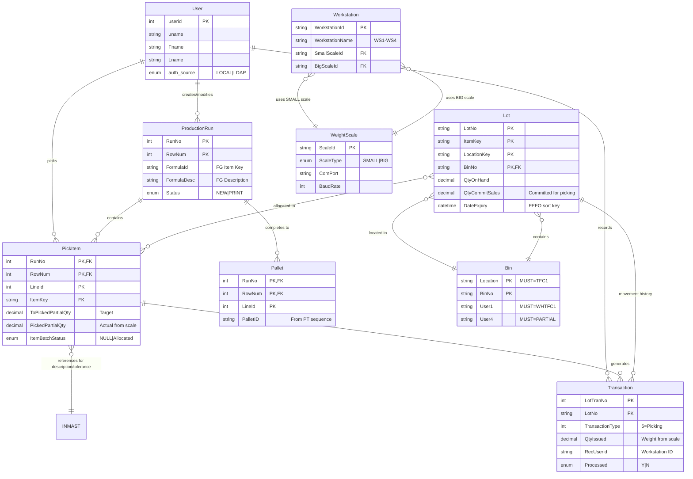

# Data Model Specification
## Partial Picking System PWA

**Feature Branch**: `001-i-have-an`
**Created**: 2025-10-06
**Based on**: Feature Spec v1.0, Database Schema v2.5
**Status**: Draft

---

## Overview

This document defines the data model for the Partial Picking System PWA, mapping business entities to database tables with validation rules, state transitions, and relationships.

**Design Principles**:
- Map directly to production database schema (TFCPILOT3)
- Preserve composite primary keys (no artificial surrogate keys)
- Validate against constitutional requirements (FEFO, 4-phase atomicity, audit trail)
- Document actual field usage patterns from production data

---

## Entity Index

1. [User](#1-user-entity)
2. [ProductionRun](#2-productionrun-entity)
3. [PickItem](#3-pickitem-entity)
4. [Lot](#4-lot-entity)
5. [Bin](#5-bin-entity)
6. [WeightScale](#6-weightscale-entity)
7. [Workstation](#7-workstation-entity)
8. [Pallet](#8-pallet-entity)
9. [Transaction](#9-transaction-entity)

---

## 1. User Entity

**Purpose**: Warehouse operator authentication and authorization with dual LDAP/SQL support

**Database Table**: `tbl_user`

### Fields

| Field | Type | Required | Validation Rules | Default | Notes |
|-------|------|----------|------------------|---------|-------|
| `userid` | int | Yes (PK) | Auto-increment, > 0 | - | Unique identifier |
| `uname` | string | Yes | 3-50 chars, alphanumeric + underscore | - | Login username |
| `Fname` | string | No | 1-100 chars | - | First name |
| `Lname` | string | No | 1-100 chars | - | Last name |
| `email` | string | No | Valid email format | - | Contact email |
| `department` | string | No | 1-100 chars | - | Department assignment |
| `auth_source` | enum | Yes | 'LOCAL' or 'LDAP' | 'LOCAL' | Authentication method |
| `ldap_username` | string | No | Required if auth_source='LDAP' | NULL | AD username |
| `ldap_dn` | string | No | Valid DN format if provided | NULL | Distinguished Name |
| `last_ldap_sync` | datetime | No | - | NULL | Last AD sync timestamp |
| `ad_enabled` | boolean | No | - | true | AD account active flag |
| `app_permissions` | string | No | Comma-separated list | 'putaway' | Application access |
| `pword` | string | No | Required if auth_source='LOCAL', bcrypt hash | NULL | Hashed password |
| `created_at` | datetime | No | - | GETDATE() | Account creation |

### Validation Rules

**At Creation**:
- `uname` must be unique across all users
- If `auth_source='LOCAL'`: `pword` is required (bcrypt hash, min 8 chars before hash)
- If `auth_source='LDAP'`: `ldap_username` is required
- `email` format: RFC 5322 validation (optional field)

**At Authentication**:
- LDAP users: Validate credentials against LDAP_URL from .env
- SQL users: Compare bcrypt hash of input password with stored `pword`
- Check `ad_enabled=true` before allowing login

**Business Rules**:
- Cannot change `auth_source` after creation
- `last_ldap_sync` updated automatically on successful LDAP authentication
- JWT token issued with 168-hour expiration (JWT_DURATION_HOURS)

### State Transitions

N/A (User accounts don't have workflow states)

### Relationships

- **1 User → Many ProductionRun** (via RecUserId, ModifiedBy)
- **1 User → Many PickItem** (via RecUserId, ModifiedBy)
- **1 User → Many Transaction** (via RecUserid)

### Example

```typescript
{
  userid: 42,
  uname: 'dechawat',
  Fname: 'Dechawat',
  Lname: 'Wongsirasawat',
  email: 'dechawat@nwfth.com',
  department: 'Warehouse',
  auth_source: 'LDAP',
  ldap_username: 'dechawat',
  ldap_dn: 'CN=Dechawat Wongsirasawat,OU=Users,DC=NWFTH,DC=com',
  last_ldap_sync: '2025-10-06T08:30:00Z',
  ad_enabled: true,
  app_permissions: 'putaway,picking,partial-picking',
  pword: null,
  created_at: '2025-01-15T10:00:00Z'
}
```

---

## 2. ProductionRun Entity

**Purpose**: Master record for partial picking runs/batches (finished goods production order)

**Database Table**: `Cust_PartialRun`

### Fields

| Field | Type | Required | Validation Rules | Default | Notes |
|-------|------|----------|------------------|---------|-------|
| `RunNo` | int | Yes (PK) | > 0, unique with RowNum | - | Run identifier |
| `RowNum` | int | Yes (PK) | > 0, represents batch number | - | Batch sequence |
| `BatchNo` | string | No | Max 50 chars | - | Batch identifier |
| `FormulaId` | string | No | Max 50 chars, trim spaces | - | **FG Item Key** (display field) |
| `FormulaDesc` | string | No | Max 255 chars | - | **FG Description** (display field) |
| `NoOfBatches` | int | No | > 0 | - | **Total batches count** (display field) |
| `PalletsPerBatch` | int | No | > 0 | - | Pallets per batch |
| `Status` | enum | No | 'NEW' or 'PRINT' | - | Run workflow status |
| `RecUserId` | string | No | FK to tbl_user.uname | - | Creator |
| `RecDate` | datetime | No | Valid date | - | **Production Date** (display field) |
| `ModifiedBy` | string | No | FK to tbl_user.uname | - | Last modifier |
| `ModifiedDate` | datetime | No | - | - | Last modification timestamp |

### Validation Rules

**At Creation**:
- `RunNo` must be unique
- `RowNum` must be sequential starting from 1 for each RunNo
- `NoOfBatches` must equal COUNT(DISTINCT RowNum) for the RunNo
- `Status` defaults to 'NEW'
- `RecDate` must not be future date

**At Update**:
- Cannot change `RunNo` or `RowNum` (part of PK)
- `Status` can only transition NEW → PRINT (not reversible)
- `ModifiedBy` and `ModifiedDate` must be updated atomically

**Business Rules**:
- All batches (all RowNum values) must be from the same production run
- `FormulaId` (FG Item Key) should be consistent across all batches in same RunNo
- Run completion triggers when all items in all batches have ItemBatchStatus='Allocated'

### State Transitions

```
┌─────────┐
│   NEW   │ ← Initial state when run created
└────┬────┘
     │ All items in all batches picked
     │ (ItemBatchStatus='Allocated')
     ↓
┌─────────┐
│  PRINT  │ ← Pallet assigned, labels print
└─────────┘
```

**Transition Rules**:
- **NEW → PRINT**: Triggered when `COUNT(*) WHERE ItemBatchStatus='Allocated'` = `COUNT(*)` for all batches
- **PRINT**: No further transitions (terminal state)

### Relationships

- **1 ProductionRun → Many PickItem** (via RunNo, RowNum)
- **1 ProductionRun → Many Pallet** (via RunNo, RowNum)
- **Many ProductionRun → 1 User** (creator via RecUserId)

### Example

```typescript
{
  RunNo: 6000037,
  RowNum: 1,
  BatchNo: '850417',
  FormulaId: 'TSM2285A',
  FormulaDesc: 'Marinade, Savory',
  NoOfBatches: 2,
  PalletsPerBatch: 1,
  Status: 'NEW',
  RecUserId: 'dechawat',
  RecDate: '2025-10-06T00:00:00Z',
  ModifiedBy: 'WS3',
  ModifiedDate: '2025-10-06T08:45:00Z'
}
```

---

## 3. PickItem Entity

**Purpose**: Individual ingredient to be picked within a run/batch with weight tracking

**Database Table**: `cust_PartialPicked`

⚠️ **CRITICAL**: Table name is `cust_PartialPicked` (lowercase 'c')

### Fields

| Field | Type | Required | Validation Rules | Default | Notes |
|-------|------|----------|------------------|---------|-------|
| `RunNo` | int | Yes (PK) | FK to Cust_PartialRun | - | Run identifier |
| `RowNum` | int | Yes (PK) | FK to Cust_PartialRun | - | Batch number |
| `LineId` | int | Yes (PK) | > 0, sequential per batch | - | Line sequence |
| `BatchNo` | string | No | Max 50 chars | - | Batch identifier |
| `LineTyp` | enum | No | 'FI' (Finished Item) | - | Line type |
| `ItemKey` | string | Yes | FK to INMAST.Itemkey | - | Item SKU |
| `Location` | string | No | Max 50 chars | - | Warehouse location |
| `Unit` | enum | No | 'KG', 'LB', 'EA' | 'KG' | Unit of measure |
| `StandardQty` | decimal | No | ≥ 0 | - | Formula standard qty |
| `PackSize` | decimal | No | > 0 | - | Package size |
| `ToPickedPartialQty` | decimal | Yes | > 0 | - | **Target weight** (Total Needed) |
| `PickedPartialQty` | decimal | No | ≥ 0 | 0 | **Actual picked weight** (from scale) |
| `PickingDate` | datetime | No | - | NULL | Timestamp when picked |
| `ItemBatchStatus` | enum | No | 'Allocated' or NULL | NULL | Picking status |
| `Allergen` | string | No | 'W' (Wheat), '' (None) | '' | Allergen code |
| `RecUserId` | string | No | FK to tbl_user.uname | - | Creator |
| `RecDate` | datetime | No | - | - | Record date |
| `ModifiedBy` | string | No | Workstation ID (WS1-WS4) | - | Last modifier |
| `ModifiedDate` | datetime | No | - | - | Last modification |

**Unused Fields** (always NULL in production):
- ❌ `ToPickedPartialQtyKG` - NEVER USED
- ❌ `PickedPartialQtyKG` - NEVER USED

### Validation Rules

**At Creation**:
- `LineId` must be sequential starting from 1 within each (RunNo, RowNum)
- `ItemKey` must exist in INMAST table
- `ToPickedPartialQty` must be > 0 (cannot pick 0 quantity)
- `ItemBatchStatus` defaults to NULL (unpicked)
- `PickedPartialQty` defaults to 0

**During Picking** (Real-Time Weight Updates):
- `PickedPartialQty` updated continuously from scale WebSocket
- Weight must be within tolerance: `ToPickedPartialQty ± INMAST.User9`
- "Add Lot" button enabled ONLY when: `WeightLow ≤ PickedPartialQty ≤ WeightHigh`

**At Save** (Pick Completion):
- `PickedPartialQty` must be within tolerance range
- `ItemBatchStatus` set to 'Allocated'
- `PickingDate` set to current timestamp
- `ModifiedBy` set to workstation ID (e.g., 'WS3')
- `ModifiedDate` set to current timestamp

**At Unpick**:
- `PickedPartialQty` reset to 0
- `ItemBatchStatus` remains 'Allocated' (audit trail preservation)
- `PickingDate`, `ModifiedBy`, `ModifiedDate` remain unchanged

**Business Rules**:
- Cannot pick same item twice (must unpick first)
- Weight tolerance validation: `abs(PickedPartialQty - ToPickedPartialQty) ≤ INMAST.User9`
- Remaining Qty = `ToPickedPartialQty - PickedPartialQty`

### State Transitions

```
┌──────────────┐
│ NULL (New)   │ ← Initial state (PickedPartialQty=0, ItemBatchStatus=NULL)
└──────┬───────┘
       │ User places item on scale, weight within tolerance, saves
       ↓
┌──────────────┐
│  Allocated   │ ← Picked (PickedPartialQty>0, ItemBatchStatus='Allocated')
└──────┬───────┘
       │ User clicks "Unpick/Delete"
       ↓
┌──────────────┐
│ Unpicked     │ ← Unpicked (PickedPartialQty=0, ItemBatchStatus='Allocated')
└──────────────┘   (Preserves audit trail: status, date remain)
```

**Transition Rules**:
- **NULL → Allocated**: Weight within tolerance AND operator saves
- **Allocated → Unpicked**: Operator deletes/unpicks item
- **Unpicked → Allocated**: Operator picks item again (re-pick)

**Visual Distinction** (UI):
- **NULL**: Default appearance (unpicked, never picked)
- **Allocated**: Green/success state (picked, PickedPartialQty > 0)
- **Unpicked**: Warning/yellow state (PickedPartialQty=0, but ItemBatchStatus='Allocated')

### Relationships

- **1 PickItem → 1 ProductionRun** (via RunNo, RowNum)
- **1 PickItem → 1 INMAST** (via ItemKey) - for description, tolerance
- **1 PickItem → Many Lot** (via lot allocation during picking)
- **1 PickItem → Many Transaction** (via RunNo, RowNum, LineId)

### Example

```typescript
// Picked Item
{
  RunNo: 213996,
  RowNum: 1,
  LineId: 1,
  BatchNo: '845148',
  LineTyp: 'FI',
  ItemKey: 'WFLOWGV2',
  Location: 'TFC1',
  Unit: 'KG',
  StandardQty: 620.4952,
  PackSize: 25,
  ToPickedPartialQty: 20.4952,      // Target: 20.4952 KG
  PickedPartialQty: 20.5,           // Actual from scale: 20.5 KG
  PickingDate: '2025-05-29T08:50:23Z',
  ItemBatchStatus: 'Allocated',
  Allergen: 'W',
  RecUserId: 'dechawat',
  RecDate: '2025-05-29T08:00:00Z',
  ModifiedBy: 'WS4',
  ModifiedDate: '2025-05-29T08:50:23Z'
}

// Unpicked Item (audit trail preserved)
{
  RunNo: 213996,
  RowNum: 1,
  LineId: 2,
  ItemKey: 'INSALT02',
  ToPickedPartialQty: 15.0,
  PickedPartialQty: 0,              // Reset to 0
  ItemBatchStatus: 'Allocated',     // Preserved (was picked before)
  PickingDate: '2025-05-29T09:15:00Z', // Preserved
  ModifiedBy: 'WS4',                // Preserved
  ModifiedDate: '2025-05-29T09:15:00Z' // Preserved
}
```

---

## 4. Lot Entity

**Purpose**: Inventory lot with expiration date, bin location, and quantity tracking

**Database Table**: `LotMaster`

⚠️ **CRITICAL**: Multiple records per LotNo (one per BinNo). Same lot can exist in multiple bins.

### Fields

| Field | Type | Required | Validation Rules | Default | Notes |
|-------|------|----------|------------------|---------|-------|
| `LotNo` | string | Yes (PK) | Max 50 chars | - | Lot number |
| `ItemKey` | string | Yes (PK) | FK to INMAST.Itemkey | - | Item SKU |
| `LocationKey` | string | Yes (PK) | Max 50 chars | - | Location code |
| `BinNo` | string | Yes (PK) | FK to BINMaster | '' | Bin number |
| `DateReceived` | datetime | No | - | - | Received date |
| `DateExpiry` | datetime | No | Must be > DateReceived | - | **Expiry date** (FEFO) |
| `QtyReceived` | decimal | No | ≥ 0 | 0 | Original received qty |
| `QtyIssued` | decimal | No | ≥ 0 | 0 | Total issued qty |
| `QtyCommitSales` | decimal | No | ≥ 0, ≤ QtyOnHand | 0 | **Committed for picking** |
| `QtyOnHand` | decimal | No | ≥ 0 | 0 | **Current on-hand qty** |
| `DocumentNo` | string | No | Max 50 chars | - | Receipt document |
| `DocumentLineNo` | int | No | > 0 | - | Receipt line |
| `TransactionType` | int | No | Valid transaction type | - | Transaction code |
| `VendorKey` | string | No | Max 50 chars | - | Vendor identifier |
| `VendorLotNo` | string | No | Max 50 chars | - | Vendor lot number |
| `QtyOnOrder` | decimal | No | ≥ 0 | 0 | Qty on order |
| `LotStatus` | enum | No | 'P' (Pass), 'H' (Hold), 'C' | '' | Lot status |
| `DateQuarantine` | datetime | No | - | NULL | Quarantine date |
| `RecUserId` | string | No | FK to tbl_user.uname | - | Creator |
| `Recdate` | datetime | No | - | - | Record date |

### Validation Rules

**At Creation**:
- Composite PK (LotNo, ItemKey, LocationKey, BinNo) must be unique
- `DateExpiry` must be > `DateReceived`
- `BinNo` must exist in BINMaster with Location='TFC1', User1='WHTFC1', User4='PARTIAL'
- `QtyOnHand` must equal `QtyReceived` initially
- `QtyCommitSales` defaults to 0

**During Picking** (Lot Allocation):
- Available Qty = `QtyOnHand - QtyCommitSales`
- Available Qty must be > 0 to allow allocation
- `QtyCommitSales` incremented by allocated quantity atomically

**At Unpick**:
- `QtyCommitSales` decremented by allocated quantity
- `QtyCommitSales` must remain ≥ 0

**Business Rules** (FEFO Compliance):
- Lot selection MUST sort by `DateExpiry ASC`, then `LocationKey ASC`
- Operators cannot override FEFO-selected bins
- System presents only the next FEFO-compliant lot with available qty

**TFC1 PARTIAL Bin Filter**:
- ONLY lots in bins where: `Location='TFC1' AND User1='WHTFC1' AND User4='PARTIAL'`
- 511 bins total (all other bins excluded)

### State Transitions

Lot status doesn't follow a strict workflow, but typical transitions:

```
┌───────────┐
│  P (Pass) │ ← Approved for use (LotStatus='P')
└─────┬─────┘
      │ Quality issue discovered
      ↓
┌───────────┐
│ H (Hold)  │ ← Quarantined (DateQuarantine set)
└─────┬─────┘
      │ Issue resolved OR disposed
      ↓
┌───────────┐
│ P or void │ ← Released or removed from inventory
└───────────┘
```

### Relationships

- **1 Lot → 1 Bin** (via LocationKey, BinNo)
- **1 Lot → 1 INMAST** (via ItemKey)
- **1 Lot → Many Transaction** (via LotNo)
- **1 Lot → Many PickItem** (via lot allocations)

### Example

```typescript
// Same lot in multiple bins
[
  {
    LotNo: '2510403-1',
    ItemKey: 'INSALT02',
    LocationKey: 'TFC1',
    BinNo: 'PWBB-12',
    DateReceived: '2025-04-03T00:00:00Z',
    DateExpiry: '2027-12-16T00:00:00Z',
    QtyReceived: 5000.0,
    QtyIssued: 715.27,
    QtyCommitSales: 3715.81,          // Committed for picking
    QtyOnHand: 4284.73,
    LotStatus: 'P',
    VendorKey: 'VEND001',
    VendorLotNo: 'ABC123'
  },
  {
    LotNo: '2510403-1',               // Same lot, different bin
    ItemKey: 'INSALT02',
    LocationKey: 'TFC1',
    BinNo: 'J0906-2A',                // Reserve stock bin
    QtyOnHand: 300.0,
    QtyCommitSales: 0.0,              // Not committed
    // ... other fields same
  }
]

// Available Qty Calculation:
// PWBB-12: 4284.73 - 3715.81 = 568.92 KG available
// J0906-2A: 300.0 - 0.0 = 300.0 KG available
```

---

## 5. Bin Entity

**Purpose**: Physical warehouse bin location in TFC1 PARTIAL area

**Database Table**: `BINMaster`

⚠️ **CRITICAL - PROJECT SCOPE**: ONLY bins where `Location='TFC1' AND User1='WHTFC1' AND User4='PARTIAL'` (511 bins)

### Fields

| Field | Type | Required | Validation Rules | Default | Notes |
|-------|------|----------|------------------|---------|-------|
| `Location` | string | Yes (PK) | Max 50 chars, MUST='TFC1' | - | Warehouse location |
| `BinNo` | string | Yes (PK) | Max 50 chars | - | Bin identifier |
| `Description` | string | No | Max 255 chars | - | Bin description |
| `aisle` | string | No | Max 10 chars | - | Aisle identifier |
| `row` | string | No | Max 10 chars | - | Row identifier |
| `rack` | string | No | Max 10 chars | - | Rack identifier |
| `User1` | string | No | Max 50 chars, MUST='WHTFC1' | - | Warehouse identifier |
| `User4` | enum | No | MUST='PARTIAL' | - | **Bin type identifier** |
| `StrgCndtnKey` | string | No | Max 50 chars | - | Storage condition |
| `Nettable` | boolean | No | - | false | Nettable flag |
| `LineSequence` | int | No | > 0 | - | Line sequence |
| `RecUserId` | string | No | FK to tbl_user.uname | - | Creator |
| `RecDate` | datetime | No | - | - | Record date |

### Validation Rules

**Project-Specific Filter**:
- `Location` MUST equal 'TFC1'
- `User1` MUST equal 'WHTFC1'
- `User4` MUST equal 'PARTIAL'
- Any bin not meeting all 3 criteria is **EXCLUDED** from this project

**At Creation**:
- Composite PK (Location, BinNo) must be unique
- `BinNo` format: alphanumeric with optional dash (e.g., 'PWBB-12')

**Business Rules**:
- Total TFC1 PARTIAL bins: **511 bins** (verified from production)
- Other locations excluded: WHSCG, WHTIP8, WHKON1, WHMBL
- Bulk bins excluded: User4=NULL or '' (e.g., SILO1, SILO2, A0001-2A)

**Bin Examples**:
- **TFC1 PARTIAL bins** (USED): PWBB-01 to PWBB-17, PWBA-01 to PWBA-04, PWBF-01, PW00-00
- **Bulk bins** (EXCLUDED): K0900-1A, J0906-2A, SILO1, SILO2

### State Transitions

N/A (Bins are static master data)

### Relationships

- **1 Bin → Many Lot** (via Location, BinNo)
- **1 Bin → Many BinTransfer** (via BinNoFrom, BinNoTo)

### Example

```typescript
{
  Location: 'TFC1',
  BinNo: 'PWBB-12',
  Description: 'PW Racking : Replenishment area',
  aisle: 'PW',
  row: 'B',
  rack: '12',
  User1: 'WHTFC1',              // ✅ Required for project
  User4: 'PARTIAL',             // ✅ Required for project (bin type)
  StrgCndtnKey: 'AMBIENT',
  Nettable: false,
  RecUserId: 'admin',
  RecDate: '2024-01-01T00:00:00Z'
}
```

---

## 6. WeightScale Entity

**Purpose**: Hardware scale device with serial port configuration

**Database Table**: `TFC_Weightscale2`

### Fields

| Field | Type | Required | Validation Rules | Default | Notes |
|-------|------|----------|------------------|---------|-------|
| `ScaleId` | string | Yes (PK) | Max 50 chars, unique | - | Scale identifier |
| `ScaleType` | enum | Yes | 'SMALL' or 'BIG' | - | Scale classification |
| `ComPort` | string | Yes | 'COM1' to 'COM99' | - | Serial port (env-specific) |
| `BaudRate` | int | Yes | 9600, 19200, 38400, 115200 | 9600 | Serial baud rate |
| `Capacity` | decimal | No | > 0 | - | Max capacity (kg) - informational |
| `Precision` | decimal | No | > 0 | - | Precision (kg) - informational |
| `Status` | enum | Yes | 'Active' or 'Inactive' | 'Active' | Scale status |

### Validation Rules

**At Creation**:
- `ScaleId` must be unique
- `ScaleType` must be 'SMALL' or 'BIG'
- `ComPort` format: 'COM' + number (e.g., 'COM3')
- `BaudRate` must match scale hardware specification (typically 9600)
- `Status` defaults to 'Active'

**At Runtime**:
- COM port assigned during client installation via config wizard
- .NET bridge service reads this table to initialize serial port readers
- `Capacity` and `Precision` are informational only (NOT enforced by app)

**Business Rules**:
- Each workstation requires 2 active scales (1 SMALL, 1 BIG)
- COM port conflicts prevented at database level (unique constraint)
- Inactive scales ignored by bridge service

### State Transitions

```
┌──────────┐
│  Active  │ ← Scale operational, bridge service connects
└────┬─────┘
     │ Maintenance or hardware failure
     ↓
┌──────────┐
│ Inactive │ ← Scale offline, bridge service skips
└────┬─────┘
     │ Maintenance complete, re-enabled
     ↓
┌──────────┐
│  Active  │
└──────────┘
```

### Relationships

- **1 WeightScale → Many Workstation** (via SmallScaleId, BigScaleId)

### Example

```typescript
{
  ScaleId: 'SCALE-SMALL-01',
  ScaleType: 'SMALL',
  ComPort: 'COM3',
  BaudRate: 9600,
  Capacity: 30.0,               // 30 kg max (informational)
  Precision: 0.001,             // 1 gram precision (informational)
  Status: 'Active'
}
```

---

## 7. Workstation Entity

**Purpose**: Picking workstation with dual scale assignment

**Database Table**: `TFC_workstation2`

### Fields

| Field | Type | Required | Validation Rules | Default | Notes |
|-------|------|----------|------------------|---------|-------|
| `WorkstationId` | string | Yes (PK) | Max 50 chars, unique | - | Workstation identifier |
| `WorkstationName` | string | Yes | Max 100 chars | - | Display name (WS1-WS4) |
| `SmallScaleId` | string | No | FK to TFC_Weightscale2 | NULL | Small scale assignment |
| `BigScaleId` | string | No | FK to TFC_Weightscale2 | NULL | Big scale assignment |
| `Status` | enum | Yes | 'Active' or 'Inactive' | 'Active' | Workstation status |

### Validation Rules

**At Creation**:
- `WorkstationId` must be unique
- `WorkstationName` typically follows pattern: WS1, WS2, WS3, WS4
- `SmallScaleId` must reference TFC_Weightscale2 with ScaleType='SMALL'
- `BigScaleId` must reference TFC_Weightscale2 with ScaleType='BIG'
- `Status` defaults to 'Active'

**At Runtime**:
- Frontend reads scale IDs to determine WebSocket endpoints
- User selects workstation on first use (persisted in localStorage)
- Scale assignments can be changed without code deployment

**Business Rules**:
- Each workstation has exactly 1 SMALL scale and 1 BIG scale
- Scale can be assigned to multiple workstations (shared hardware)
- Inactive workstations hidden from selection UI

### State Transitions

```
┌──────────┐
│  Active  │ ← Workstation operational
└────┬─────┘
     │ Maintenance or decommission
     ↓
┌──────────┐
│ Inactive │ ← Workstation offline
└────┬─────┘
     │ Re-enabled
     ↓
┌──────────┐
│  Active  │
└──────────┘
```

### Relationships

- **1 Workstation → 1 WeightScale** (SMALL via SmallScaleId)
- **1 Workstation → 1 WeightScale** (BIG via BigScaleId)
- **Many Workstation → Many PickItem** (via ModifiedBy field)

### Example

```typescript
{
  WorkstationId: 'WS-001',
  WorkstationName: 'WS3',
  SmallScaleId: 'SCALE-SMALL-01',
  BigScaleId: 'SCALE-BIG-02',
  Status: 'Active'
}
```

---

## 8. Pallet Entity

**Purpose**: Completed batch pallet with sequential ID from PT sequence

**Database Table**: `Cust_PartialPalletLotPicked`

⚠️ **CRITICAL**: Records created AFTER all items picked, NOT during picking

### Fields

| Field | Type | Required | Validation Rules | Default | Notes |
|-------|------|----------|------------------|---------|-------|
| `RunNo` | int | Yes (PK) | FK to Cust_PartialRun | - | Run identifier |
| `RowNum` | int | Yes (PK) | FK to Cust_PartialRun | - | Batch number |
| `LineId` | int | Yes (PK) | Always = 1 | 1 | Line identifier |
| `BatchNo` | string | No | Max 50 chars | - | Batch identifier |
| `PalletID` | string | Yes | From PT sequence, unique | - | **Pallet identifier** |
| `RecUserid` | string | No | Workstation ID or user | - | Creator |
| `RecDate` | datetime | No | - | GETDATE() | Pallet assignment date |
| `ModifiedBy` | string | No | - | - | Modifier |
| `ModifiedDate` | datetime | No | - | - | Modification date |

### Validation Rules

**At Creation** (Run Completion):
- `LineId` is always 1 (fixed value)
- `PalletID` obtained from PT sequence atomically:
  ```sql
  UPDATE Seqnum SET SeqNum = SeqNum + 1 WHERE SeqName = 'PT';
  SELECT SeqNum FROM Seqnum WHERE SeqName = 'PT';
  ```
- Record created ONLY when all items in batch have ItemBatchStatus='Allocated'
- Atomic transaction with run status update (NEW → PRINT)

**Trigger Condition**:
```sql
-- All items must be allocated before pallet creation
SELECT COUNT(*) as Total,
       COUNT(CASE WHEN ItemBatchStatus = 'Allocated' THEN 1 END) as Picked
FROM cust_PartialPicked
WHERE RunNo = @RunNo AND RowNum = @RowNum;
-- When Total = Picked, trigger completion
```

**Business Rules**:
- One pallet record per batch (not per run)
- PalletID sequential: 623524, 623525, 623526, ...
- Run status changes from 'NEW' to 'PRINT' simultaneously
- Batch summary labels print (1 label per batch)

### State Transitions

N/A (Pallet creation is one-time event, no workflow states)

### Relationships

- **1 Pallet → 1 ProductionRun** (via RunNo, RowNum)

### Example

```typescript
{
  RunNo: 213935,
  RowNum: 1,
  LineId: 1,
  BatchNo: '845912',
  PalletID: '623524',            // From PT sequence
  RecUserid: 'WS3',
  RecDate: '2025-05-29T12:00:04Z',
  ModifiedBy: null,
  ModifiedDate: null
}
```

---

## 9. Transaction Entity

**Purpose**: Audit record of picking operation with lot movement tracking

**Database Table**: `LotTransaction`

### Fields

| Field | Type | Required | Validation Rules | Default | Notes |
|-------|------|----------|------------------|---------|-------|
| `LotTranNo` | int | Yes (PK) | Auto-increment, > 0 | - | Transaction number |
| `LotNo` | string | Yes | FK to LotMaster | - | Lot number |
| `ItemKey` | string | Yes | FK to INMAST | - | Item SKU |
| `LocationKey` | string | Yes | Max 50 chars | - | Location code |
| `DateReceived` | datetime | No | - | NULL | Received date (NULL for picking) |
| `DateExpiry` | datetime | No | - | - | Expiry date |
| `TransactionType` | int | Yes | 5 for picking | - | Transaction type |
| `ReceiptDocNo` | string | No | Max 50 chars | - | Receipt document |
| `ReceiptDocLineNo` | int | No | > 0 | - | Receipt line |
| `QtyReceived` | decimal | No | ≥ 0 | 0 | Qty received (0 for picking) |
| `Vendorkey` | string | No | Max 50 chars | NULL | Vendor key (NULL for picking) |
| `VendorlotNo` | string | No | Max 50 chars | NULL | Vendor lot (NULL for picking) |
| `IssueDocNo` | string | No | Max 50 chars | - | **Issue document (BatchNo)** |
| `IssueDocLineNo` | int | No | > 0 | - | **Issue line (LineId)** |
| `IssueDate` | datetime | No | - | GETDATE() | **Picking timestamp** |
| `QtyIssued` | decimal | Yes | > 0 | - | **Weight from scale** |
| `CustomerKey` | string | No | Max 50 chars | - | Customer code |
| `RecUserid` | string | No | Workstation ID | - | **Workstation (WS1-WS4)** |
| `RecDate` | datetime | No | - | GETDATE() | Transaction date |
| `Processed` | enum | Yes | 'Y' or 'N' | 'N' | Processed flag |
| `BinNo` | string | No | FK to BINMaster | - | Source bin |
| `User5` | string | No | Max 255 chars | - | **'Picking Customization'** |

**Always NULL/0 During Picking**:
- ❌ `DateReceived` = NULL
- ❌ `QtyReceived` = 0
- ❌ `Vendorkey` = NULL, `VendorlotNo` = NULL
- ❌ `TempQty` = 0, `QtyForLotAssignment` = 0, `QtyUsed` = 0
- ❌ `DateQuarantine` = NULL

### Validation Rules

**At Creation** (During Picking):
- `LotTranNo` auto-incremented (no manual assignment)
- `TransactionType` MUST = 5 for partial picking
- `IssueDocNo` = BatchNo from cust_PartialPicked
- `IssueDocLineNo` = LineId from cust_PartialPicked
- `QtyIssued` = actual weight from scale (must be > 0)
- `RecUserid` = workstation ID (e.g., 'WS3')
- `Processed` defaults to 'N' (not yet processed to inventory)
- `User5` = 'Picking Customization' (system marker)

**Business Rules**:
- Append-only table (never delete transactions, audit trail)
- Created as part of 4-phase atomic picking transaction (Phase 3)
- Each pick operation creates exactly 1 LotTransaction record
- `IssueDate` and `RecDate` are picking timestamp

### State Transitions

```
┌───────────────┐
│ N (Not        │ ← Initial state when created
│   Processed)  │
└───────┬───────┘
        │ Inventory system processes transaction
        ↓
┌───────────────┐
│ Y (Processed) │ ← Transaction applied to inventory
└───────────────┘
```

### Relationships

- **1 Transaction → 1 Lot** (via LotNo, ItemKey, LocationKey)
- **1 Transaction → 1 PickItem** (via IssueDocNo=BatchNo, IssueDocLineNo=LineId)
- **1 Transaction → 1 Bin** (via BinNo)

### Example

```typescript
{
  LotTranNo: 17282833,
  LotNo: '2510391-1',
  ItemKey: 'INMSGT01',
  LocationKey: 'TFC1',
  DateReceived: null,                       // ❌ NULL during picking
  DateExpiry: '2027-12-16T00:00:00Z',
  TransactionType: 5,                       // ✅ 5 = Issue/Picking
  ReceiptDocNo: 'BT-25265828',
  ReceiptDocLineNo: 1,
  QtyReceived: 0,                           // ❌ Always 0 for picking
  Vendorkey: null,                          // ❌ NULL
  VendorlotNo: null,                        // ❌ NULL
  IssueDocNo: '838248',                     // ✅ BatchNo
  IssueDocLineNo: 9,                        // ✅ LineId
  IssueDate: '2025-05-29T11:59:33Z',        // ✅ Picking timestamp
  QtyIssued: 12.56,                         // ✅ Weight from scale
  CustomerKey: 'UPC01',
  RecUserid: 'WS3',                         // ✅ Workstation ID
  RecDate: '2025-05-29T11:59:33Z',
  Processed: 'N',                           // ✅ Not yet processed
  BinNo: 'PWBB-05',                         // ✅ Source bin
  User5: 'Picking Customization'            // ✅ System marker
}
```

---

## Entity Relationship Diagram



---

## Appendix A: Constitutional Compliance

This data model complies with all constitutional requirements:

### I. Database Schema Fidelity ✅
- Composite primary keys preserved (RunNo+RowNum+LineId)
- Correct field naming: `PickedPartialQty` (NOT PickedPartialQtyKG)
- QtyCommitSales updates during picking (Phase 4 of atomic transaction)
- BIN filtering: Location='TFC1' AND User1='WHTFC1' AND User4='PARTIAL'

### II. FEFO Compliance ✅
- Lot selection sorts by DateExpiry ASC, then LocationKey ASC
- Documented in Lot entity validation rules
- Server-side enforcement (no client-side override)

### III. 4-Phase Transaction Atomicity ✅
- Phase 1: Lot allocation (Cust_PartialLotPicked creation)
- Phase 2: Weight update (PickedPartialQty + INMAST.PickedPartialQtyKG)
- Phase 3: Transaction recording (LotTransaction with TransactionType=5)
- Phase 4: Inventory commitment (LotMaster.QtyCommitSales increment)

### IV. Real-Time Weight Integration ✅
- PickedPartialQty field updated from WebSocket (<200ms latency)
- Tolerance validation: INMAST.User9 (absolute KG values)
- WeightScale and Workstation entities support dual scale configuration

### V. Audit Trail Preservation ✅
- Unpick operations reset PickedPartialQty to 0
- ItemBatchStatus, PickingDate, ModifiedBy preserved after unpick
- LotTransaction append-only (never delete)
- All entities include ModifiedBy, ModifiedDate tracking

### VIII. Environment Configuration ✅
- No hard-coded values in data model
- COM ports, baud rates stored in TFC_Weightscale2 table
- Configuration values loaded from database, not code

---

## Appendix B: Validation Summary

### Total Validations by Entity

| Entity | Field Validations | State Transitions | Business Rules | Total |
|--------|-------------------|-------------------|----------------|-------|
| User | 8 | 0 | 3 | 11 |
| ProductionRun | 7 | 2 states | 3 | 12 |
| PickItem | 12 | 3 states | 5 | 20 |
| Lot | 10 | 3 states | 3 | 16 |
| Bin | 4 | 0 | 3 | 7 |
| WeightScale | 7 | 2 states | 3 | 12 |
| Workstation | 6 | 2 states | 3 | 11 |
| Pallet | 4 | 0 | 3 | 7 |
| Transaction | 9 | 2 states | 3 | 14 |
| **Total** | **67** | **14** | **29** | **110** |

---

**Document Version**: 1.0
**Created**: 2025-10-06
**Based on**: Feature Spec v1.0, Database Schema v2.5, Constitution v1.0.0
**Next Phase**: API Contracts (OpenAPI spec + WebSocket protocol)
